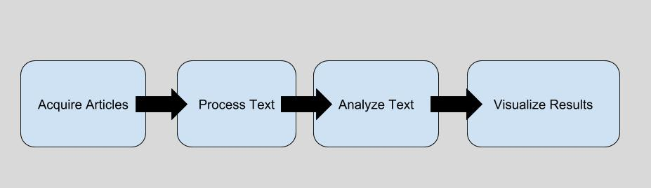
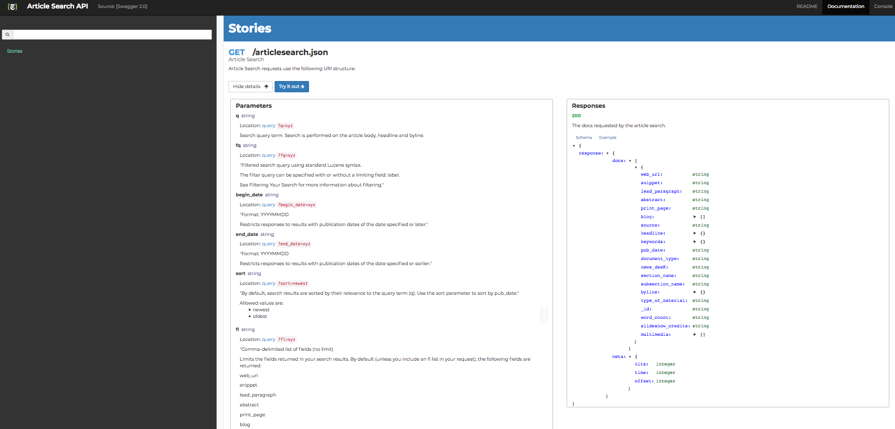
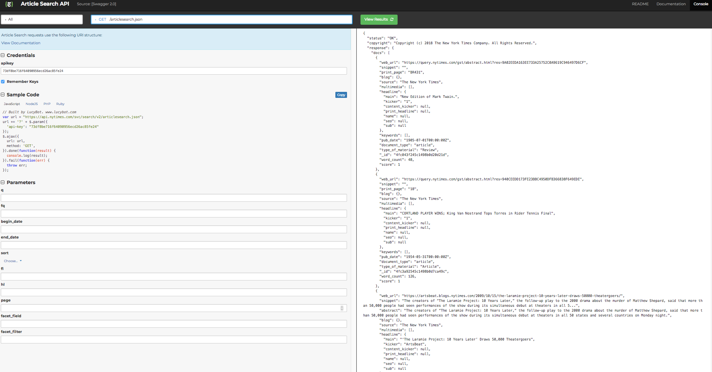

# Analyzing NY Times Articles


## General Data Science Outline


## Our Outline


# Acquire Articles - The NY Times API

https://developers.nytimes.com/


### Reading Documentation

https://developer.nytimes.com/article_search_v2.json





#### HTTP Requests <a id="http"></a>
HTTP stands for Hyper Text Transfer Protocol. This protocol (like many) was proposed by the Internet Engineering Task Force (IETF) through a request for comments (RFC). We're going to start with a very simple HTTP method: the get method.  


To learn more about HTTP methods see:  
https://developer.mozilla.org/en-US/docs/Web/HTTP/Methods

#### Python's Requests Package <a id="req"></a>
The first thing to understand when dealing with APIs is how to make get requests in general.
To do this, we'll use the Python requests package.

http://docs.python-requests.org/en/master/


### Making a  get request <a id="get_request"></a>


```python
import requests
```


```python
response = requests.get('https://flatironschool.com')
print('Type:', type(response), '\n')
print('Response:', response, '\n')
print('Response text:\n', response.text)
```

    Type: <class 'requests.models.Response'> 
    
    Response: <Response [403]> 
    
    Response text:
     <html>
    <head><title>403 Forbidden</title></head>
    <body bgcolor="white">
    <center><h1>403 Forbidden</h1></center>
    <hr><center>nginx</center>
    </body>
    </html>
    


Hmmm, well that was only partially helpful. You can see that our request was denied. (This is shown by the response itself, which has the code 403, meaning forbidden.) Most likely, this is caused by permissioning from Flatiron School's servers, which may be blocking requests that appear to be from an automated platform.

### HTTP Response Codes <a id="http_codes"></a>
In general, here's some common HTTP response codes you might come across:


Let's try another get request in the hopes of getting a successful (200) response.


```python
#The Electronic Frontier Foundation (EFF) website; advocating for data privacy and an open internet
response = requests.get('https://www.eff.org')
print(response)
print(response.text[:2500])
```

    <Response [200]>
    <!DOCTYPE html>
      <!--[if IEMobile 7]><html class="no-js ie iem7" lang="en" dir="ltr"><![endif]-->
      <!--[if lte IE 6]><html class="no-js ie lt-ie9 lt-ie8 lt-ie7" lang="en" dir="ltr"><![endif]-->
      <!--[if (IE 7)&(!IEMobile)]><html class="no-js ie lt-ie9 lt-ie8" lang="en" dir="ltr"><![endif]-->
      <!--[if IE 8]><html class="no-js ie lt-ie9" lang="en" dir="ltr"><![endif]-->
      <!--[if (gte IE 9)|(gt IEMobile 7)]><html class="no-js ie" lang="en" dir="ltr" prefix="fb: http://ogp.me/ns/fb# og: http://ogp.me/ns# article: http://ogp.me/ns/article# book: http://ogp.me/ns/book# profile: http://ogp.me/ns/profile# video: http://ogp.me/ns/video# product: http://ogp.me/ns/product#"><![endif]-->
      <!--[if !IE]><!--><html class="no-js" lang="en" dir="ltr" prefix="fb: http://ogp.me/ns/fb# og: http://ogp.me/ns# article: http://ogp.me/ns/article# book: http://ogp.me/ns/book# profile: http://ogp.me/ns/profile# video: http://ogp.me/ns/video# product: http://ogp.me/ns/product#"><!--<![endif]-->
    <head>
      <meta charset="utf-8" />
    <link href="https://www.eff.org/vi" rel="alternate" hreflang="vi" />
    <link rel="apple-touch-icon-precomposed" href="https://www.eff.org/sites/all/themes/phoenix/apple-touch-icon-precomposed-114x114.png" sizes="114x114" />
    <link href="https://www.eff.org/ur" rel="alternate" hreflang="ur" />
    <link href="https://www.eff.org/tr" rel="alternate" hreflang="tr" />
    <link href="https://www.eff.org/sh" rel="alternate" hreflang="sh" />
    <link href="https://www.eff.org/sv" rel="alternate" hreflang="sv" />
    <link href="https://www.eff.org/th" rel="alternate" hreflang="th" />
    <link rel="apple-touch-icon-precomposed" href="https://www.eff.org/sites/all/themes/phoenix/apple-touch-icon-precomposed-72x72.png" sizes="72x72" />
    <link rel="apple-touch-icon-precomposed" href="https://www.eff.org/sites/all/themes/phoenix/apple-touch-icon-precomposed-144x144.png" sizes="144x144" />
    <link rel="profile" href="http://www.w3.org/1999/xhtml/vocab" />
    <link rel="shortcut icon" href="https://www.eff.org/sites/all/themes/frontier/favicon.ico" type="image/vnd.microsoft.icon" />
    <meta name="HandheldFriendly" content="true" />
    <meta name="MobileOptimized" content="width" />
    <link rel="apple-touch-icon-precomposed" href="https://www.eff.org/sites/all/themes/phoenix/apple-touch-icon-precomposed.png" />
    <meta http-equiv="cleartype" content="on" />
    <link href="https://www.eff.org/ru" rel="alternate" hreflang="ru" />
    <link href="https://www.eff.org/es" rel="alternate" hreflang="es" />
    <link href


Success! As you can see, the response.text is the html code for the given url that we requested. In the background, this forms the basis for web browsers themselves. Every time you put in a new url or click on a link your computer makes a get request for that particular page and then the browser itself renders that page into a visual display on screen.

### OAuth  <a id="oauth"></a>
Some requests are a bit more complicated. Often, websites require identity verification such as logins. This helps a variety of issues such as privacy concerns, limiting access to content and tracking users history. Going forward, OAuth has furthered this idea by allowing third parties such as apps access to user information without providing the underlying password itself.

In the words of the Internet Engineering Task Force, "The OAuth 2.0 authorization framework enables a third-party
application to obtain limited access to an HTTP service, either on
behalf of a resource owner by orchestrating an approval interaction
between the resource owner and the HTTP service, or by allowing the
third-party application to obtain access on its own behalf.  This
specification replaces and obsoletes the OAuth 1.0 protocol described
in RFC 5849."

See https://oauth.net/2/ or https://tools.ietf.org/html/rfc6749 for more details.

## Access Tokens

In order to make requests to many APIs, you are required to *login* via an access token. As a result, the first step is to sign up through the web interface using your browser. Once you have an API key, you can then use it to make requests to the API. As with login passwords for your computer, these access tokens should be kept secret! For example, rather then including the passwords directly in this file, I have saved them to a seperate file called **'ny_times_api_keys.py'**. The file would look something like this:

```api_key = 'blah_blah_blah_YOUR_KEY_HERE'```

Now it's time to start making some api calls!


```python
from ny_times_api_keys import *
```


```python
import requests
```


```python
url = "https://api.nytimes.com/svc/search/v2/articlesearch.json"
url_params = {"api-key" : api_key,
             'fq' : 'The New York Times',
             'sort' : "newest"}
response = requests.get(url, params=url_params)

```


```python
response
```


    <Response [200]>


# JSON Files

While you can see that we received an HTTP code of 200, indicating success, the actual data from the request is stored in a json file format. JSON stands for **Javascript Object Notation** and is the standard format for most data requests from the web these days. You can read more about json [here](https://www.json.org/). With that, let's take a quick look at our data:


```python
response.json()
```


    {'status': 'OK',
     'copyright': 'Copyright (c) 2018 The New York Times Company. All Rights Reserved.',
     'response': {'docs': [{'web_url': 'https://www.nytimes.com/interactive/2018/upshot/elections-poll-ny22.html',
        'snippet': 'The district stretches from Lake Ontario to the Pennsylvania border.',
        'blog': {},
        'source': 'The New York Times',
        'multimedia': [{'rank': 0,
          'subtype': 'xlarge',
          'caption': None,
          'credit': None,
          'type': 'image',
          'url': 'images/2018/11/01/upshot/elections-poll-ny22-1541083888183/elections-poll-ny22-1541083888183-articleLarge.png',
          'height': 368,
          'width': 600,
          'legacy': {'xlarge': 'images/2018/11/01/upshot/elections-poll-ny22-1541083888183/elections-poll-ny22-1541083888183-articleLarge.png',
           'xlargewidth': 600,
           'xlargeheight': 368},
          'subType': 'xlarge',
          'crop_name': 'articleLarge'},
         {'rank': 0,
          'subtype': 'wide',
          'caption': None,
          'credit': None,
          'type': 'image',
          'url': 'images/2018/11/01/upshot/elections-poll-ny22-1541083888183/elections-poll-ny22-1541083888183-thumbWide.png',
          'height': 126,
          'width': 190,
          'legacy': {'wide': 'images/2018/11/01/upshot/elections-poll-ny22-1541083888183/elections-poll-ny22-1541083888183-thumbWide.png',
           'widewidth': 190,
           'wideheight': 126},
          'subType': 'wide',
          'crop_name': 'thumbWide'},
         {'rank': 0,
          'subtype': 'thumbnail',
          'caption': None,
          'credit': None,
          'type': 'image',
          'url': 'images/2018/11/01/upshot/elections-poll-ny22-1541083888183/elections-poll-ny22-1541083888183-thumbStandard.png',
          'height': 75,
          'width': 75,
          'legacy': {'thumbnail': 'images/2018/11/01/upshot/elections-poll-ny22-1541083888183/elections-poll-ny22-1541083888183-thumbStandard.png',
           'thumbnailwidth': 75,
           'thumbnailheight': 75},
          'subType': 'thumbnail',
          'crop_name': 'thumbStandard'},
         {'rank': 0,
          'subtype': 'articleInline',
          'caption': None,
          'credit': None,
          'type': 'image',
          'url': 'images/2018/11/01/upshot/elections-poll-ny22-1541083888183/elections-poll-ny22-1541083888183-articleInline.png',
          'height': 117,
          'width': 190,
          'legacy': {},
          'subType': 'articleInline',
          'crop_name': 'articleInline'},
         {'rank': 0,
          'subtype': 'blog225',
          'caption': None,
          'credit': None,
          'type': 'image',
          'url': 'images/2018/11/01/upshot/elections-poll-ny22-1541083888183/elections-poll-ny22-1541083888183-blog225.png',
          'height': 138,
          'width': 225,
          'legacy': {},
          'subType': 'blog225',
          'crop_name': 'blog225'},
         {'rank': 0,
          'subtype': 'blog427',
          'caption': None,
          'credit': None,
          'type': 'image',
          'url': 'images/2018/11/01/upshot/elections-poll-ny22-1541083888183/elections-poll-ny22-1541083888183-blog427.png',
          'height': 262,
          'width': 427,
          'legacy': {},
          'subType': 'blog427',
          'crop_name': 'blog427'},
         {'rank': 0,
          'subtype': 'blog480',
          'caption': None,
          'credit': None,
          'type': 'image',
          'url': 'images/2018/11/01/upshot/elections-poll-ny22-1541083888183/elections-poll-ny22-1541083888183-blog480.png',
          'height': 295,
          'width': 480,
          'legacy': {},
          'subType': 'blog480',
          'crop_name': 'blog480'},
         {'rank': 0,
          'subtype': 'blog533',
          'caption': None,
          'credit': None,
          'type': 'image',
          'url': 'images/2018/11/01/upshot/elections-poll-ny22-1541083888183/elections-poll-ny22-1541083888183-blog533.png',
          'height': 327,
          'width': 533,
          'legacy': {},
          'subType': 'blog533',
          'crop_name': 'blog533'},
         {'rank': 0,
          'subtype': 'blogSmallInline',
          'caption': None,
          'credit': None,
          'type': 'image',
          'url': 'images/2018/11/01/upshot/elections-poll-ny22-1541083888183/elections-poll-ny22-1541083888183-blogSmallInline.png',
          'height': 93,
          'width': 151,
          'legacy': {},
          'subType': 'blogSmallInline',
          'crop_name': 'blogSmallInline'},
         {'rank': 0,
          'subtype': 'blogSmallThumb',
          'caption': None,
          'credit': None,
          'type': 'image',
          'url': 'images/2018/11/01/upshot/elections-poll-ny22-1541083888183/elections-poll-ny22-1541083888183-blogSmallThumb.png',
          'height': 50,
          'width': 50,
          'legacy': {},
          'subType': 'blogSmallThumb',
          'crop_name': 'blogSmallThumb'},
         {'rank': 0,
          'subtype': 'facebookJumbo',
          'caption': None,
          'credit': None,
          'type': 'image',
          'url': 'images/2018/11/01/upshot/elections-poll-ny22-1541083888183/elections-poll-ny22-1541083888183-facebookJumbo.png',
          'height': 550,
          'width': 1050,
          'legacy': {},
          'subType': 'facebookJumbo',
          'crop_name': 'facebookJumbo'},
         {'rank': 0,
          'subtype': 'filmstrip',
          'caption': None,
          'credit': None,
          'type': 'image',
          'url': 'images/2018/11/01/upshot/elections-poll-ny22-1541083888183/elections-poll-ny22-1541083888183-filmstrip.png',
          'height': 190,
          'width': 190,
          'legacy': {},
          'subType': 'filmstrip',
          'crop_name': 'filmstrip'},
         {'rank': 0,
          'subtype': 'hpLarge',
          'caption': None,
          'credit': None,
          'type': 'image',
          'url': 'images/2018/11/01/upshot/elections-poll-ny22-1541083888183/elections-poll-ny22-1541083888183-hpLarge.png',
          'height': 288,
          'width': 511,
          'legacy': {},
          'subType': 'hpLarge',
          'crop_name': 'hpLarge'},
         {'rank': 0,
          'subtype': 'hpSmall',
          'caption': None,
          'credit': None,
          'type': 'image',
          'url': 'images/2018/11/01/upshot/elections-poll-ny22-1541083888183/elections-poll-ny22-1541083888183-hpSmall.png',
          'height': 100,
          'width': 163,
          'legacy': {},
          'subType': 'hpSmall',
          'crop_name': 'hpSmall'},
         {'rank': 0,
          'subtype': 'jumbo',
          'caption': None,
          'credit': None,
          'type': 'image',
          'url': 'images/2018/11/01/upshot/elections-poll-ny22-1541083888183/elections-poll-ny22-1541083888183-jumbo.png',
          'height': 629,
          'width': 1024,
          'legacy': {},
          'subType': 'jumbo',
          'crop_name': 'jumbo'},
         {'rank': 0,
          'subtype': 'largeHorizontal375',
          'caption': None,
          'credit': None,
          'type': 'image',
          'url': 'images/2018/11/01/upshot/elections-poll-ny22-1541083888183/elections-poll-ny22-1541083888183-largeHorizontal375.png',
          'height': 250,
          'width': 375,
          'legacy': {},
          'subType': 'largeHorizontal375',
          'crop_name': 'largeHorizontal375'},
         {'rank': 0,
          'subtype': 'largeHorizontalJumbo',
          'caption': None,
          'credit': None,
          'type': 'image',
          'url': 'images/2018/11/01/upshot/elections-poll-ny22-1541083888183/elections-poll-ny22-1541083888183-largeHorizontalJumbo.png',
          'height': 682,
          'width': 1024,
          'legacy': {},
          'subType': 'largeHorizontalJumbo',
          'crop_name': 'largeHorizontalJumbo'},
         {'rank': 0,
          'subtype': 'largeWidescreen573',
          'caption': None,
          'credit': None,
          'type': 'image',
          'url': 'images/2018/11/01/upshot/elections-poll-ny22-1541083888183/elections-poll-ny22-1541083888183-largeWidescreen573.png',
          'height': 322,
          'width': 573,
          'legacy': {},
          'subType': 'largeWidescreen573',
          'crop_name': 'largeWidescreen573'},
         {'rank': 0,
          'subtype': 'largeWidescreen1050',
          'caption': None,
          'credit': None,
          'type': 'image',
          'url': 'images/2018/11/01/upshot/elections-poll-ny22-1541083888183/elections-poll-ny22-1541083888183-largeWidescreen1050.png',
          'height': 591,
          'width': 1050,
          'legacy': {},
          'subType': 'largeWidescreen1050',
          'crop_name': 'largeWidescreen1050'},
         {'rank': 0,
          'subtype': 'master1050',
          'caption': None,
          'credit': None,
          'type': 'image',
          'url': 'images/2018/11/01/upshot/elections-poll-ny22-1541083888183/elections-poll-ny22-1541083888183-master1050.png',
          'height': 645,
          'width': 1050,
          'legacy': {},
          'subType': 'master1050',
          'crop_name': 'master1050'},
         {'rank': 0,
          'subtype': 'master180',
          'caption': None,
          'credit': None,
          'type': 'image',
          'url': 'images/2018/11/01/upshot/elections-poll-ny22-1541083888183/elections-poll-ny22-1541083888183-master180.png',
          'height': 111,
          'width': 180,
          'legacy': {},
          'subType': 'master180',
          'crop_name': 'master180'},
         {'rank': 0,
          'subtype': 'master315',
          'caption': None,
          'credit': None,
          'type': 'image',
          'url': 'images/2018/11/01/upshot/elections-poll-ny22-1541083888183/elections-poll-ny22-1541083888183-master315.png',
          'height': 193,
          'width': 315,
          'legacy': {},
          'subType': 'master315',
          'crop_name': 'master315'},
         {'rank': 0,
          'subtype': 'master495',
          'caption': None,
          'credit': None,
          'type': 'image',
          'url': 'images/2018/11/01/upshot/elections-poll-ny22-1541083888183/elections-poll-ny22-1541083888183-master495.png',
          'height': 304,
          'width': 495,
          'legacy': {},
          'subType': 'master495',
          'crop_name': 'master495'},
         {'rank': 0,
          'subtype': 'master768',
          'caption': None,
          'credit': None,
          'type': 'image',
          'url': 'images/2018/11/01/upshot/elections-poll-ny22-1541083888183/elections-poll-ny22-1541083888183-master768.png',
          'height': 472,
          'width': 768,
          'legacy': {},
          'subType': 'master768',
          'crop_name': 'master768'},
         {'rank': 0,
          'subtype': 'master675',
          'caption': None,
          'credit': None,
          'type': 'image',
          'url': 'images/2018/11/01/upshot/elections-poll-ny22-1541083888183/elections-poll-ny22-1541083888183-master675.png',
          'height': 415,
          'width': 675,
          'legacy': {},
          'subType': 'master675',
          'crop_name': 'master675'},
         {'rank': 0,
          'subtype': 'mediumFlexible177',
          'caption': None,
          'credit': None,
          'type': 'image',
          'url': 'images/2018/11/01/upshot/elections-poll-ny22-1541083888183/elections-poll-ny22-1541083888183-mediumFlexible177.png',
          'height': 109,
          'width': 177,
          'legacy': {},
          'subType': 'mediumFlexible177',
          'crop_name': 'mediumFlexible177'},
         {'rank': 0,
          'subtype': 'mediumSquare149',
          'caption': None,
          'credit': None,
          'type': 'image',
          'url': 'images/2018/11/01/upshot/elections-poll-ny22-1541083888183/elections-poll-ny22-1541083888183-mediumSquare149.png',
          'height': 149,
          'width': 149,
          'legacy': {},
          'subType': 'mediumSquare149',
          'crop_name': 'mediumSquare149'},
         {'rank': 0,
          'subtype': 'mediumThreeByTwo210',
          'caption': None,
          'credit': None,
          'type': 'image',
          'url': 'images/2018/11/01/upshot/elections-poll-ny22-1541083888183/elections-poll-ny22-1541083888183-mediumThreeByTwo210.png',
          'height': 140,
          'width': 210,
          'legacy': {},
          'subType': 'mediumThreeByTwo210',
          'crop_name': 'mediumThreeByTwo210'},
         {'rank': 0,
          'subtype': 'mediumThreeByTwo225',
          'caption': None,
          'credit': None,
          'type': 'image',
          'url': 'images/2018/11/01/upshot/elections-poll-ny22-1541083888183/elections-poll-ny22-1541083888183-mediumThreeByTwo225.png',
          'height': 150,
          'width': 225,
          'legacy': {},
          'subType': 'mediumThreeByTwo225',
          'crop_name': 'mediumThreeByTwo225'},
         {'rank': 0,
          'subtype': 'mediumThreeByTwo440',
          'caption': None,
          'credit': None,
          'type': 'image',
          'url': 'images/2018/11/01/upshot/elections-poll-ny22-1541083888183/elections-poll-ny22-1541083888183-mediumThreeByTwo440.png',
          'height': 293,
          'width': 440,
          'legacy': {},
          'subType': 'mediumThreeByTwo440',
          'crop_name': 'mediumThreeByTwo440'},
         {'rank': 0,
          'subtype': 'mediumThreeByTwo378',
          'caption': None,
          'credit': None,
          'type': 'image',
          'url': 'images/2018/11/01/upshot/elections-poll-ny22-1541083888183/elections-poll-ny22-1541083888183-mediumThreeByTwo378.png',
          'height': 252,
          'width': 378,
          'legacy': {},
          'subType': 'mediumThreeByTwo378',
          'crop_name': 'mediumThreeByTwo378'},
         {'rank': 0,
          'subtype': 'mediumThreeByTwo252',
          'caption': None,
          'credit': None,
          'type': 'image',
          'url': 'images/2018/11/01/upshot/elections-poll-ny22-1541083888183/elections-poll-ny22-1541083888183-mediumThreeByTwo252.png',
          'height': 168,
          'width': 252,
          'legacy': {},
          'subType': 'mediumThreeByTwo252',
          'crop_name': 'mediumThreeByTwo252'},
         {'rank': 0,
          'subtype': 'miniMoth',
          'caption': None,
          'credit': None,
          'type': 'image',
          'url': 'images/2018/11/01/upshot/elections-poll-ny22-1541083888183/elections-poll-ny22-1541083888183-miniMoth.png',
          'height': 70,
          'width': 151,
          'legacy': {},
          'subType': 'miniMoth',
          'crop_name': 'miniMoth'},
         {'rank': 0,
          'subtype': 'moth',
          'caption': None,
          'credit': None,
          'type': 'image',
          'url': 'images/2018/11/01/upshot/elections-poll-ny22-1541083888183/elections-poll-ny22-1541083888183-moth.png',
          'height': 151,
          'width': 151,
          'legacy': {},
          'subType': 'moth',
          'crop_name': 'moth'},
         {'rank': 0,
          'subtype': 'popup',
          'caption': None,
          'credit': None,
          'type': 'image',
          'url': 'images/2018/11/01/upshot/elections-poll-ny22-1541083888183/elections-poll-ny22-1541083888183-popup.png',
          'height': 399,
          'width': 650,
          'legacy': {},
          'subType': 'popup',
          'crop_name': 'popup'},
         {'rank': 0,
          'subtype': 'sfSpan',
          'caption': None,
          'credit': None,
          'type': 'image',
          'url': 'images/2018/11/01/upshot/elections-poll-ny22-1541083888183/elections-poll-ny22-1541083888183-sfSpan.png',
          'height': 263,
          'width': 395,
          'legacy': {},
          'subType': 'sfSpan',
          'crop_name': 'sfSpan'},
         {'rank': 0,
          'subtype': 'slide',
          'caption': None,
          'credit': None,
          'type': 'image',
          'url': 'images/2018/11/01/upshot/elections-poll-ny22-1541083888183/elections-poll-ny22-1541083888183-slide.png',
          'height': 368,
          'width': 600,
          'legacy': {},
          'subType': 'slide',
          'crop_name': 'slide'},
         {'rank': 0,
          'subtype': 'smallSquare168',
          'caption': None,
          'credit': None,
          'type': 'image',
          'url': 'images/2018/11/01/upshot/elections-poll-ny22-1541083888183/elections-poll-ny22-1541083888183-smallSquare168.png',
          'height': 168,
          'width': 168,
          'legacy': {},
          'subType': 'smallSquare168',
          'crop_name': 'smallSquare168'},
         {'rank': 0,
          'subtype': 'smallSquare252',
          'caption': None,
          'credit': None,
          'type': 'image',
          'url': 'images/2018/11/01/upshot/elections-poll-ny22-1541083888183/elections-poll-ny22-1541083888183-smallSquare252.png',
          'height': 252,
          'width': 252,
          'legacy': {},
          'subType': 'smallSquare252',
          'crop_name': 'smallSquare252'},
         {'rank': 0,
          'subtype': 'square320',
          'caption': None,
          'credit': None,
          'type': 'image',
          'url': 'images/2018/11/01/upshot/elections-poll-ny22-1541083888183/elections-poll-ny22-1541083888183-square320.png',
          'height': 320,
          'width': 320,
          'legacy': {},
          'subType': 'square320',
          'crop_name': 'square320'},
         {'rank': 0,
          'subtype': 'square640',
          'caption': None,
          'credit': None,
          'type': 'image',
          'url': 'images/2018/11/01/upshot/elections-poll-ny22-1541083888183/elections-poll-ny22-1541083888183-square640.png',
          'height': 640,
          'width': 640,
          'legacy': {},
          'subType': 'square640',
          'crop_name': 'square640'},
         {'rank': 0,
          'subtype': 'superJumbo',
          'caption': None,
          'credit': None,
          'type': 'image',
          'url': 'images/2018/11/01/upshot/elections-poll-ny22-1541083888183/elections-poll-ny22-1541083888183-superJumbo.png',
          'height': 861,
          'width': 1402,
          'legacy': {},
          'subType': 'superJumbo',
          'crop_name': 'superJumbo'},
         {'rank': 0,
          'subtype': 'thumbLarge',
          'caption': None,
          'credit': None,
          'type': 'image',
          'url': 'images/2018/11/01/upshot/elections-poll-ny22-1541083888183/elections-poll-ny22-1541083888183-thumbLarge.png',
          'height': 150,
          'width': 150,
          'legacy': {},
          'subType': 'thumbLarge',
          'crop_name': 'thumbLarge'},
         {'rank': 0,
          'subtype': 'tmagArticle',
          'caption': None,
          'credit': None,
          'type': 'image',
          'url': 'images/2018/11/01/upshot/elections-poll-ny22-1541083888183/elections-poll-ny22-1541083888183-tmagArticle.png',
          'height': 364,
          'width': 592,
          'legacy': {},
          'subType': 'tmagArticle',
          'crop_name': 'tmagArticle'},
         {'rank': 0,
          'subtype': 'tmagSF',
          'caption': None,
          'credit': None,
          'type': 'image',
          'url': 'images/2018/11/01/upshot/elections-poll-ny22-1541083888183/elections-poll-ny22-1541083888183-tmagSF.png',
          'height': 222,
          'width': 362,
          'legacy': {},
          'subType': 'tmagSF',
          'crop_name': 'tmagSF'},
         {'rank': 0,
          'subtype': 'videoFifteenBySeven1305',
          'caption': None,
          'credit': None,
          'type': 'image',
          'url': 'images/2018/11/01/upshot/elections-poll-ny22-1541083888183/elections-poll-ny22-1541083888183-videoFifteenBySeven1305.png',
          'height': 609,
          'width': 1305,
          'legacy': {},
          'subType': 'videoFifteenBySeven1305',
          'crop_name': 'videoFifteenBySeven1305'},
         {'rank': 0,
          'subtype': 'videoHpMedium',
          'caption': None,
          'credit': None,
          'type': 'image',
          'url': 'images/2018/11/01/upshot/elections-poll-ny22-1541083888183/elections-poll-ny22-1541083888183-videoHpMedium.png',
          'height': 211,
          'width': 375,
          'legacy': {},
          'subType': 'videoHpMedium',
          'crop_name': 'videoHpMedium'},
         {'rank': 0,
          'subtype': 'videoLarge',
          'caption': None,
          'credit': None,
          'type': 'image',
          'url': 'images/2018/11/01/upshot/elections-poll-ny22-1541083888183/elections-poll-ny22-1541083888183-videoLarge.png',
          'height': 507,
          'width': 768,
          'legacy': {},
          'subType': 'videoLarge',
          'crop_name': 'videoLarge'},
         {'rank': 0,
          'subtype': 'videoSixteenByNine1050',
          'caption': None,
          'credit': None,
          'type': 'image',
          'url': 'images/2018/11/01/upshot/elections-poll-ny22-1541083888183/elections-poll-ny22-1541083888183-videoSixteenByNine1050.png',
          'height': 591,
          'width': 1050,
          'legacy': {},
          'subType': 'videoSixteenByNine1050',
          'crop_name': 'videoSixteenByNine1050'},
         {'rank': 0,
          'subtype': 'videoSixteenByNine150',
          'caption': None,
          'credit': None,
          'type': 'image',
          'url': 'images/2018/11/01/upshot/elections-poll-ny22-1541083888183/elections-poll-ny22-1541083888183-videoSixteenByNine150.png',
          'height': 84,
          'width': 150,
          'legacy': {},
          'subType': 'videoSixteenByNine150',
          'crop_name': 'videoSixteenByNine150'},
         {'rank': 0,
          'subtype': 'videoSixteenByNine225',
          'caption': None,
          'credit': None,
          'type': 'image',
          'url': 'images/2018/11/01/upshot/elections-poll-ny22-1541083888183/elections-poll-ny22-1541083888183-videoSixteenByNine225.png',
          'height': 126,
          'width': 225,
          'legacy': {},
          'subType': 'videoSixteenByNine225',
          'crop_name': 'videoSixteenByNine225'},
         {'rank': 0,
          'subtype': 'videoSixteenByNine310',
          'caption': None,
          'credit': None,
          'type': 'image',
          'url': 'images/2018/11/01/upshot/elections-poll-ny22-1541083888183/elections-poll-ny22-1541083888183-videoSixteenByNine310.png',
          'height': 174,
          'width': 310,
          'legacy': {},
          'subType': 'videoSixteenByNine310',
          'crop_name': 'videoSixteenByNine310'},
         {'rank': 0,
          'subtype': 'videoSixteenByNine390',
          'caption': None,
          'credit': None,
          'type': 'image',
          'url': 'images/2018/11/01/upshot/elections-poll-ny22-1541083888183/elections-poll-ny22-1541083888183-videoSixteenByNine390.png',
          'height': 219,
          'width': 390,
          'legacy': {},
          'subType': 'videoSixteenByNine390',
          'crop_name': 'videoSixteenByNine390'},
         {'rank': 0,
          'subtype': 'videoSixteenByNine480',
          'caption': None,
          'credit': None,
          'type': 'image',
          'url': 'images/2018/11/01/upshot/elections-poll-ny22-1541083888183/elections-poll-ny22-1541083888183-videoSixteenByNine480.png',
          'height': 270,
          'width': 480,
          'legacy': {},
          'subType': 'videoSixteenByNine480',
          'crop_name': 'videoSixteenByNine480'},
         {'rank': 0,
          'subtype': 'videoSixteenByNine495',
          'caption': None,
          'credit': None,
          'type': 'image',
          'url': 'images/2018/11/01/upshot/elections-poll-ny22-1541083888183/elections-poll-ny22-1541083888183-videoSixteenByNine495.png',
          'height': 278,
          'width': 495,
          'legacy': {},
          'subType': 'videoSixteenByNine495',
          'crop_name': 'videoSixteenByNine495'},
         {'rank': 0,
          'subtype': 'videoSixteenByNine540',
          'caption': None,
          'credit': None,
          'type': 'image',
          'url': 'images/2018/11/01/upshot/elections-poll-ny22-1541083888183/elections-poll-ny22-1541083888183-videoSixteenByNine540.png',
          'height': 304,
          'width': 540,
          'legacy': {},
          'subType': 'videoSixteenByNine540',
          'crop_name': 'videoSixteenByNine540'},
         {'rank': 0,
          'subtype': 'videoSixteenByNine600',
          'caption': None,
          'credit': None,
          'type': 'image',
          'url': 'images/2018/11/01/upshot/elections-poll-ny22-1541083888183/elections-poll-ny22-1541083888183-videoSixteenByNine600.png',
          'height': 338,
          'width': 600,
          'legacy': {},
          'subType': 'videoSixteenByNine600',
          'crop_name': 'videoSixteenByNine600'},
         {'rank': 0,
          'subtype': 'videoSixteenByNine768',
          'caption': None,
          'credit': None,
          'type': 'image',
          'url': 'images/2018/11/01/upshot/elections-poll-ny22-1541083888183/elections-poll-ny22-1541083888183-videoSixteenByNine768.png',
          'height': 432,
          'width': 768,
          'legacy': {},
          'subType': 'videoSixteenByNine768',
          'crop_name': 'videoSixteenByNine768'},
         {'rank': 0,
          'subtype': 'videoSixteenByNine96',
          'caption': None,
          'credit': None,
          'type': 'image',
          'url': 'images/2018/11/01/upshot/elections-poll-ny22-1541083888183/elections-poll-ny22-1541083888183-videoSixteenByNine96.png',
          'height': 54,
          'width': 96,
          'legacy': {},
          'subType': 'videoSixteenByNine96',
          'crop_name': 'videoSixteenByNine96'},
         {'rank': 0,
          'subtype': 'videoSixteenByNineJumbo1600',
          'caption': None,
          'credit': None,
          'type': 'image',
          'url': 'images/2018/11/01/upshot/elections-poll-ny22-1541083888183/elections-poll-ny22-1541083888183-videoSixteenByNineJumbo1600.png',
          'height': 789,
          'width': 1402,
          'legacy': {},
          'subType': 'videoSixteenByNineJumbo1600',
          'crop_name': 'videoSixteenByNineJumbo1600'},
         {'rank': 0,
          'subtype': 'videoSmall',
          'caption': None,
          'credit': None,
          'type': 'image',
          'url': 'images/2018/11/01/upshot/elections-poll-ny22-1541083888183/elections-poll-ny22-1541083888183-videoSmall.png',
          'height': 281,
          'width': 500,
          'legacy': {},
          'subType': 'videoSmall',
          'crop_name': 'videoSmall'},
         {'rank': 0,
          'subtype': 'videoThumb',
          'caption': None,
          'credit': None,
          'type': 'image',
          'url': 'images/2018/11/01/upshot/elections-poll-ny22-1541083888183/elections-poll-ny22-1541083888183-videoThumb.png',
          'height': 50,
          'width': 75,
          'legacy': {},
          'subType': 'videoThumb',
          'crop_name': 'videoThumb'},
         {'rank': 0,
          'subtype': 'watch268',
          'caption': None,
          'credit': None,
          'type': 'image',
          'url': 'images/2018/11/01/upshot/elections-poll-ny22-1541083888183/elections-poll-ny22-1541083888183-watch268.png',
          'height': 303,
          'width': 272,
          'legacy': {},
          'subType': 'watch268',
          'crop_name': 'watch268'},
         {'rank': 0,
          'subtype': 'watch308',
          'caption': None,
          'credit': None,
          'type': 'image',
          'url': 'images/2018/11/01/upshot/elections-poll-ny22-1541083888183/elections-poll-ny22-1541083888183-watch308.png',
          'height': 348,
          'width': 312,
          'legacy': {},
          'subType': 'watch308',
          'crop_name': 'watch308'},
         {'rank': 0,
          'subtype': 'windowsTile336H',
          'caption': None,
          'credit': None,
          'type': 'image',
          'url': 'images/2018/11/01/upshot/elections-poll-ny22-1541083888183/elections-poll-ny22-1541083888183-windowsTile336H.png',
          'height': 336,
          'width': 694,
          'legacy': {},
          'subType': 'windowsTile336H',
          'crop_name': 'windowsTile336H'}],
        'headline': {'main': 'Midterm Election Poll: New York’s 22nd District, Tenney vs. Brindisi',
         'kicker': '',
         'content_kicker': None,
         'print_headline': None,
         'name': None,
         'seo': None,
         'sub': None},
        'keywords': [{'name': 'subject',
          'value': 'Elections',
          'rank': 2,
          'major': 'N'},
         {'name': 'subject',
          'value': 'Midterm Elections (2018)',
          'rank': 3,
          'major': 'N'}],
        'pub_date': '2018-11-01T16:52:13+0000',
        'document_type': 'multimedia',
        'news_desk': 'The Upshot',
        'byline': {'original': None, 'person': None, 'organization': None},
        'type_of_material': 'Interactive Feature',
        '_id': '5bdb2f4800a1bc2872e91b1b',
        'word_count': 0,
        'score': 1.0,
        'uri': 'nyt://interactive/dfa9bd60-ad50-5107-94c5-534c4d75fb14'},
       {'web_url': 'https://www.nytimes.com/interactive/2018/upshot/elections-poll-ny19-3.html',
        'snippet': '',
        'blog': {},
        'source': 'The New York Times',
        'multimedia': [{'rank': 0,
          'subtype': 'xlarge',
          'caption': None,
          'credit': None,
          'type': 'image',
          'url': 'images/2018/11/01/upshot/elections-poll-ny19-3-1541083929871/elections-poll-ny19-3-1541083929871-articleLarge.png',
          'height': 368,
          'width': 600,
          'legacy': {'xlarge': 'images/2018/11/01/upshot/elections-poll-ny19-3-1541083929871/elections-poll-ny19-3-1541083929871-articleLarge.png',
           'xlargewidth': 600,
           'xlargeheight': 368},
          'subType': 'xlarge',
          'crop_name': 'articleLarge'},
         {'rank': 0,
          'subtype': 'wide',
          'caption': None,
          'credit': None,
          'type': 'image',
          'url': 'images/2018/11/01/upshot/elections-poll-ny19-3-1541083929871/elections-poll-ny19-3-1541083929871-thumbWide.png',
          'height': 126,
          'width': 190,
          'legacy': {'wide': 'images/2018/11/01/upshot/elections-poll-ny19-3-1541083929871/elections-poll-ny19-3-1541083929871-thumbWide.png',
           'widewidth': 190,
           'wideheight': 126},
          'subType': 'wide',
          'crop_name': 'thumbWide'},
         {'rank': 0,
          'subtype': 'thumbnail',
          'caption': None,
          'credit': None,
          'type': 'image',
          'url': 'images/2018/11/01/upshot/elections-poll-ny19-3-1541083929871/elections-poll-ny19-3-1541083929871-thumbStandard.png',
          'height': 75,
          'width': 75,
          'legacy': {'thumbnail': 'images/2018/11/01/upshot/elections-poll-ny19-3-1541083929871/elections-poll-ny19-3-1541083929871-thumbStandard.png',
           'thumbnailwidth': 75,
           'thumbnailheight': 75},
          'subType': 'thumbnail',
          'crop_name': 'thumbStandard'},
         {'rank': 0,
          'subtype': 'articleInline',
          'caption': None,
          'credit': None,
          'type': 'image',
          'url': 'images/2018/11/01/upshot/elections-poll-ny19-3-1541083929871/elections-poll-ny19-3-1541083929871-articleInline.png',
          'height': 117,
          'width': 190,
          'legacy': {},
          'subType': 'articleInline',
          'crop_name': 'articleInline'},
         {'rank': 0,
          'subtype': 'blog225',
          'caption': None,
          'credit': None,
          'type': 'image',
          'url': 'images/2018/11/01/upshot/elections-poll-ny19-3-1541083929871/elections-poll-ny19-3-1541083929871-blog225.png',
          'height': 138,
          'width': 225,
          'legacy': {},
          'subType': 'blog225',
          'crop_name': 'blog225'},
         {'rank': 0,
          'subtype': 'blog427',
          'caption': None,
          'credit': None,
          'type': 'image',
          'url': 'images/2018/11/01/upshot/elections-poll-ny19-3-1541083929871/elections-poll-ny19-3-1541083929871-blog427.png',
          'height': 262,
          'width': 427,
          'legacy': {},
          'subType': 'blog427',
          'crop_name': 'blog427'},
         {'rank': 0,
          'subtype': 'blog480',
          'caption': None,
          'credit': None,
          'type': 'image',
          'url': 'images/2018/11/01/upshot/elections-poll-ny19-3-1541083929871/elections-poll-ny19-3-1541083929871-blog480.png',
          'height': 295,
          'width': 480,
          'legacy': {},
          'subType': 'blog480',
          'crop_name': 'blog480'},
         {'rank': 0,
          'subtype': 'blog533',
          'caption': None,
          'credit': None,
          'type': 'image',
          'url': 'images/2018/11/01/upshot/elections-poll-ny19-3-1541083929871/elections-poll-ny19-3-1541083929871-blog533.png',
          'height': 327,
          'width': 533,
          'legacy': {},
          'subType': 'blog533',
          'crop_name': 'blog533'},
         {'rank': 0,
          'subtype': 'blogSmallInline',
          'caption': None,
          'credit': None,
          'type': 'image',
          'url': 'images/2018/11/01/upshot/elections-poll-ny19-3-1541083929871/elections-poll-ny19-3-1541083929871-blogSmallInline.png',
          'height': 93,
          'width': 151,
          'legacy': {},
          'subType': 'blogSmallInline',
          'crop_name': 'blogSmallInline'},
         {'rank': 0,
          'subtype': 'blogSmallThumb',
          'caption': None,
          'credit': None,
          'type': 'image',
          'url': 'images/2018/11/01/upshot/elections-poll-ny19-3-1541083929871/elections-poll-ny19-3-1541083929871-blogSmallThumb.png',
          'height': 50,
          'width': 50,
          'legacy': {},
          'subType': 'blogSmallThumb',
          'crop_name': 'blogSmallThumb'},
         {'rank': 0,
          'subtype': 'facebookJumbo',
          'caption': None,
          'credit': None,
          'type': 'image',
          'url': 'images/2018/11/01/upshot/elections-poll-ny19-3-1541083929871/elections-poll-ny19-3-1541083929871-facebookJumbo.png',
          'height': 550,
          'width': 1050,
          'legacy': {},
          'subType': 'facebookJumbo',
          'crop_name': 'facebookJumbo'},
         {'rank': 0,
          'subtype': 'filmstrip',
          'caption': None,
          'credit': None,
          'type': 'image',
          'url': 'images/2018/11/01/upshot/elections-poll-ny19-3-1541083929871/elections-poll-ny19-3-1541083929871-filmstrip.png',
          'height': 190,
          'width': 190,
          'legacy': {},
          'subType': 'filmstrip',
          'crop_name': 'filmstrip'},
         {'rank': 0,
          'subtype': 'hpLarge',
          'caption': None,
          'credit': None,
          'type': 'image',
          'url': 'images/2018/11/01/upshot/elections-poll-ny19-3-1541083929871/elections-poll-ny19-3-1541083929871-hpLarge.png',
          'height': 288,
          'width': 511,
          'legacy': {},
          'subType': 'hpLarge',
          'crop_name': 'hpLarge'},
         {'rank': 0,
          'subtype': 'hpSmall',
          'caption': None,
          'credit': None,
          'type': 'image',
          'url': 'images/2018/11/01/upshot/elections-poll-ny19-3-1541083929871/elections-poll-ny19-3-1541083929871-hpSmall.png',
          'height': 100,
          'width': 163,
          'legacy': {},
          'subType': 'hpSmall',
          'crop_name': 'hpSmall'},
         {'rank': 0,
          'subtype': 'jumbo',
          'caption': None,
          'credit': None,
          'type': 'image',
          'url': 'images/2018/11/01/upshot/elections-poll-ny19-3-1541083929871/elections-poll-ny19-3-1541083929871-jumbo.png',
          'height': 629,
          'width': 1024,
          'legacy': {},
          'subType': 'jumbo',
          'crop_name': 'jumbo'},
         {'rank': 0,
          'subtype': 'largeHorizontal375',
          'caption': None,
          'credit': None,
          'type': 'image',
          'url': 'images/2018/11/01/upshot/elections-poll-ny19-3-1541083929871/elections-poll-ny19-3-1541083929871-largeHorizontal375.png',
          'height': 250,
          'width': 375,
          'legacy': {},
          'subType': 'largeHorizontal375',
          'crop_name': 'largeHorizontal375'},
         {'rank': 0,
          'subtype': 'largeHorizontalJumbo',
          'caption': None,
          'credit': None,
          'type': 'image',
          'url': 'images/2018/11/01/upshot/elections-poll-ny19-3-1541083929871/elections-poll-ny19-3-1541083929871-largeHorizontalJumbo.png',
          'height': 682,
          'width': 1024,
          'legacy': {},
          'subType': 'largeHorizontalJumbo',
          'crop_name': 'largeHorizontalJumbo'},
         {'rank': 0,
          'subtype': 'largeWidescreen573',
          'caption': None,
          'credit': None,
          'type': 'image',
          'url': 'images/2018/11/01/upshot/elections-poll-ny19-3-1541083929871/elections-poll-ny19-3-1541083929871-largeWidescreen573.png',
          'height': 322,
          'width': 573,
          'legacy': {},
          'subType': 'largeWidescreen573',
          'crop_name': 'largeWidescreen573'},
         {'rank': 0,
          'subtype': 'largeWidescreen1050',
          'caption': None,
          'credit': None,
          'type': 'image',
          'url': 'images/2018/11/01/upshot/elections-poll-ny19-3-1541083929871/elections-poll-ny19-3-1541083929871-largeWidescreen1050.png',
          'height': 591,
          'width': 1050,
          'legacy': {},
          'subType': 'largeWidescreen1050',
          'crop_name': 'largeWidescreen1050'},
         {'rank': 0,
          'subtype': 'master1050',
          'caption': None,
          'credit': None,
          'type': 'image',
          'url': 'images/2018/11/01/upshot/elections-poll-ny19-3-1541083929871/elections-poll-ny19-3-1541083929871-master1050.png',
          'height': 645,
          'width': 1050,
          'legacy': {},
          'subType': 'master1050',
          'crop_name': 'master1050'},
         {'rank': 0,
          'subtype': 'master180',
          'caption': None,
          'credit': None,
          'type': 'image',
          'url': 'images/2018/11/01/upshot/elections-poll-ny19-3-1541083929871/elections-poll-ny19-3-1541083929871-master180.png',
          'height': 111,
          'width': 180,
          'legacy': {},
          'subType': 'master180',
          'crop_name': 'master180'},
         {'rank': 0,
          'subtype': 'master315',
          'caption': None,
          'credit': None,
          'type': 'image',
          'url': 'images/2018/11/01/upshot/elections-poll-ny19-3-1541083929871/elections-poll-ny19-3-1541083929871-master315.png',
          'height': 193,
          'width': 315,
          'legacy': {},
          'subType': 'master315',
          'crop_name': 'master315'},
         {'rank': 0,
          'subtype': 'master495',
          'caption': None,
          'credit': None,
          'type': 'image',
          'url': 'images/2018/11/01/upshot/elections-poll-ny19-3-1541083929871/elections-poll-ny19-3-1541083929871-master495.png',
          'height': 304,
          'width': 495,
          'legacy': {},
          'subType': 'master495',
          'crop_name': 'master495'},
         {'rank': 0,
          'subtype': 'master768',
          'caption': None,
          'credit': None,
          'type': 'image',
          'url': 'images/2018/11/01/upshot/elections-poll-ny19-3-1541083929871/elections-poll-ny19-3-1541083929871-master768.png',
          'height': 472,
          'width': 768,
          'legacy': {},
          'subType': 'master768',
          'crop_name': 'master768'},
         {'rank': 0,
          'subtype': 'master675',
          'caption': None,
          'credit': None,
          'type': 'image',
          'url': 'images/2018/11/01/upshot/elections-poll-ny19-3-1541083929871/elections-poll-ny19-3-1541083929871-master675.png',
          'height': 415,
          'width': 675,
          'legacy': {},
          'subType': 'master675',
          'crop_name': 'master675'},
         {'rank': 0,
          'subtype': 'mediumFlexible177',
          'caption': None,
          'credit': None,
          'type': 'image',
          'url': 'images/2018/11/01/upshot/elections-poll-ny19-3-1541083929871/elections-poll-ny19-3-1541083929871-mediumFlexible177.png',
          'height': 109,
          'width': 177,
          'legacy': {},
          'subType': 'mediumFlexible177',
          'crop_name': 'mediumFlexible177'},
         {'rank': 0,
          'subtype': 'mediumSquare149',
          'caption': None,
          'credit': None,
          'type': 'image',
          'url': 'images/2018/11/01/upshot/elections-poll-ny19-3-1541083929871/elections-poll-ny19-3-1541083929871-mediumSquare149.png',
          'height': 149,
          'width': 149,
          'legacy': {},
          'subType': 'mediumSquare149',
          'crop_name': 'mediumSquare149'},
         {'rank': 0,
          'subtype': 'mediumThreeByTwo210',
          'caption': None,
          'credit': None,
          'type': 'image',
          'url': 'images/2018/11/01/upshot/elections-poll-ny19-3-1541083929871/elections-poll-ny19-3-1541083929871-mediumThreeByTwo210.png',
          'height': 140,
          'width': 210,
          'legacy': {},
          'subType': 'mediumThreeByTwo210',
          'crop_name': 'mediumThreeByTwo210'},
         {'rank': 0,
          'subtype': 'mediumThreeByTwo225',
          'caption': None,
          'credit': None,
          'type': 'image',
          'url': 'images/2018/11/01/upshot/elections-poll-ny19-3-1541083929871/elections-poll-ny19-3-1541083929871-mediumThreeByTwo225.png',
          'height': 150,
          'width': 225,
          'legacy': {},
          'subType': 'mediumThreeByTwo225',
          'crop_name': 'mediumThreeByTwo225'},
         {'rank': 0,
          'subtype': 'mediumThreeByTwo440',
          'caption': None,
          'credit': None,
          'type': 'image',
          'url': 'images/2018/11/01/upshot/elections-poll-ny19-3-1541083929871/elections-poll-ny19-3-1541083929871-mediumThreeByTwo440.png',
          'height': 293,
          'width': 440,
          'legacy': {},
          'subType': 'mediumThreeByTwo440',
          'crop_name': 'mediumThreeByTwo440'},
         {'rank': 0,
          'subtype': 'mediumThreeByTwo378',
          'caption': None,
          'credit': None,
          'type': 'image',
          'url': 'images/2018/11/01/upshot/elections-poll-ny19-3-1541083929871/elections-poll-ny19-3-1541083929871-mediumThreeByTwo378.png',
          'height': 252,
          'width': 378,
          'legacy': {},
          'subType': 'mediumThreeByTwo378',
          'crop_name': 'mediumThreeByTwo378'},
         {'rank': 0,
          'subtype': 'mediumThreeByTwo252',
          'caption': None,
          'credit': None,
          'type': 'image',
          'url': 'images/2018/11/01/upshot/elections-poll-ny19-3-1541083929871/elections-poll-ny19-3-1541083929871-mediumThreeByTwo252.png',
          'height': 168,
          'width': 252,
          'legacy': {},
          'subType': 'mediumThreeByTwo252',
          'crop_name': 'mediumThreeByTwo252'},
         {'rank': 0,
          'subtype': 'miniMoth',
          'caption': None,
          'credit': None,
          'type': 'image',
          'url': 'images/2018/11/01/upshot/elections-poll-ny19-3-1541083929871/elections-poll-ny19-3-1541083929871-miniMoth.png',
          'height': 70,
          'width': 151,
          'legacy': {},
          'subType': 'miniMoth',
          'crop_name': 'miniMoth'},
         {'rank': 0,
          'subtype': 'moth',
          'caption': None,
          'credit': None,
          'type': 'image',
          'url': 'images/2018/11/01/upshot/elections-poll-ny19-3-1541083929871/elections-poll-ny19-3-1541083929871-moth.png',
          'height': 151,
          'width': 151,
          'legacy': {},
          'subType': 'moth',
          'crop_name': 'moth'},
         {'rank': 0,
          'subtype': 'popup',
          'caption': None,
          'credit': None,
          'type': 'image',
          'url': 'images/2018/11/01/upshot/elections-poll-ny19-3-1541083929871/elections-poll-ny19-3-1541083929871-popup.png',
          'height': 399,
          'width': 650,
          'legacy': {},
          'subType': 'popup',
          'crop_name': 'popup'},
         {'rank': 0,
          'subtype': 'sfSpan',
          'caption': None,
          'credit': None,
          'type': 'image',
          'url': 'images/2018/11/01/upshot/elections-poll-ny19-3-1541083929871/elections-poll-ny19-3-1541083929871-sfSpan.png',
          'height': 263,
          'width': 395,
          'legacy': {},
          'subType': 'sfSpan',
          'crop_name': 'sfSpan'},
         {'rank': 0,
          'subtype': 'slide',
          'caption': None,
          'credit': None,
          'type': 'image',
          'url': 'images/2018/11/01/upshot/elections-poll-ny19-3-1541083929871/elections-poll-ny19-3-1541083929871-slide.png',
          'height': 368,
          'width': 600,
          'legacy': {},
          'subType': 'slide',
          'crop_name': 'slide'},
         {'rank': 0,
          'subtype': 'smallSquare168',
          'caption': None,
          'credit': None,
          'type': 'image',
          'url': 'images/2018/11/01/upshot/elections-poll-ny19-3-1541083929871/elections-poll-ny19-3-1541083929871-smallSquare168.png',
          'height': 168,
          'width': 168,
          'legacy': {},
          'subType': 'smallSquare168',
          'crop_name': 'smallSquare168'},
         {'rank': 0,
          'subtype': 'smallSquare252',
          'caption': None,
          'credit': None,
          'type': 'image',
          'url': 'images/2018/11/01/upshot/elections-poll-ny19-3-1541083929871/elections-poll-ny19-3-1541083929871-smallSquare252.png',
          'height': 252,
          'width': 252,
          'legacy': {},
          'subType': 'smallSquare252',
          'crop_name': 'smallSquare252'},
         {'rank': 0,
          'subtype': 'square320',
          'caption': None,
          'credit': None,
          'type': 'image',
          'url': 'images/2018/11/01/upshot/elections-poll-ny19-3-1541083929871/elections-poll-ny19-3-1541083929871-square320.png',
          'height': 320,
          'width': 320,
          'legacy': {},
          'subType': 'square320',
          'crop_name': 'square320'},
         {'rank': 0,
          'subtype': 'square640',
          'caption': None,
          'credit': None,
          'type': 'image',
          'url': 'images/2018/11/01/upshot/elections-poll-ny19-3-1541083929871/elections-poll-ny19-3-1541083929871-square640.png',
          'height': 640,
          'width': 640,
          'legacy': {},
          'subType': 'square640',
          'crop_name': 'square640'},
         {'rank': 0,
          'subtype': 'superJumbo',
          'caption': None,
          'credit': None,
          'type': 'image',
          'url': 'images/2018/11/01/upshot/elections-poll-ny19-3-1541083929871/elections-poll-ny19-3-1541083929871-superJumbo.png',
          'height': 861,
          'width': 1402,
          'legacy': {},
          'subType': 'superJumbo',
          'crop_name': 'superJumbo'},
         {'rank': 0,
          'subtype': 'thumbLarge',
          'caption': None,
          'credit': None,
          'type': 'image',
          'url': 'images/2018/11/01/upshot/elections-poll-ny19-3-1541083929871/elections-poll-ny19-3-1541083929871-thumbLarge.png',
          'height': 150,
          'width': 150,
          'legacy': {},
          'subType': 'thumbLarge',
          'crop_name': 'thumbLarge'},
         {'rank': 0,
          'subtype': 'tmagArticle',
          'caption': None,
          'credit': None,
          'type': 'image',
          'url': 'images/2018/11/01/upshot/elections-poll-ny19-3-1541083929871/elections-poll-ny19-3-1541083929871-tmagArticle.png',
          'height': 364,
          'width': 592,
          'legacy': {},
          'subType': 'tmagArticle',
          'crop_name': 'tmagArticle'},
         {'rank': 0,
          'subtype': 'tmagSF',
          'caption': None,
          'credit': None,
          'type': 'image',
          'url': 'images/2018/11/01/upshot/elections-poll-ny19-3-1541083929871/elections-poll-ny19-3-1541083929871-tmagSF.png',
          'height': 222,
          'width': 362,
          'legacy': {},
          'subType': 'tmagSF',
          'crop_name': 'tmagSF'},
         {'rank': 0,
          'subtype': 'videoFifteenBySeven1305',
          'caption': None,
          'credit': None,
          'type': 'image',
          'url': 'images/2018/11/01/upshot/elections-poll-ny19-3-1541083929871/elections-poll-ny19-3-1541083929871-videoFifteenBySeven1305.png',
          'height': 609,
          'width': 1305,
          'legacy': {},
          'subType': 'videoFifteenBySeven1305',
          'crop_name': 'videoFifteenBySeven1305'},
         {'rank': 0,
          'subtype': 'videoHpMedium',
          'caption': None,
          'credit': None,
          'type': 'image',
          'url': 'images/2018/11/01/upshot/elections-poll-ny19-3-1541083929871/elections-poll-ny19-3-1541083929871-videoHpMedium.png',
          'height': 211,
          'width': 375,
          'legacy': {},
          'subType': 'videoHpMedium',
          'crop_name': 'videoHpMedium'},
         {'rank': 0,
          'subtype': 'videoLarge',
          'caption': None,
          'credit': None,
          'type': 'image',
          'url': 'images/2018/11/01/upshot/elections-poll-ny19-3-1541083929871/elections-poll-ny19-3-1541083929871-videoLarge.png',
          'height': 507,
          'width': 768,
          'legacy': {},
          'subType': 'videoLarge',
          'crop_name': 'videoLarge'},
         {'rank': 0,
          'subtype': 'videoSixteenByNine1050',
          'caption': None,
          'credit': None,
          'type': 'image',
          'url': 'images/2018/11/01/upshot/elections-poll-ny19-3-1541083929871/elections-poll-ny19-3-1541083929871-videoSixteenByNine1050.png',
          'height': 591,
          'width': 1050,
          'legacy': {},
          'subType': 'videoSixteenByNine1050',
          'crop_name': 'videoSixteenByNine1050'},
         {'rank': 0,
          'subtype': 'videoSixteenByNine150',
          'caption': None,
          'credit': None,
          'type': 'image',
          'url': 'images/2018/11/01/upshot/elections-poll-ny19-3-1541083929871/elections-poll-ny19-3-1541083929871-videoSixteenByNine150.png',
          'height': 84,
          'width': 150,
          'legacy': {},
          'subType': 'videoSixteenByNine150',
          'crop_name': 'videoSixteenByNine150'},
         {'rank': 0,
          'subtype': 'videoSixteenByNine225',
          'caption': None,
          'credit': None,
          'type': 'image',
          'url': 'images/2018/11/01/upshot/elections-poll-ny19-3-1541083929871/elections-poll-ny19-3-1541083929871-videoSixteenByNine225.png',
          'height': 126,
          'width': 225,
          'legacy': {},
          'subType': 'videoSixteenByNine225',
          'crop_name': 'videoSixteenByNine225'},
         {'rank': 0,
          'subtype': 'videoSixteenByNine310',
          'caption': None,
          'credit': None,
          'type': 'image',
          'url': 'images/2018/11/01/upshot/elections-poll-ny19-3-1541083929871/elections-poll-ny19-3-1541083929871-videoSixteenByNine310.png',
          'height': 174,
          'width': 310,
          'legacy': {},
          'subType': 'videoSixteenByNine310',
          'crop_name': 'videoSixteenByNine310'},
         {'rank': 0,
          'subtype': 'videoSixteenByNine390',
          'caption': None,
          'credit': None,
          'type': 'image',
          'url': 'images/2018/11/01/upshot/elections-poll-ny19-3-1541083929871/elections-poll-ny19-3-1541083929871-videoSixteenByNine390.png',
          'height': 219,
          'width': 390,
          'legacy': {},
          'subType': 'videoSixteenByNine390',
          'crop_name': 'videoSixteenByNine390'},
         {'rank': 0,
          'subtype': 'videoSixteenByNine480',
          'caption': None,
          'credit': None,
          'type': 'image',
          'url': 'images/2018/11/01/upshot/elections-poll-ny19-3-1541083929871/elections-poll-ny19-3-1541083929871-videoSixteenByNine480.png',
          'height': 270,
          'width': 480,
          'legacy': {},
          'subType': 'videoSixteenByNine480',
          'crop_name': 'videoSixteenByNine480'},
         {'rank': 0,
          'subtype': 'videoSixteenByNine495',
          'caption': None,
          'credit': None,
          'type': 'image',
          'url': 'images/2018/11/01/upshot/elections-poll-ny19-3-1541083929871/elections-poll-ny19-3-1541083929871-videoSixteenByNine495.png',
          'height': 278,
          'width': 495,
          'legacy': {},
          'subType': 'videoSixteenByNine495',
          'crop_name': 'videoSixteenByNine495'},
         {'rank': 0,
          'subtype': 'videoSixteenByNine540',
          'caption': None,
          'credit': None,
          'type': 'image',
          'url': 'images/2018/11/01/upshot/elections-poll-ny19-3-1541083929871/elections-poll-ny19-3-1541083929871-videoSixteenByNine540.png',
          'height': 304,
          'width': 540,
          'legacy': {},
          'subType': 'videoSixteenByNine540',
          'crop_name': 'videoSixteenByNine540'},
         {'rank': 0,
          'subtype': 'videoSixteenByNine600',
          'caption': None,
          'credit': None,
          'type': 'image',
          'url': 'images/2018/11/01/upshot/elections-poll-ny19-3-1541083929871/elections-poll-ny19-3-1541083929871-videoSixteenByNine600.png',
          'height': 338,
          'width': 600,
          'legacy': {},
          'subType': 'videoSixteenByNine600',
          'crop_name': 'videoSixteenByNine600'},
         {'rank': 0,
          'subtype': 'videoSixteenByNine768',
          'caption': None,
          'credit': None,
          'type': 'image',
          'url': 'images/2018/11/01/upshot/elections-poll-ny19-3-1541083929871/elections-poll-ny19-3-1541083929871-videoSixteenByNine768.png',
          'height': 432,
          'width': 768,
          'legacy': {},
          'subType': 'videoSixteenByNine768',
          'crop_name': 'videoSixteenByNine768'},
         {'rank': 0,
          'subtype': 'videoSixteenByNine96',
          'caption': None,
          'credit': None,
          'type': 'image',
          'url': 'images/2018/11/01/upshot/elections-poll-ny19-3-1541083929871/elections-poll-ny19-3-1541083929871-videoSixteenByNine96.png',
          'height': 54,
          'width': 96,
          'legacy': {},
          'subType': 'videoSixteenByNine96',
          'crop_name': 'videoSixteenByNine96'},
         {'rank': 0,
          'subtype': 'videoSixteenByNineJumbo1600',
          'caption': None,
          'credit': None,
          'type': 'image',
          'url': 'images/2018/11/01/upshot/elections-poll-ny19-3-1541083929871/elections-poll-ny19-3-1541083929871-videoSixteenByNineJumbo1600.png',
          'height': 789,
          'width': 1402,
          'legacy': {},
          'subType': 'videoSixteenByNineJumbo1600',
          'crop_name': 'videoSixteenByNineJumbo1600'},
         {'rank': 0,
          'subtype': 'videoSmall',
          'caption': None,
          'credit': None,
          'type': 'image',
          'url': 'images/2018/11/01/upshot/elections-poll-ny19-3-1541083929871/elections-poll-ny19-3-1541083929871-videoSmall.png',
          'height': 281,
          'width': 500,
          'legacy': {},
          'subType': 'videoSmall',
          'crop_name': 'videoSmall'},
         {'rank': 0,
          'subtype': 'videoThumb',
          'caption': None,
          'credit': None,
          'type': 'image',
          'url': 'images/2018/11/01/upshot/elections-poll-ny19-3-1541083929871/elections-poll-ny19-3-1541083929871-videoThumb.png',
          'height': 50,
          'width': 75,
          'legacy': {},
          'subType': 'videoThumb',
          'crop_name': 'videoThumb'},
         {'rank': 0,
          'subtype': 'watch268',
          'caption': None,
          'credit': None,
          'type': 'image',
          'url': 'images/2018/11/01/upshot/elections-poll-ny19-3-1541083929871/elections-poll-ny19-3-1541083929871-watch268.png',
          'height': 303,
          'width': 272,
          'legacy': {},
          'subType': 'watch268',
          'crop_name': 'watch268'},
         {'rank': 0,
          'subtype': 'watch308',
          'caption': None,
          'credit': None,
          'type': 'image',
          'url': 'images/2018/11/01/upshot/elections-poll-ny19-3-1541083929871/elections-poll-ny19-3-1541083929871-watch308.png',
          'height': 348,
          'width': 312,
          'legacy': {},
          'subType': 'watch308',
          'crop_name': 'watch308'},
         {'rank': 0,
          'subtype': 'windowsTile336H',
          'caption': None,
          'credit': None,
          'type': 'image',
          'url': 'images/2018/11/01/upshot/elections-poll-ny19-3-1541083929871/elections-poll-ny19-3-1541083929871-windowsTile336H.png',
          'height': 336,
          'width': 694,
          'legacy': {},
          'subType': 'windowsTile336H',
          'crop_name': 'windowsTile336H'}],
        'headline': {'main': 'Midterm Election Poll: New York’s 19th District, Faso vs. Delgado',
         'kicker': '',
         'content_kicker': None,
         'print_headline': None,
         'name': None,
         'seo': None,
         'sub': None},
        'keywords': [{'name': 'subject',
          'value': 'Elections',
          'rank': 2,
          'major': 'N'},
         {'name': 'subject',
          'value': 'Midterm Elections (2018)',
          'rank': 3,
          'major': 'N'}],
        'pub_date': '2018-11-01T16:51:47+0000',
        'document_type': 'multimedia',
        'news_desk': 'The Upshot',
        'byline': {'original': None, 'person': None, 'organization': None},
        'type_of_material': 'Interactive Feature',
        '_id': '5bdb2f4300a1bc2872e91b1a',
        'word_count': 0,
        'score': 1.0,
        'uri': 'nyt://interactive/362227cb-20e5-55d4-a690-c5393846b01a'},
       {'web_url': 'https://www.nytimes.com/interactive/2018/upshot/elections-poll-ky06-3.html',
        'snippet': 'The district voted for Donald J. Trump and Mitt Romney by comfortable margins, but it has strong Democratic roots. Democrats have a registration advantage.',
        'blog': {},
        'source': 'The New York Times',
        'multimedia': [{'rank': 0,
          'subtype': 'xlarge',
          'caption': None,
          'credit': None,
          'type': 'image',
          'url': 'images/2018/09/06/upshot/elections-poll-ky06-1-1536260968572/elections-poll-ky06-1-1536260968572-articleLarge-v2.png',
          'height': 368,
          'width': 600,
          'legacy': {'xlarge': 'images/2018/09/06/upshot/elections-poll-ky06-1-1536260968572/elections-poll-ky06-1-1536260968572-articleLarge-v2.png',
           'xlargewidth': 600,
           'xlargeheight': 368},
          'subType': 'xlarge',
          'crop_name': 'articleLarge'},
         {'rank': 0,
          'subtype': 'wide',
          'caption': None,
          'credit': None,
          'type': 'image',
          'url': 'images/2018/09/06/upshot/elections-poll-ky06-1-1536260968572/elections-poll-ky06-1-1536260968572-thumbWide-v2.png',
          'height': 126,
          'width': 190,
          'legacy': {'wide': 'images/2018/09/06/upshot/elections-poll-ky06-1-1536260968572/elections-poll-ky06-1-1536260968572-thumbWide-v2.png',
           'widewidth': 190,
           'wideheight': 126},
          'subType': 'wide',
          'crop_name': 'thumbWide'},
         {'rank': 0,
          'subtype': 'thumbnail',
          'caption': None,
          'credit': None,
          'type': 'image',
          'url': 'images/2018/09/06/upshot/elections-poll-ky06-1-1536260968572/elections-poll-ky06-1-1536260968572-thumbStandard-v2.png',
          'height': 75,
          'width': 75,
          'legacy': {'thumbnail': 'images/2018/09/06/upshot/elections-poll-ky06-1-1536260968572/elections-poll-ky06-1-1536260968572-thumbStandard-v2.png',
           'thumbnailwidth': 75,
           'thumbnailheight': 75},
          'subType': 'thumbnail',
          'crop_name': 'thumbStandard'},
         {'rank': 0,
          'subtype': 'articleInline',
          'caption': None,
          'credit': None,
          'type': 'image',
          'url': 'images/2018/09/06/upshot/elections-poll-ky06-1-1536260968572/elections-poll-ky06-1-1536260968572-articleInline-v2.png',
          'height': 117,
          'width': 190,
          'legacy': {},
          'subType': 'articleInline',
          'crop_name': 'articleInline'},
         {'rank': 0,
          'subtype': 'blog225',
          'caption': None,
          'credit': None,
          'type': 'image',
          'url': 'images/2018/09/06/upshot/elections-poll-ky06-1-1536260968572/elections-poll-ky06-1-1536260968572-blog225-v2.png',
          'height': 138,
          'width': 225,
          'legacy': {},
          'subType': 'blog225',
          'crop_name': 'blog225'},
         {'rank': 0,
          'subtype': 'blog427',
          'caption': None,
          'credit': None,
          'type': 'image',
          'url': 'images/2018/09/06/upshot/elections-poll-ky06-1-1536260968572/elections-poll-ky06-1-1536260968572-blog427-v2.png',
          'height': 262,
          'width': 427,
          'legacy': {},
          'subType': 'blog427',
          'crop_name': 'blog427'},
         {'rank': 0,
          'subtype': 'blog480',
          'caption': None,
          'credit': None,
          'type': 'image',
          'url': 'images/2018/09/06/upshot/elections-poll-ky06-1-1536260968572/elections-poll-ky06-1-1536260968572-blog480-v2.png',
          'height': 295,
          'width': 480,
          'legacy': {},
          'subType': 'blog480',
          'crop_name': 'blog480'},
         {'rank': 0,
          'subtype': 'blog533',
          'caption': None,
          'credit': None,
          'type': 'image',
          'url': 'images/2018/09/06/upshot/elections-poll-ky06-1-1536260968572/elections-poll-ky06-1-1536260968572-blog533-v2.png',
          'height': 327,
          'width': 533,
          'legacy': {},
          'subType': 'blog533',
          'crop_name': 'blog533'},
         {'rank': 0,
          'subtype': 'blogSmallInline',
          'caption': None,
          'credit': None,
          'type': 'image',
          'url': 'images/2018/09/06/upshot/elections-poll-ky06-1-1536260968572/elections-poll-ky06-1-1536260968572-blogSmallInline-v2.png',
          'height': 93,
          'width': 151,
          'legacy': {},
          'subType': 'blogSmallInline',
          'crop_name': 'blogSmallInline'},
         {'rank': 0,
          'subtype': 'blogSmallThumb',
          'caption': None,
          'credit': None,
          'type': 'image',
          'url': 'images/2018/09/06/upshot/elections-poll-ky06-1-1536260968572/elections-poll-ky06-1-1536260968572-blogSmallThumb-v2.png',
          'height': 50,
          'width': 50,
          'legacy': {},
          'subType': 'blogSmallThumb',
          'crop_name': 'blogSmallThumb'},
         {'rank': 0,
          'subtype': 'facebookJumbo',
          'caption': None,
          'credit': None,
          'type': 'image',
          'url': 'images/2018/09/06/upshot/elections-poll-ky06-1-1536260968572/elections-poll-ky06-1-1536260968572-facebookJumbo-v2.png',
          'height': 550,
          'width': 1050,
          'legacy': {},
          'subType': 'facebookJumbo',
          'crop_name': 'facebookJumbo'},
         {'rank': 0,
          'subtype': 'filmstrip',
          'caption': None,
          'credit': None,
          'type': 'image',
          'url': 'images/2018/09/06/upshot/elections-poll-ky06-1-1536260968572/elections-poll-ky06-1-1536260968572-filmstrip-v2.png',
          'height': 190,
          'width': 190,
          'legacy': {},
          'subType': 'filmstrip',
          'crop_name': 'filmstrip'},
         {'rank': 0,
          'subtype': 'hpLarge',
          'caption': None,
          'credit': None,
          'type': 'image',
          'url': 'images/2018/09/06/upshot/elections-poll-ky06-1-1536260968572/elections-poll-ky06-1-1536260968572-hpLarge-v2.png',
          'height': 288,
          'width': 511,
          'legacy': {},
          'subType': 'hpLarge',
          'crop_name': 'hpLarge'},
         {'rank': 0,
          'subtype': 'hpSmall',
          'caption': None,
          'credit': None,
          'type': 'image',
          'url': 'images/2018/09/06/upshot/elections-poll-ky06-1-1536260968572/elections-poll-ky06-1-1536260968572-hpSmall-v2.png',
          'height': 100,
          'width': 163,
          'legacy': {},
          'subType': 'hpSmall',
          'crop_name': 'hpSmall'},
         {'rank': 0,
          'subtype': 'jumbo',
          'caption': None,
          'credit': None,
          'type': 'image',
          'url': 'images/2018/09/06/upshot/elections-poll-ky06-1-1536260968572/elections-poll-ky06-1-1536260968572-jumbo-v2.png',
          'height': 629,
          'width': 1024,
          'legacy': {},
          'subType': 'jumbo',
          'crop_name': 'jumbo'},
         {'rank': 0,
          'subtype': 'largeHorizontal375',
          'caption': None,
          'credit': None,
          'type': 'image',
          'url': 'images/2018/09/06/upshot/elections-poll-ky06-1-1536260968572/elections-poll-ky06-1-1536260968572-largeHorizontal375-v2.png',
          'height': 250,
          'width': 375,
          'legacy': {},
          'subType': 'largeHorizontal375',
          'crop_name': 'largeHorizontal375'},
         {'rank': 0,
          'subtype': 'largeHorizontalJumbo',
          'caption': None,
          'credit': None,
          'type': 'image',
          'url': 'images/2018/09/06/upshot/elections-poll-ky06-1-1536260968572/elections-poll-ky06-1-1536260968572-largeHorizontalJumbo-v2.png',
          'height': 683,
          'width': 1024,
          'legacy': {},
          'subType': 'largeHorizontalJumbo',
          'crop_name': 'largeHorizontalJumbo'},
         {'rank': 0,
          'subtype': 'largeWidescreen573',
          'caption': None,
          'credit': None,
          'type': 'image',
          'url': 'images/2018/09/06/upshot/elections-poll-ky06-1-1536260968572/elections-poll-ky06-1-1536260968572-largeWidescreen573-v2.png',
          'height': 322,
          'width': 573,
          'legacy': {},
          'subType': 'largeWidescreen573',
          'crop_name': 'largeWidescreen573'},
         {'rank': 0,
          'subtype': 'largeWidescreen1050',
          'caption': None,
          'credit': None,
          'type': 'image',
          'url': 'images/2018/09/06/upshot/elections-poll-ky06-1-1536260968572/elections-poll-ky06-1-1536260968572-largeWidescreen1050-v2.png',
          'height': 591,
          'width': 1050,
          'legacy': {},
          'subType': 'largeWidescreen1050',
          'crop_name': 'largeWidescreen1050'},
         {'rank': 0,
          'subtype': 'master1050',
          'caption': None,
          'credit': None,
          'type': 'image',
          'url': 'images/2018/09/06/upshot/elections-poll-ky06-1-1536260968572/elections-poll-ky06-1-1536260968572-master1050-v2.png',
          'height': 645,
          'width': 1050,
          'legacy': {},
          'subType': 'master1050',
          'crop_name': 'master1050'},
         {'rank': 0,
          'subtype': 'master180',
          'caption': None,
          'credit': None,
          'type': 'image',
          'url': 'images/2018/09/06/upshot/elections-poll-ky06-1-1536260968572/elections-poll-ky06-1-1536260968572-master180-v2.png',
          'height': 111,
          'width': 180,
          'legacy': {},
          'subType': 'master180',
          'crop_name': 'master180'},
         {'rank': 0,
          'subtype': 'master315',
          'caption': None,
          'credit': None,
          'type': 'image',
          'url': 'images/2018/09/06/upshot/elections-poll-ky06-1-1536260968572/elections-poll-ky06-1-1536260968572-master315-v2.png',
          'height': 193,
          'width': 315,
          'legacy': {},
          'subType': 'master315',
          'crop_name': 'master315'},
         {'rank': 0,
          'subtype': 'master495',
          'caption': None,
          'credit': None,
          'type': 'image',
          'url': 'images/2018/09/06/upshot/elections-poll-ky06-1-1536260968572/elections-poll-ky06-1-1536260968572-master495-v2.png',
          'height': 304,
          'width': 495,
          'legacy': {},
          'subType': 'master495',
          'crop_name': 'master495'},
         {'rank': 0,
          'subtype': 'master768',
          'caption': None,
          'credit': None,
          'type': 'image',
          'url': 'images/2018/09/06/upshot/elections-poll-ky06-1-1536260968572/elections-poll-ky06-1-1536260968572-master768-v2.png',
          'height': 472,
          'width': 768,
          'legacy': {},
          'subType': 'master768',
          'crop_name': 'master768'},
         {'rank': 0,
          'subtype': 'master675',
          'caption': None,
          'credit': None,
          'type': 'image',
          'url': 'images/2018/09/06/upshot/elections-poll-ky06-1-1536260968572/elections-poll-ky06-1-1536260968572-master675-v2.png',
          'height': 415,
          'width': 675,
          'legacy': {},
          'subType': 'master675',
          'crop_name': 'master675'},
         {'rank': 0,
          'subtype': 'mediumFlexible177',
          'caption': None,
          'credit': None,
          'type': 'image',
          'url': 'images/2018/09/06/upshot/elections-poll-ky06-1-1536260968572/elections-poll-ky06-1-1536260968572-mediumFlexible177-v2.png',
          'height': 109,
          'width': 177,
          'legacy': {},
          'subType': 'mediumFlexible177',
          'crop_name': 'mediumFlexible177'},
         {'rank': 0,
          'subtype': 'mediumSquare149',
          'caption': None,
          'credit': None,
          'type': 'image',
          'url': 'images/2018/09/06/upshot/elections-poll-ky06-1-1536260968572/elections-poll-ky06-1-1536260968572-mediumSquare149-v2.png',
          'height': 149,
          'width': 149,
          'legacy': {},
          'subType': 'mediumSquare149',
          'crop_name': 'mediumSquare149'},
         {'rank': 0,
          'subtype': 'mediumThreeByTwo210',
          'caption': None,
          'credit': None,
          'type': 'image',
          'url': 'images/2018/09/06/upshot/elections-poll-ky06-1-1536260968572/elections-poll-ky06-1-1536260968572-mediumThreeByTwo210-v2.png',
          'height': 140,
          'width': 210,
          'legacy': {},
          'subType': 'mediumThreeByTwo210',
          'crop_name': 'mediumThreeByTwo210'},
         {'rank': 0,
          'subtype': 'mediumThreeByTwo225',
          'caption': None,
          'credit': None,
          'type': 'image',
          'url': 'images/2018/09/06/upshot/elections-poll-ky06-1-1536260968572/elections-poll-ky06-1-1536260968572-mediumThreeByTwo225-v2.png',
          'height': 150,
          'width': 225,
          'legacy': {},
          'subType': 'mediumThreeByTwo225',
          'crop_name': 'mediumThreeByTwo225'},
         {'rank': 0,
          'subtype': 'mediumThreeByTwo440',
          'caption': None,
          'credit': None,
          'type': 'image',
          'url': 'images/2018/09/06/upshot/elections-poll-ky06-1-1536260968572/elections-poll-ky06-1-1536260968572-mediumThreeByTwo440-v2.png',
          'height': 293,
          'width': 440,
          'legacy': {},
          'subType': 'mediumThreeByTwo440',
          'crop_name': 'mediumThreeByTwo440'},
         {'rank': 0,
          'subtype': 'mediumThreeByTwo378',
          'caption': None,
          'credit': None,
          'type': 'image',
          'url': 'images/2018/09/06/upshot/elections-poll-ky06-1-1536260968572/elections-poll-ky06-1-1536260968572-mediumThreeByTwo378-v2.png',
          'height': 252,
          'width': 378,
          'legacy': {},
          'subType': 'mediumThreeByTwo378',
          'crop_name': 'mediumThreeByTwo378'},
         {'rank': 0,
          'subtype': 'mediumThreeByTwo252',
          'caption': None,
          'credit': None,
          'type': 'image',
          'url': 'images/2018/09/06/upshot/elections-poll-ky06-1-1536260968572/elections-poll-ky06-1-1536260968572-mediumThreeByTwo252-v2.png',
          'height': 168,
          'width': 252,
          'legacy': {},
          'subType': 'mediumThreeByTwo252',
          'crop_name': 'mediumThreeByTwo252'},
         {'rank': 0,
          'subtype': 'miniMoth',
          'caption': None,
          'credit': None,
          'type': 'image',
          'url': 'images/2018/09/06/upshot/elections-poll-ky06-1-1536260968572/elections-poll-ky06-1-1536260968572-miniMoth-v2.png',
          'height': 70,
          'width': 151,
          'legacy': {},
          'subType': 'miniMoth',
          'crop_name': 'miniMoth'},
         {'rank': 0,
          'subtype': 'moth',
          'caption': None,
          'credit': None,
          'type': 'image',
          'url': 'images/2018/09/06/upshot/elections-poll-ky06-1-1536260968572/elections-poll-ky06-1-1536260968572-moth-v2.png',
          'height': 151,
          'width': 151,
          'legacy': {},
          'subType': 'moth',
          'crop_name': 'moth'},
         {'rank': 0,
          'subtype': 'popup',
          'caption': None,
          'credit': None,
          'type': 'image',
          'url': 'images/2018/09/06/upshot/elections-poll-ky06-1-1536260968572/elections-poll-ky06-1-1536260968572-popup-v2.png',
          'height': 399,
          'width': 650,
          'legacy': {},
          'subType': 'popup',
          'crop_name': 'popup'},
         {'rank': 0,
          'subtype': 'sfSpan',
          'caption': None,
          'credit': None,
          'type': 'image',
          'url': 'images/2018/09/06/upshot/elections-poll-ky06-1-1536260968572/elections-poll-ky06-1-1536260968572-sfSpan-v2.png',
          'height': 263,
          'width': 395,
          'legacy': {},
          'subType': 'sfSpan',
          'crop_name': 'sfSpan'},
         {'rank': 0,
          'subtype': 'slide',
          'caption': None,
          'credit': None,
          'type': 'image',
          'url': 'images/2018/09/06/upshot/elections-poll-ky06-1-1536260968572/elections-poll-ky06-1-1536260968572-slide-v2.png',
          'height': 368,
          'width': 600,
          'legacy': {},
          'subType': 'slide',
          'crop_name': 'slide'},
         {'rank': 0,
          'subtype': 'smallSquare168',
          'caption': None,
          'credit': None,
          'type': 'image',
          'url': 'images/2018/09/06/upshot/elections-poll-ky06-1-1536260968572/elections-poll-ky06-1-1536260968572-smallSquare168-v2.png',
          'height': 168,
          'width': 168,
          'legacy': {},
          'subType': 'smallSquare168',
          'crop_name': 'smallSquare168'},
         {'rank': 0,
          'subtype': 'smallSquare252',
          'caption': None,
          'credit': None,
          'type': 'image',
          'url': 'images/2018/09/06/upshot/elections-poll-ky06-1-1536260968572/elections-poll-ky06-1-1536260968572-smallSquare252-v2.png',
          'height': 252,
          'width': 252,
          'legacy': {},
          'subType': 'smallSquare252',
          'crop_name': 'smallSquare252'},
         {'rank': 0,
          'subtype': 'square320',
          'caption': None,
          'credit': None,
          'type': 'image',
          'url': 'images/2018/09/06/upshot/elections-poll-ky06-1-1536260968572/elections-poll-ky06-1-1536260968572-square320-v2.png',
          'height': 320,
          'width': 320,
          'legacy': {},
          'subType': 'square320',
          'crop_name': 'square320'},
         {'rank': 0,
          'subtype': 'square640',
          'caption': None,
          'credit': None,
          'type': 'image',
          'url': 'images/2018/09/06/upshot/elections-poll-ky06-1-1536260968572/elections-poll-ky06-1-1536260968572-square640-v2.png',
          'height': 640,
          'width': 640,
          'legacy': {},
          'subType': 'square640',
          'crop_name': 'square640'},
         {'rank': 0,
          'subtype': 'superJumbo',
          'caption': None,
          'credit': None,
          'type': 'image',
          'url': 'images/2018/09/06/upshot/elections-poll-ky06-1-1536260968572/elections-poll-ky06-1-1536260968572-superJumbo-v2.png',
          'height': 1258,
          'width': 2048,
          'legacy': {},
          'subType': 'superJumbo',
          'crop_name': 'superJumbo'},
         {'rank': 0,
          'subtype': 'thumbLarge',
          'caption': None,
          'credit': None,
          'type': 'image',
          'url': 'images/2018/09/06/upshot/elections-poll-ky06-1-1536260968572/elections-poll-ky06-1-1536260968572-thumbLarge-v2.png',
          'height': 150,
          'width': 150,
          'legacy': {},
          'subType': 'thumbLarge',
          'crop_name': 'thumbLarge'},
         {'rank': 0,
          'subtype': 'tmagArticle',
          'caption': None,
          'credit': None,
          'type': 'image',
          'url': 'images/2018/09/06/upshot/elections-poll-ky06-1-1536260968572/elections-poll-ky06-1-1536260968572-tmagArticle-v2.png',
          'height': 364,
          'width': 592,
          'legacy': {},
          'subType': 'tmagArticle',
          'crop_name': 'tmagArticle'},
         {'rank': 0,
          'subtype': 'tmagSF',
          'caption': None,
          'credit': None,
          'type': 'image',
          'url': 'images/2018/09/06/upshot/elections-poll-ky06-1-1536260968572/elections-poll-ky06-1-1536260968572-tmagSF-v2.png',
          'height': 222,
          'width': 362,
          'legacy': {},
          'subType': 'tmagSF',
          'crop_name': 'tmagSF'},
         {'rank': 0,
          'subtype': 'verticalTwoByThree735',
          'caption': None,
          'credit': None,
          'type': 'image',
          'url': 'images/2018/09/06/upshot/elections-poll-ky06-1-1536260968572/elections-poll-ky06-1-1536260968572-verticalTwoByThree735-v2.png',
          'height': 1103,
          'width': 735,
          'legacy': {},
          'subType': 'verticalTwoByThree735',
          'crop_name': 'verticalTwoByThree735'},
         {'rank': 0,
          'subtype': 'videoFifteenBySeven1305',
          'caption': None,
          'credit': None,
          'type': 'image',
          'url': 'images/2018/09/06/upshot/elections-poll-ky06-1-1536260968572/elections-poll-ky06-1-1536260968572-videoFifteenBySeven1305-v2.png',
          'height': 609,
          'width': 1305,
          'legacy': {},
          'subType': 'videoFifteenBySeven1305',
          'crop_name': 'videoFifteenBySeven1305'},
         {'rank': 0,
          'subtype': 'videoFifteenBySeven2610',
          'caption': None,
          'credit': None,
          'type': 'image',
          'url': 'images/2018/09/06/upshot/elections-poll-ky06-1-1536260968572/elections-poll-ky06-1-1536260968572-videoFifteenBySeven2610-v2.png',
          'height': 1218,
          'width': 2610,
          'legacy': {},
          'subType': 'videoFifteenBySeven2610',
          'crop_name': 'videoFifteenBySeven2610'},
         {'rank': 0,
          'subtype': 'videoHpMedium',
          'caption': None,
          'credit': None,
          'type': 'image',
          'url': 'images/2018/09/06/upshot/elections-poll-ky06-1-1536260968572/elections-poll-ky06-1-1536260968572-videoHpMedium-v3.png',
          'height': 211,
          'width': 375,
          'legacy': {},
          'subType': 'videoHpMedium',
          'crop_name': 'videoHpMedium'},
         {'rank': 0,
          'subtype': 'videoLarge',
          'caption': None,
          'credit': None,
          'type': 'image',
          'url': 'images/2018/09/06/upshot/elections-poll-ky06-1-1536260968572/elections-poll-ky06-1-1536260968572-videoLarge-v2.png',
          'height': 507,
          'width': 768,
          'legacy': {},
          'subType': 'videoLarge',
          'crop_name': 'videoLarge'},
         {'rank': 0,
          'subtype': 'videoSixteenByNine1050',
          'caption': None,
          'credit': None,
          'type': 'image',
          'url': 'images/2018/09/06/upshot/elections-poll-ky06-1-1536260968572/elections-poll-ky06-1-1536260968572-videoSixteenByNine1050-v3.png',
          'height': 591,
          'width': 1050,
          'legacy': {},
          'subType': 'videoSixteenByNine1050',
          'crop_name': 'videoSixteenByNine1050'},
         {'rank': 0,
          'subtype': 'videoSixteenByNine150',
          'caption': None,
          'credit': None,
          'type': 'image',
          'url': 'images/2018/09/06/upshot/elections-poll-ky06-1-1536260968572/elections-poll-ky06-1-1536260968572-videoSixteenByNine150-v3.png',
          'height': 84,
          'width': 150,
          'legacy': {},
          'subType': 'videoSixteenByNine150',
          'crop_name': 'videoSixteenByNine150'},
         {'rank': 0,
          'subtype': 'videoSixteenByNine225',
          'caption': None,
          'credit': None,
          'type': 'image',
          'url': 'images/2018/09/06/upshot/elections-poll-ky06-1-1536260968572/elections-poll-ky06-1-1536260968572-videoSixteenByNine225-v3.png',
          'height': 126,
          'width': 225,
          'legacy': {},
          'subType': 'videoSixteenByNine225',
          'crop_name': 'videoSixteenByNine225'},
         {'rank': 0,
          'subtype': 'videoSixteenByNine310',
          'caption': None,
          'credit': None,
          'type': 'image',
          'url': 'images/2018/09/06/upshot/elections-poll-ky06-1-1536260968572/elections-poll-ky06-1-1536260968572-videoSixteenByNine310-v3.png',
          'height': 174,
          'width': 310,
          'legacy': {},
          'subType': 'videoSixteenByNine310',
          'crop_name': 'videoSixteenByNine310'},
         {'rank': 0,
          'subtype': 'videoSixteenByNine390',
          'caption': None,
          'credit': None,
          'type': 'image',
          'url': 'images/2018/09/06/upshot/elections-poll-ky06-1-1536260968572/elections-poll-ky06-1-1536260968572-videoSixteenByNine390-v3.png',
          'height': 219,
          'width': 390,
          'legacy': {},
          'subType': 'videoSixteenByNine390',
          'crop_name': 'videoSixteenByNine390'},
         {'rank': 0,
          'subtype': 'videoSixteenByNine480',
          'caption': None,
          'credit': None,
          'type': 'image',
          'url': 'images/2018/09/06/upshot/elections-poll-ky06-1-1536260968572/elections-poll-ky06-1-1536260968572-videoSixteenByNine480-v3.png',
          'height': 270,
          'width': 480,
          'legacy': {},
          'subType': 'videoSixteenByNine480',
          'crop_name': 'videoSixteenByNine480'},
         {'rank': 0,
          'subtype': 'videoSixteenByNine495',
          'caption': None,
          'credit': None,
          'type': 'image',
          'url': 'images/2018/09/06/upshot/elections-poll-ky06-1-1536260968572/elections-poll-ky06-1-1536260968572-videoSixteenByNine495-v3.png',
          'height': 278,
          'width': 495,
          'legacy': {},
          'subType': 'videoSixteenByNine495',
          'crop_name': 'videoSixteenByNine495'},
         {'rank': 0,
          'subtype': 'videoSixteenByNine540',
          'caption': None,
          'credit': None,
          'type': 'image',
          'url': 'images/2018/09/06/upshot/elections-poll-ky06-1-1536260968572/elections-poll-ky06-1-1536260968572-videoSixteenByNine540-v3.png',
          'height': 304,
          'width': 540,
          'legacy': {},
          'subType': 'videoSixteenByNine540',
          'crop_name': 'videoSixteenByNine540'},
         {'rank': 0,
          'subtype': 'videoSixteenByNine600',
          'caption': None,
          'credit': None,
          'type': 'image',
          'url': 'images/2018/09/06/upshot/elections-poll-ky06-1-1536260968572/elections-poll-ky06-1-1536260968572-videoSixteenByNine600-v3.png',
          'height': 338,
          'width': 600,
          'legacy': {},
          'subType': 'videoSixteenByNine600',
          'crop_name': 'videoSixteenByNine600'},
         {'rank': 0,
          'subtype': 'videoSixteenByNine768',
          'caption': None,
          'credit': None,
          'type': 'image',
          'url': 'images/2018/09/06/upshot/elections-poll-ky06-1-1536260968572/elections-poll-ky06-1-1536260968572-videoSixteenByNine768-v3.png',
          'height': 432,
          'width': 768,
          'legacy': {},
          'subType': 'videoSixteenByNine768',
          'crop_name': 'videoSixteenByNine768'},
         {'rank': 0,
          'subtype': 'videoSixteenByNine96',
          'caption': None,
          'credit': None,
          'type': 'image',
          'url': 'images/2018/09/06/upshot/elections-poll-ky06-1-1536260968572/elections-poll-ky06-1-1536260968572-videoSixteenByNine96-v3.png',
          'height': 54,
          'width': 96,
          'legacy': {},
          'subType': 'videoSixteenByNine96',
          'crop_name': 'videoSixteenByNine96'},
         {'rank': 0,
          'subtype': 'videoSixteenByNineJumbo1600',
          'caption': None,
          'credit': None,
          'type': 'image',
          'url': 'images/2018/09/06/upshot/elections-poll-ky06-1-1536260968572/elections-poll-ky06-1-1536260968572-videoSixteenByNineJumbo1600-v3.png',
          'height': 900,
          'width': 1600,
          'legacy': {},
          'subType': 'videoSixteenByNineJumbo1600',
          'crop_name': 'videoSixteenByNineJumbo1600'},
         {'rank': 0,
          'subtype': 'videoSmall',
          'caption': None,
          'credit': None,
          'type': 'image',
          'url': 'images/2018/09/06/upshot/elections-poll-ky06-1-1536260968572/elections-poll-ky06-1-1536260968572-videoSmall-v3.png',
          'height': 281,
          'width': 500,
          'legacy': {},
          'subType': 'videoSmall',
          'crop_name': 'videoSmall'},
         {'rank': 0,
          'subtype': 'videoThumb',
          'caption': None,
          'credit': None,
          'type': 'image',
          'url': 'images/2018/09/06/upshot/elections-poll-ky06-1-1536260968572/elections-poll-ky06-1-1536260968572-videoThumb-v2.png',
          'height': 50,
          'width': 75,
          'legacy': {},
          'subType': 'videoThumb',
          'crop_name': 'videoThumb'},
         {'rank': 0,
          'subtype': 'watch268',
          'caption': None,
          'credit': None,
          'type': 'image',
          'url': 'images/2018/09/06/upshot/elections-poll-ky06-1-1536260968572/elections-poll-ky06-1-1536260968572-watch268-v2.png',
          'height': 303,
          'width': 272,
          'legacy': {},
          'subType': 'watch268',
          'crop_name': 'watch268'},
         {'rank': 0,
          'subtype': 'watch308',
          'caption': None,
          'credit': None,
          'type': 'image',
          'url': 'images/2018/09/06/upshot/elections-poll-ky06-1-1536260968572/elections-poll-ky06-1-1536260968572-watch308-v2.png',
          'height': 348,
          'width': 312,
          'legacy': {},
          'subType': 'watch308',
          'crop_name': 'watch308'},
         {'rank': 0,
          'subtype': 'windowsTile336H',
          'caption': None,
          'credit': None,
          'type': 'image',
          'url': 'images/2018/09/06/upshot/elections-poll-ky06-1-1536260968572/elections-poll-ky06-1-1536260968572-windowsTile336H-v2.png',
          'height': 336,
          'width': 694,
          'legacy': {},
          'subType': 'windowsTile336H',
          'crop_name': 'windowsTile336H'}],
        'headline': {'main': 'Midterm Election Poll: Kentucky’s 6th District, Barr vs. McGrath',
         'kicker': '',
         'content_kicker': None,
         'print_headline': None,
         'name': None,
         'seo': None,
         'sub': None},
        'keywords': [{'name': 'subject',
          'value': 'Elections',
          'rank': 2,
          'major': 'N'},
         {'name': 'subject',
          'value': 'Midterm Elections (2018)',
          'rank': 3,
          'major': 'N'}],
        'pub_date': '2018-11-01T16:50:51+0000',
        'document_type': 'multimedia',
        'news_desk': 'The Upshot',
        'byline': {'original': None, 'person': None, 'organization': None},
        'type_of_material': 'Interactive Feature',
        '_id': '5bdb2efe00a1bc2872e91b19',
        'word_count': 0,
        'score': 1.0,
        'uri': 'nyt://interactive/86ccd00e-8cba-5e57-9a7a-b2be74864e2a'},
       {'web_url': 'https://www.nytimes.com/aponline/2018/11/01/us/ap-us-election-2018-ohio-trump-accuser.html',
        'snippet': "It didn't take Bonnie Mock more than a minute to begin telling the woman asking for her vote just how fed up she is with President Donald Trump.",
        'blog': {},
        'source': 'AP',
        'multimedia': [],
        'headline': {'main': "Trump Accuser's Election Bid Is About More Than #MeToo",
         'kicker': None,
         'content_kicker': None,
         'print_headline': "Trump Accuser's Election Bid Is About More Than #MeToo",
         'name': None,
         'seo': None,
         'sub': None},
        'keywords': [],
        'pub_date': '2018-11-01T16:44:47+0000',
        'document_type': 'article',
        'news_desk': 'None',
        'byline': {'original': 'By THE ASSOCIATED PRESS',
         'person': [],
         'organization': 'THE ASSOCIATED PRESS'},
        'type_of_material': 'News',
        '_id': '5bdb2d9200a1bc2872e91b14',
        'word_count': 807,
        'score': 1.0,
        'uri': 'nyt://article/5d205d04-5001-54bb-827c-3df7b584bbf5'},
       {'web_url': 'https://www.nytimes.com/2018/11/01/briefing/week-in-good-news-mandarin-duck-central-park-little-free-libraries.html',
        'snippet': 'Sometimes it seems as if we’re living under a constant barrage of heavy news. But it isn’t all bad out there.',
        'blog': {},
        'source': 'The New York Times',
        'multimedia': [{'rank': 0,
          'subtype': 'xlarge',
          'caption': None,
          'credit': None,
          'type': 'image',
          'url': 'images/2018/11/01/business/01XP-DUCK-goodnews/merlin_146110284_a18adf52-a329-42ba-801d-037822c66889-articleLarge.jpg',
          'height': 420,
          'width': 600,
          'legacy': {'xlarge': 'images/2018/11/01/business/01XP-DUCK-goodnews/merlin_146110284_a18adf52-a329-42ba-801d-037822c66889-articleLarge.jpg',
           'xlargewidth': 600,
           'xlargeheight': 420},
          'subType': 'xlarge',
          'crop_name': 'articleLarge'},
         {'rank': 0,
          'subtype': 'wide',
          'caption': None,
          'credit': None,
          'type': 'image',
          'url': 'images/2018/11/01/business/01XP-DUCK-goodnews/31XP-DUCK-thumbWide-v2.jpg',
          'height': 126,
          'width': 190,
          'legacy': {'wide': 'images/2018/11/01/business/01XP-DUCK-goodnews/31XP-DUCK-thumbWide-v2.jpg',
           'widewidth': 190,
           'wideheight': 126},
          'subType': 'wide',
          'crop_name': 'thumbWide'},
         {'rank': 0,
          'subtype': 'thumbnail',
          'caption': None,
          'credit': None,
          'type': 'image',
          'url': 'images/2018/11/01/business/01XP-DUCK-goodnews/31XP-DUCK-thumbStandard.jpg',
          'height': 75,
          'width': 75,
          'legacy': {'thumbnail': 'images/2018/11/01/business/01XP-DUCK-goodnews/31XP-DUCK-thumbStandard.jpg',
           'thumbnailwidth': 75,
           'thumbnailheight': 75},
          'subType': 'thumbnail',
          'crop_name': 'thumbStandard'},
         {'rank': 0,
          'subtype': 'articleInline',
          'caption': None,
          'credit': None,
          'type': 'image',
          'url': 'images/2018/11/01/business/01XP-DUCK-goodnews/merlin_146110284_a18adf52-a329-42ba-801d-037822c66889-articleInline.jpg',
          'height': 133,
          'width': 190,
          'legacy': {},
          'subType': 'articleInline',
          'crop_name': 'articleInline'},
         {'rank': 0,
          'subtype': 'blog225',
          'caption': None,
          'credit': None,
          'type': 'image',
          'url': 'images/2018/11/01/business/01XP-DUCK-goodnews/merlin_146110284_a18adf52-a329-42ba-801d-037822c66889-blog225.jpg',
          'height': 158,
          'width': 225,
          'legacy': {},
          'subType': 'blog225',
          'crop_name': 'blog225'},
         {'rank': 0,
          'subtype': 'blog427',
          'caption': None,
          'credit': None,
          'type': 'image',
          'url': 'images/2018/11/01/business/01XP-DUCK-goodnews/merlin_146110284_a18adf52-a329-42ba-801d-037822c66889-blog427.jpg',
          'height': 299,
          'width': 427,
          'legacy': {},
          'subType': 'blog427',
          'crop_name': 'blog427'},
         {'rank': 0,
          'subtype': 'blog480',
          'caption': None,
          'credit': None,
          'type': 'image',
          'url': 'images/2018/11/01/business/01XP-DUCK-goodnews/merlin_146110284_a18adf52-a329-42ba-801d-037822c66889-blog480.jpg',
          'height': 336,
          'width': 480,
          'legacy': {},
          'subType': 'blog480',
          'crop_name': 'blog480'},
         {'rank': 0,
          'subtype': 'blog533',
          'caption': None,
          'credit': None,
          'type': 'image',
          'url': 'images/2018/11/01/business/01XP-DUCK-goodnews/merlin_146110284_a18adf52-a329-42ba-801d-037822c66889-blog533.jpg',
          'height': 373,
          'width': 533,
          'legacy': {},
          'subType': 'blog533',
          'crop_name': 'blog533'},
         {'rank': 0,
          'subtype': 'blogSmallInline',
          'caption': None,
          'credit': None,
          'type': 'image',
          'url': 'images/2018/11/01/business/01XP-DUCK-goodnews/merlin_146110284_a18adf52-a329-42ba-801d-037822c66889-blogSmallInline.jpg',
          'height': 106,
          'width': 151,
          'legacy': {},
          'subType': 'blogSmallInline',
          'crop_name': 'blogSmallInline'},
         {'rank': 0,
          'subtype': 'blogSmallThumb',
          'caption': None,
          'credit': None,
          'type': 'image',
          'url': 'images/2018/11/01/business/01XP-DUCK-goodnews/31XP-DUCK-blogSmallThumb.jpg',
          'height': 50,
          'width': 50,
          'legacy': {},
          'subType': 'blogSmallThumb',
          'crop_name': 'blogSmallThumb'},
         {'rank': 0,
          'subtype': 'facebookJumbo',
          'caption': None,
          'credit': None,
          'type': 'image',
          'url': 'images/2018/11/01/business/01XP-DUCK-goodnews/31XP-DUCK-facebookJumbo.jpg',
          'height': 550,
          'width': 1050,
          'legacy': {},
          'subType': 'facebookJumbo',
          'crop_name': 'facebookJumbo'},
         {'rank': 0,
          'subtype': 'filmstrip',
          'caption': None,
          'credit': None,
          'type': 'image',
          'url': 'images/2018/11/01/business/01XP-DUCK-goodnews/31XP-DUCK-filmstrip.jpg',
          'height': 190,
          'width': 190,
          'legacy': {},
          'subType': 'filmstrip',
          'crop_name': 'filmstrip'},
         {'rank': 0,
          'subtype': 'hpLarge',
          'caption': None,
          'credit': None,
          'type': 'image',
          'url': 'images/2018/11/01/business/01XP-DUCK-goodnews/31XP-DUCK-hpLarge.jpg',
          'height': 288,
          'width': 511,
          'legacy': {},
          'subType': 'hpLarge',
          'crop_name': 'hpLarge'},
         {'rank': 0,
          'subtype': 'hpSmall',
          'caption': None,
          'credit': None,
          'type': 'image',
          'url': 'images/2018/11/01/business/01XP-DUCK-goodnews/merlin_146110284_a18adf52-a329-42ba-801d-037822c66889-hpSmall.jpg',
          'height': 114,
          'width': 163,
          'legacy': {},
          'subType': 'hpSmall',
          'crop_name': 'hpSmall'},
         {'rank': 0,
          'subtype': 'jumbo',
          'caption': None,
          'credit': None,
          'type': 'image',
          'url': 'images/2018/11/01/business/01XP-DUCK-goodnews/merlin_146110284_a18adf52-a329-42ba-801d-037822c66889-jumbo.jpg',
          'height': 717,
          'width': 1024,
          'legacy': {},
          'subType': 'jumbo',
          'crop_name': 'jumbo'},
         {'rank': 0,
          'subtype': 'largeHorizontal375',
          'caption': None,
          'credit': None,
          'type': 'image',
          'url': 'images/2018/11/01/business/01XP-DUCK-goodnews/31XP-DUCK-largeHorizontal375.jpg',
          'height': 250,
          'width': 375,
          'legacy': {},
          'subType': 'largeHorizontal375',
          'crop_name': 'largeHorizontal375'},
         {'rank': 0,
          'subtype': 'largeHorizontalJumbo',
          'caption': None,
          'credit': None,
          'type': 'image',
          'url': 'images/2018/11/01/business/01XP-DUCK-goodnews/31XP-DUCK-largeHorizontalJumbo.jpg',
          'height': 683,
          'width': 1024,
          'legacy': {},
          'subType': 'largeHorizontalJumbo',
          'crop_name': 'largeHorizontalJumbo'},
         {'rank': 0,
          'subtype': 'largeWidescreen573',
          'caption': None,
          'credit': None,
          'type': 'image',
          'url': 'images/2018/11/01/business/01XP-DUCK-goodnews/31XP-DUCK-largeWidescreen573.jpg',
          'height': 323,
          'width': 573,
          'legacy': {},
          'subType': 'largeWidescreen573',
          'crop_name': 'largeWidescreen573'},
         {'rank': 0,
          'subtype': 'largeWidescreen1050',
          'caption': None,
          'credit': None,
          'type': 'image',
          'url': 'images/2018/11/01/business/01XP-DUCK-goodnews/31XP-DUCK-largeWidescreen1050.jpg',
          'height': 591,
          'width': 1050,
          'legacy': {},
          'subType': 'largeWidescreen1050',
          'crop_name': 'largeWidescreen1050'},
         {'rank': 0,
          'subtype': 'master1050',
          'caption': None,
          'credit': None,
          'type': 'image',
          'url': 'images/2018/11/01/business/01XP-DUCK-goodnews/merlin_146110284_a18adf52-a329-42ba-801d-037822c66889-master1050.jpg',
          'height': 736,
          'width': 1050,
          'legacy': {},
          'subType': 'master1050',
          'crop_name': 'master1050'},
         {'rank': 0,
          'subtype': 'master180',
          'caption': None,
          'credit': None,
          'type': 'image',
          'url': 'images/2018/11/01/business/01XP-DUCK-goodnews/merlin_146110284_a18adf52-a329-42ba-801d-037822c66889-master180.jpg',
          'height': 126,
          'width': 180,
          'legacy': {},
          'subType': 'master180',
          'crop_name': 'master180'},
         {'rank': 0,
          'subtype': 'master315',
          'caption': None,
          'credit': None,
          'type': 'image',
          'url': 'images/2018/11/01/business/01XP-DUCK-goodnews/merlin_146110284_a18adf52-a329-42ba-801d-037822c66889-master315.jpg',
          'height': 221,
          'width': 315,
          'legacy': {},
          'subType': 'master315',
          'crop_name': 'master315'},
         {'rank': 0,
          'subtype': 'master495',
          'caption': None,
          'credit': None,
          'type': 'image',
          'url': 'images/2018/11/01/business/01XP-DUCK-goodnews/merlin_146110284_a18adf52-a329-42ba-801d-037822c66889-master495.jpg',
          'height': 347,
          'width': 495,
          'legacy': {},
          'subType': 'master495',
          'crop_name': 'master495'},
         {'rank': 0,
          'subtype': 'master768',
          'caption': None,
          'credit': None,
          'type': 'image',
          'url': 'images/2018/11/01/business/01XP-DUCK-goodnews/merlin_146110284_a18adf52-a329-42ba-801d-037822c66889-master768.jpg',
          'height': 538,
          'width': 768,
          'legacy': {},
          'subType': 'master768',
          'crop_name': 'master768'},
         {'rank': 0,
          'subtype': 'master675',
          'caption': None,
          'credit': None,
          'type': 'image',
          'url': 'images/2018/11/01/business/01XP-DUCK-goodnews/merlin_146110284_a18adf52-a329-42ba-801d-037822c66889-master675.jpg',
          'height': 473,
          'width': 675,
          'legacy': {},
          'subType': 'master675',
          'crop_name': 'master675'},
         {'rank': 0,
          'subtype': 'mediumFlexible177',
          'caption': None,
          'credit': None,
          'type': 'image',
          'url': 'images/2018/11/01/business/01XP-DUCK-goodnews/merlin_146110284_a18adf52-a329-42ba-801d-037822c66889-mediumFlexible177.jpg',
          'height': 124,
          'width': 177,
          'legacy': {},
          'subType': 'mediumFlexible177',
          'crop_name': 'mediumFlexible177'},
         {'rank': 0,
          'subtype': 'mediumSquare149',
          'caption': None,
          'credit': None,
          'type': 'image',
          'url': 'images/2018/11/01/business/01XP-DUCK-goodnews/31XP-DUCK-mediumSquare149.jpg',
          'height': 149,
          'width': 149,
          'legacy': {},
          'subType': 'mediumSquare149',
          'crop_name': 'mediumSquare149'},
         {'rank': 0,
          'subtype': 'mediumThreeByTwo210',
          'caption': None,
          'credit': None,
          'type': 'image',
          'url': 'images/2018/11/01/business/01XP-DUCK-goodnews/31XP-DUCK-mediumThreeByTwo210-v2.jpg',
          'height': 140,
          'width': 210,
          'legacy': {},
          'subType': 'mediumThreeByTwo210',
          'crop_name': 'mediumThreeByTwo210'},
         {'rank': 0,
          'subtype': 'mediumThreeByTwo225',
          'caption': None,
          'credit': None,
          'type': 'image',
          'url': 'images/2018/11/01/business/01XP-DUCK-goodnews/31XP-DUCK-mediumThreeByTwo225-v2.jpg',
          'height': 150,
          'width': 225,
          'legacy': {},
          'subType': 'mediumThreeByTwo225',
          'crop_name': 'mediumThreeByTwo225'},
         {'rank': 0,
          'subtype': 'mediumThreeByTwo440',
          'caption': None,
          'credit': None,
          'type': 'image',
          'url': 'images/2018/11/01/business/01XP-DUCK-goodnews/31XP-DUCK-mediumThreeByTwo440-v2.jpg',
          'height': 293,
          'width': 440,
          'legacy': {},
          'subType': 'mediumThreeByTwo440',
          'crop_name': 'mediumThreeByTwo440'},
         {'rank': 0,
          'subtype': 'mediumThreeByTwo378',
          'caption': None,
          'credit': None,
          'type': 'image',
          'url': 'images/2018/11/01/business/01XP-DUCK-goodnews/31XP-DUCK-mediumThreeByTwo378-v2.jpg',
          'height': 252,
          'width': 378,
          'legacy': {},
          'subType': 'mediumThreeByTwo378',
          'crop_name': 'mediumThreeByTwo378'},
         {'rank': 0,
          'subtype': 'mediumThreeByTwo252',
          'caption': None,
          'credit': None,
          'type': 'image',
          'url': 'images/2018/11/01/business/01XP-DUCK-goodnews/31XP-DUCK-mediumThreeByTwo252-v2.jpg',
          'height': 168,
          'width': 252,
          'legacy': {},
          'subType': 'mediumThreeByTwo252',
          'crop_name': 'mediumThreeByTwo252'},
         {'rank': 0,
          'subtype': 'miniMoth',
          'caption': None,
          'credit': None,
          'type': 'image',
          'url': 'images/2018/11/01/business/01XP-DUCK-goodnews/31XP-DUCK-miniMoth.jpg',
          'height': 70,
          'width': 151,
          'legacy': {},
          'subType': 'miniMoth',
          'crop_name': 'miniMoth'},
         {'rank': 0,
          'subtype': 'moth',
          'caption': None,
          'credit': None,
          'type': 'image',
          'url': 'images/2018/11/01/business/01XP-DUCK-goodnews/31XP-DUCK-moth.jpg',
          'height': 151,
          'width': 151,
          'legacy': {},
          'subType': 'moth',
          'crop_name': 'moth'},
         {'rank': 0,
          'subtype': 'popup',
          'caption': None,
          'credit': None,
          'type': 'image',
          'url': 'images/2018/11/01/business/01XP-DUCK-goodnews/merlin_146110284_a18adf52-a329-42ba-801d-037822c66889-popup.jpg',
          'height': 455,
          'width': 650,
          'legacy': {},
          'subType': 'popup',
          'crop_name': 'popup'},
         {'rank': 0,
          'subtype': 'sfSpan',
          'caption': None,
          'credit': None,
          'type': 'image',
          'url': 'images/2018/11/01/business/01XP-DUCK-goodnews/31XP-DUCK-sfSpan.jpg',
          'height': 263,
          'width': 395,
          'legacy': {},
          'subType': 'sfSpan',
          'crop_name': 'sfSpan'},
         {'rank': 0,
          'subtype': 'slide',
          'caption': None,
          'credit': None,
          'type': 'image',
          'url': 'images/2018/11/01/business/01XP-DUCK-goodnews/merlin_146110284_a18adf52-a329-42ba-801d-037822c66889-slide.jpg',
          'height': 420,
          'width': 600,
          'legacy': {},
          'subType': 'slide',
          'crop_name': 'slide'},
         {'rank': 0,
          'subtype': 'smallSquare168',
          'caption': None,
          'credit': None,
          'type': 'image',
          'url': 'images/2018/11/01/business/01XP-DUCK-goodnews/31XP-DUCK-smallSquare168.jpg',
          'height': 168,
          'width': 168,
          'legacy': {},
          'subType': 'smallSquare168',
          'crop_name': 'smallSquare168'},
         {'rank': 0,
          'subtype': 'smallSquare252',
          'caption': None,
          'credit': None,
          'type': 'image',
          'url': 'images/2018/11/01/business/01XP-DUCK-goodnews/31XP-DUCK-smallSquare252.jpg',
          'height': 252,
          'width': 252,
          'legacy': {},
          'subType': 'smallSquare252',
          'crop_name': 'smallSquare252'},
         {'rank': 0,
          'subtype': 'square320',
          'caption': None,
          'credit': None,
          'type': 'image',
          'url': 'images/2018/11/01/business/01XP-DUCK-goodnews/31XP-DUCK-square320.jpg',
          'height': 320,
          'width': 320,
          'legacy': {},
          'subType': 'square320',
          'crop_name': 'square320'},
         {'rank': 0,
          'subtype': 'square640',
          'caption': None,
          'credit': None,
          'type': 'image',
          'url': 'images/2018/11/01/business/01XP-DUCK-goodnews/31XP-DUCK-square640.jpg',
          'height': 640,
          'width': 640,
          'legacy': {},
          'subType': 'square640',
          'crop_name': 'square640'},
         {'rank': 0,
          'subtype': 'superJumbo',
          'caption': None,
          'credit': None,
          'type': 'image',
          'url': 'images/2018/11/01/business/01XP-DUCK-goodnews/merlin_146110284_a18adf52-a329-42ba-801d-037822c66889-superJumbo.jpg',
          'height': 1435,
          'width': 2048,
          'legacy': {},
          'subType': 'superJumbo',
          'crop_name': 'superJumbo'},
         {'rank': 0,
          'subtype': 'thumbLarge',
          'caption': None,
          'credit': None,
          'type': 'image',
          'url': 'images/2018/11/01/business/01XP-DUCK-goodnews/31XP-DUCK-thumbLarge.jpg',
          'height': 150,
          'width': 150,
          'legacy': {},
          'subType': 'thumbLarge',
          'crop_name': 'thumbLarge'},
         {'rank': 0,
          'subtype': 'tmagArticle',
          'caption': None,
          'credit': None,
          'type': 'image',
          'url': 'images/2018/11/01/business/01XP-DUCK-goodnews/merlin_146110284_a18adf52-a329-42ba-801d-037822c66889-tmagArticle.jpg',
          'height': 415,
          'width': 592,
          'legacy': {},
          'subType': 'tmagArticle',
          'crop_name': 'tmagArticle'},
         {'rank': 0,
          'subtype': 'tmagSF',
          'caption': None,
          'credit': None,
          'type': 'image',
          'url': 'images/2018/11/01/business/01XP-DUCK-goodnews/merlin_146110284_a18adf52-a329-42ba-801d-037822c66889-tmagSF.jpg',
          'height': 254,
          'width': 362,
          'legacy': {},
          'subType': 'tmagSF',
          'crop_name': 'tmagSF'},
         {'rank': 0,
          'subtype': 'verticalTwoByThree735',
          'caption': None,
          'credit': None,
          'type': 'image',
          'url': 'images/2018/11/01/business/01XP-DUCK-goodnews/31XP-DUCK-verticalTwoByThree735.jpg',
          'height': 1103,
          'width': 735,
          'legacy': {},
          'subType': 'verticalTwoByThree735',
          'crop_name': 'verticalTwoByThree735'},
         {'rank': 0,
          'subtype': 'videoFifteenBySeven1305',
          'caption': None,
          'credit': None,
          'type': 'image',
          'url': 'images/2018/11/01/business/01XP-DUCK-goodnews/31XP-DUCK-videoFifteenBySeven1305.jpg',
          'height': 609,
          'width': 1305,
          'legacy': {},
          'subType': 'videoFifteenBySeven1305',
          'crop_name': 'videoFifteenBySeven1305'},
         {'rank': 0,
          'subtype': 'videoFifteenBySeven2610',
          'caption': None,
          'credit': None,
          'type': 'image',
          'url': 'images/2018/11/01/business/01XP-DUCK-goodnews/31XP-DUCK-videoFifteenBySeven2610.jpg',
          'height': 1218,
          'width': 2610,
          'legacy': {},
          'subType': 'videoFifteenBySeven2610',
          'crop_name': 'videoFifteenBySeven2610'},
         {'rank': 0,
          'subtype': 'videoHpMedium',
          'caption': None,
          'credit': None,
          'type': 'image',
          'url': 'images/2018/11/01/business/01XP-DUCK-goodnews/31XP-DUCK-videoHpMedium.jpg',
          'height': 211,
          'width': 375,
          'legacy': {},
          'subType': 'videoHpMedium',
          'crop_name': 'videoHpMedium'},
         {'rank': 0,
          'subtype': 'videoLarge',
          'caption': None,
          'credit': None,
          'type': 'image',
          'url': 'images/2018/11/01/business/01XP-DUCK-goodnews/31XP-DUCK-videoLarge-v2.jpg',
          'height': 507,
          'width': 768,
          'legacy': {},
          'subType': 'videoLarge',
          'crop_name': 'videoLarge'},
         {'rank': 0,
          'subtype': 'videoSixteenByNine1050',
          'caption': None,
          'credit': None,
          'type': 'image',
          'url': 'images/2018/11/01/business/01XP-DUCK-goodnews/31XP-DUCK-videoSixteenByNine1050.jpg',
          'height': 591,
          'width': 1050,
          'legacy': {},
          'subType': 'videoSixteenByNine1050',
          'crop_name': 'videoSixteenByNine1050'},
         {'rank': 0,
          'subtype': 'videoSixteenByNine150',
          'caption': None,
          'credit': None,
          'type': 'image',
          'url': 'images/2018/11/01/business/01XP-DUCK-goodnews/31XP-DUCK-videoSixteenByNine150.jpg',
          'height': 84,
          'width': 150,
          'legacy': {},
          'subType': 'videoSixteenByNine150',
          'crop_name': 'videoSixteenByNine150'},
         {'rank': 0,
          'subtype': 'videoSixteenByNine225',
          'caption': None,
          'credit': None,
          'type': 'image',
          'url': 'images/2018/11/01/business/01XP-DUCK-goodnews/31XP-DUCK-videoSixteenByNine225.jpg',
          'height': 126,
          'width': 225,
          'legacy': {},
          'subType': 'videoSixteenByNine225',
          'crop_name': 'videoSixteenByNine225'},
         {'rank': 0,
          'subtype': 'videoSixteenByNine3000',
          'caption': None,
          'credit': None,
          'type': 'image',
          'url': 'images/2018/11/01/business/01XP-DUCK-goodnews/31XP-DUCK-videoSixteenByNine3000.jpg',
          'height': 1689,
          'width': 3000,
          'legacy': {},
          'subType': 'videoSixteenByNine3000',
          'crop_name': 'videoSixteenByNine3000'},
         {'rank': 0,
          'subtype': 'videoSixteenByNine310',
          'caption': None,
          'credit': None,
          'type': 'image',
          'url': 'images/2018/11/01/business/01XP-DUCK-goodnews/31XP-DUCK-videoSixteenByNine310.jpg',
          'height': 174,
          'width': 310,
          'legacy': {},
          'subType': 'videoSixteenByNine310',
          'crop_name': 'videoSixteenByNine310'},
         {'rank': 0,
          'subtype': 'videoSixteenByNine390',
          'caption': None,
          'credit': None,
          'type': 'image',
          'url': 'images/2018/11/01/business/01XP-DUCK-goodnews/31XP-DUCK-videoSixteenByNine390.jpg',
          'height': 219,
          'width': 390,
          'legacy': {},
          'subType': 'videoSixteenByNine390',
          'crop_name': 'videoSixteenByNine390'},
         {'rank': 0,
          'subtype': 'videoSixteenByNine480',
          'caption': None,
          'credit': None,
          'type': 'image',
          'url': 'images/2018/11/01/business/01XP-DUCK-goodnews/31XP-DUCK-videoSixteenByNine480.jpg',
          'height': 270,
          'width': 480,
          'legacy': {},
          'subType': 'videoSixteenByNine480',
          'crop_name': 'videoSixteenByNine480'},
         {'rank': 0,
          'subtype': 'videoSixteenByNine495',
          'caption': None,
          'credit': None,
          'type': 'image',
          'url': 'images/2018/11/01/business/01XP-DUCK-goodnews/31XP-DUCK-videoSixteenByNine495.jpg',
          'height': 278,
          'width': 495,
          'legacy': {},
          'subType': 'videoSixteenByNine495',
          'crop_name': 'videoSixteenByNine495'},
         {'rank': 0,
          'subtype': 'videoSixteenByNine540',
          'caption': None,
          'credit': None,
          'type': 'image',
          'url': 'images/2018/11/01/business/01XP-DUCK-goodnews/31XP-DUCK-videoSixteenByNine540.jpg',
          'height': 304,
          'width': 540,
          'legacy': {},
          'subType': 'videoSixteenByNine540',
          'crop_name': 'videoSixteenByNine540'},
         {'rank': 0,
          'subtype': 'videoSixteenByNine600',
          'caption': None,
          'credit': None,
          'type': 'image',
          'url': 'images/2018/11/01/business/01XP-DUCK-goodnews/31XP-DUCK-videoSixteenByNine600.jpg',
          'height': 338,
          'width': 600,
          'legacy': {},
          'subType': 'videoSixteenByNine600',
          'crop_name': 'videoSixteenByNine600'},
         {'rank': 0,
          'subtype': 'videoSixteenByNine768',
          'caption': None,
          'credit': None,
          'type': 'image',
          'url': 'images/2018/11/01/business/01XP-DUCK-goodnews/31XP-DUCK-videoSixteenByNine768.jpg',
          'height': 432,
          'width': 768,
          'legacy': {},
          'subType': 'videoSixteenByNine768',
          'crop_name': 'videoSixteenByNine768'},
         {'rank': 0,
          'subtype': 'videoSixteenByNine96',
          'caption': None,
          'credit': None,
          'type': 'image',
          'url': 'images/2018/11/01/business/01XP-DUCK-goodnews/31XP-DUCK-videoSixteenByNine96.jpg',
          'height': 54,
          'width': 96,
          'legacy': {},
          'subType': 'videoSixteenByNine96',
          'crop_name': 'videoSixteenByNine96'},
         {'rank': 0,
          'subtype': 'videoSixteenByNineJumbo1600',
          'caption': None,
          'credit': None,
          'type': 'image',
          'url': 'images/2018/11/01/business/01XP-DUCK-goodnews/31XP-DUCK-videoSixteenByNineJumbo1600.jpg',
          'height': 901,
          'width': 1600,
          'legacy': {},
          'subType': 'videoSixteenByNineJumbo1600',
          'crop_name': 'videoSixteenByNineJumbo1600'},
         {'rank': 0,
          'subtype': 'videoSmall',
          'caption': None,
          'credit': None,
          'type': 'image',
          'url': 'images/2018/11/01/business/01XP-DUCK-goodnews/31XP-DUCK-videoSmall.jpg',
          'height': 281,
          'width': 500,
          'legacy': {},
          'subType': 'videoSmall',
          'crop_name': 'videoSmall'},
         {'rank': 0,
          'subtype': 'videoThumb',
          'caption': None,
          'credit': None,
          'type': 'image',
          'url': 'images/2018/11/01/business/01XP-DUCK-goodnews/31XP-DUCK-videoThumb-v2.jpg',
          'height': 50,
          'width': 75,
          'legacy': {},
          'subType': 'videoThumb',
          'crop_name': 'videoThumb'},
         {'rank': 0,
          'subtype': 'watch268',
          'caption': None,
          'credit': None,
          'type': 'image',
          'url': 'images/2018/11/01/business/01XP-DUCK-goodnews/31XP-DUCK-watch268.jpg',
          'height': 304,
          'width': 272,
          'legacy': {},
          'subType': 'watch268',
          'crop_name': 'watch268'},
         {'rank': 0,
          'subtype': 'watch308',
          'caption': None,
          'credit': None,
          'type': 'image',
          'url': 'images/2018/11/01/business/01XP-DUCK-goodnews/31XP-DUCK-watch308.jpg',
          'height': 348,
          'width': 312,
          'legacy': {},
          'subType': 'watch308',
          'crop_name': 'watch308'},
         {'rank': 0,
          'subtype': 'windowsTile336H',
          'caption': None,
          'credit': None,
          'type': 'image',
          'url': 'images/2018/11/01/business/01XP-DUCK-goodnews/31XP-DUCK-windowsTile336H.jpg',
          'height': 336,
          'width': 694,
          'legacy': {},
          'subType': 'windowsTile336H',
          'crop_name': 'windowsTile336H'}],
        'headline': {'main': 'The Week in Good News: A Duck in Central Park, Rooftop Gardens, ‘Little Free Libraries’',
         'kicker': None,
         'content_kicker': None,
         'print_headline': '',
         'name': None,
         'seo': None,
         'sub': None},
        'keywords': [],
        'pub_date': '2018-11-01T16:29:57+0000',
        'document_type': 'article',
        'news_desk': 'NewsDesk',
        'byline': {'original': 'By DES SHOE',
         'person': [{'firstname': 'Des',
           'middlename': None,
           'lastname': 'SHOE',
           'qualifier': None,
           'title': None,
           'role': 'reported',
           'organization': '',
           'rank': 1}],
         'organization': None},
        'type_of_material': 'News',
        '_id': '5bdb2a1000a1bc2872e91b10',
        'word_count': 800,
        'score': 1.0,
        'uri': 'nyt://article/49da312e-f195-5785-869f-46500878724c'},
       {'web_url': 'https://www.nytimes.com/aponline/2018/11/01/us/ap-us-metoo-literary-magazines.html',
        'snippet': 'For literary magazines over the past year, much of the news has been in the masthead.',
        'blog': {},
        'source': 'AP',
        'multimedia': [],
        'headline': {'main': '#MeToo Brings Change, Debate to Literary Magazines',
         'kicker': None,
         'content_kicker': None,
         'print_headline': '#MeToo Brings Change, Debate to Literary Magazines',
         'name': None,
         'seo': None,
         'sub': None},
        'keywords': [],
        'pub_date': '2018-11-01T16:29:43+0000',
        'document_type': 'article',
        'news_desk': 'None',
        'byline': {'original': 'By THE ASSOCIATED PRESS',
         'person': [],
         'organization': 'THE ASSOCIATED PRESS'},
        'type_of_material': 'News',
        '_id': '5bdb29f900a1bc2872e91b0f',
        'word_count': 1021,
        'score': 1.0,
        'uri': 'nyt://article/3d1fae3b-6a03-5418-a35f-c6a646cfcc04'},
       {'web_url': 'https://www.nytimes.com/aponline/2018/11/01/us/ap-us-oklahoma-teenagers-shot.html',
        'snippet': "An 18-year-old man was killed and two teenage girls were injured in a shooting in rural eastern Oklahoma Thursday and a woman believed to be the mother of at least one of the victims is in custody, sheriff's officials said.",
        'blog': {},
        'source': 'AP',
        'multimedia': [],
        'headline': {'main': '1 Teen Dead, 2 Hurt in Oklahoma Shooting; Woman in Custody',
         'kicker': None,
         'content_kicker': None,
         'print_headline': '1 Teen Dead, 2 Hurt in Oklahoma Shooting; Woman in Custody',
         'name': None,
         'seo': None,
         'sub': None},
        'keywords': [],
        'pub_date': '2018-11-01T16:29:38+0000',
        'document_type': 'article',
        'news_desk': 'None',
        'byline': {'original': 'By THE ASSOCIATED PRESS',
         'person': [],
         'organization': 'THE ASSOCIATED PRESS'},
        'type_of_material': 'News',
        '_id': '5bdb29f500a1bc2872e91b0d',
        'word_count': 214,
        'score': 1.0,
        'uri': 'nyt://article/73740a59-48a6-5be3-8b18-29f439a0a2a5'},
       {'web_url': 'https://www.nytimes.com/2018/11/01/business/midterm-election-russia-cyber.html',
        'snippet': 'Nefarious activity by known or suspected hackers seems low this year. But that might not be good news and could spell trouble even after Tuesday’s vote.',
        'blog': {},
        'source': 'The New York Times',
        'multimedia': [{'rank': 0,
          'subtype': 'xlarge',
          'caption': None,
          'credit': None,
          'type': 'image',
          'url': 'images/2018/11/01/business/01cyber8/01cyber8-articleLarge.jpg',
          'height': 400,
          'width': 600,
          'legacy': {'xlarge': 'images/2018/11/01/business/01cyber8/01cyber8-articleLarge.jpg',
           'xlargewidth': 600,
           'xlargeheight': 400},
          'subType': 'xlarge',
          'crop_name': 'articleLarge'},
         {'rank': 0,
          'subtype': 'wide',
          'caption': None,
          'credit': None,
          'type': 'image',
          'url': 'images/2018/11/01/business/01cyber8/01cyber8-thumbWide.jpg',
          'height': 126,
          'width': 190,
          'legacy': {'wide': 'images/2018/11/01/business/01cyber8/01cyber8-thumbWide.jpg',
           'widewidth': 190,
           'wideheight': 126},
          'subType': 'wide',
          'crop_name': 'thumbWide'},
         {'rank': 0,
          'subtype': 'thumbnail',
          'caption': None,
          'credit': None,
          'type': 'image',
          'url': 'images/2018/11/01/business/01cyber8/01cyber8-thumbStandard.jpg',
          'height': 75,
          'width': 75,
          'legacy': {'thumbnail': 'images/2018/11/01/business/01cyber8/01cyber8-thumbStandard.jpg',
           'thumbnailwidth': 75,
           'thumbnailheight': 75},
          'subType': 'thumbnail',
          'crop_name': 'thumbStandard'},
         {'rank': 0,
          'subtype': 'articleInline',
          'caption': None,
          'credit': None,
          'type': 'image',
          'url': 'images/2018/11/01/business/01cyber8/01cyber8-articleInline.jpg',
          'height': 127,
          'width': 190,
          'legacy': {},
          'subType': 'articleInline',
          'crop_name': 'articleInline'},
         {'rank': 0,
          'subtype': 'blog225',
          'caption': None,
          'credit': None,
          'type': 'image',
          'url': 'images/2018/11/01/business/01cyber8/01cyber8-blog225.jpg',
          'height': 150,
          'width': 225,
          'legacy': {},
          'subType': 'blog225',
          'crop_name': 'blog225'},
         {'rank': 0,
          'subtype': 'blog427',
          'caption': None,
          'credit': None,
          'type': 'image',
          'url': 'images/2018/11/01/business/01cyber8/01cyber8-blog427.jpg',
          'height': 285,
          'width': 427,
          'legacy': {},
          'subType': 'blog427',
          'crop_name': 'blog427'},
         {'rank': 0,
          'subtype': 'blog480',
          'caption': None,
          'credit': None,
          'type': 'image',
          'url': 'images/2018/11/01/business/01cyber8/01cyber8-blog480.jpg',
          'height': 320,
          'width': 480,
          'legacy': {},
          'subType': 'blog480',
          'crop_name': 'blog480'},
         {'rank': 0,
          'subtype': 'blog533',
          'caption': None,
          'credit': None,
          'type': 'image',
          'url': 'images/2018/11/01/business/01cyber8/01cyber8-blog533.jpg',
          'height': 355,
          'width': 533,
          'legacy': {},
          'subType': 'blog533',
          'crop_name': 'blog533'},
         {'rank': 0,
          'subtype': 'blogSmallInline',
          'caption': None,
          'credit': None,
          'type': 'image',
          'url': 'images/2018/11/01/business/01cyber8/01cyber8-blogSmallInline.jpg',
          'height': 101,
          'width': 151,
          'legacy': {},
          'subType': 'blogSmallInline',
          'crop_name': 'blogSmallInline'},
         {'rank': 0,
          'subtype': 'blogSmallThumb',
          'caption': None,
          'credit': None,
          'type': 'image',
          'url': 'images/2018/11/01/business/01cyber8/01cyber8-blogSmallThumb.jpg',
          'height': 50,
          'width': 50,
          'legacy': {},
          'subType': 'blogSmallThumb',
          'crop_name': 'blogSmallThumb'},
         {'rank': 0,
          'subtype': 'facebookJumbo',
          'caption': None,
          'credit': None,
          'type': 'image',
          'url': 'images/2018/11/01/business/01cyber8/01cyber8-facebookJumbo.jpg',
          'height': 549,
          'width': 1050,
          'legacy': {},
          'subType': 'facebookJumbo',
          'crop_name': 'facebookJumbo'},
         {'rank': 0,
          'subtype': 'filmstrip',
          'caption': None,
          'credit': None,
          'type': 'image',
          'url': 'images/2018/11/01/business/01cyber8/01cyber8-filmstrip.jpg',
          'height': 190,
          'width': 190,
          'legacy': {},
          'subType': 'filmstrip',
          'crop_name': 'filmstrip'},
         {'rank': 0,
          'subtype': 'hpLarge',
          'caption': None,
          'credit': None,
          'type': 'image',
          'url': 'images/2018/11/01/business/01cyber8/01cyber8-hpLarge.jpg',
          'height': 287,
          'width': 511,
          'legacy': {},
          'subType': 'hpLarge',
          'crop_name': 'hpLarge'},
         {'rank': 0,
          'subtype': 'hpSmall',
          'caption': None,
          'credit': None,
          'type': 'image',
          'url': 'images/2018/11/01/business/01cyber8/01cyber8-hpSmall.jpg',
          'height': 109,
          'width': 163,
          'legacy': {},
          'subType': 'hpSmall',
          'crop_name': 'hpSmall'},
         {'rank': 0,
          'subtype': 'jumbo',
          'caption': None,
          'credit': None,
          'type': 'image',
          'url': 'images/2018/11/01/business/01cyber8/01cyber8-jumbo.jpg',
          'height': 683,
          'width': 1024,
          'legacy': {},
          'subType': 'jumbo',
          'crop_name': 'jumbo'},
         {'rank': 0,
          'subtype': 'largeHorizontal375',
          'caption': None,
          'credit': None,
          'type': 'image',
          'url': 'images/2018/11/01/business/01cyber8/01cyber8-largeHorizontal375.jpg',
          'height': 250,
          'width': 375,
          'legacy': {},
          'subType': 'largeHorizontal375',
          'crop_name': 'largeHorizontal375'},
         {'rank': 0,
          'subtype': 'largeHorizontalJumbo',
          'caption': None,
          'credit': None,
          'type': 'image',
          'url': 'images/2018/11/01/business/01cyber8/01cyber8-largeHorizontalJumbo.jpg',
          'height': 683,
          'width': 1024,
          'legacy': {},
          'subType': 'largeHorizontalJumbo',
          'crop_name': 'largeHorizontalJumbo'},
         {'rank': 0,
          'subtype': 'largeWidescreen573',
          'caption': None,
          'credit': None,
          'type': 'image',
          'url': 'images/2018/11/01/business/01cyber8/01cyber8-largeWidescreen573.jpg',
          'height': 322,
          'width': 573,
          'legacy': {},
          'subType': 'largeWidescreen573',
          'crop_name': 'largeWidescreen573'},
         {'rank': 0,
          'subtype': 'largeWidescreen1050',
          'caption': None,
          'credit': None,
          'type': 'image',
          'url': 'images/2018/11/01/business/01cyber8/01cyber8-largeWidescreen1050.jpg',
          'height': 591,
          'width': 1050,
          'legacy': {},
          'subType': 'largeWidescreen1050',
          'crop_name': 'largeWidescreen1050'},
         {'rank': 0,
          'subtype': 'master1050',
          'caption': None,
          'credit': None,
          'type': 'image',
          'url': 'images/2018/11/01/business/01cyber8/01cyber8-master1050.jpg',
          'height': 700,
          'width': 1050,
          'legacy': {},
          'subType': 'master1050',
          'crop_name': 'master1050'},
         {'rank': 0,
          'subtype': 'master180',
          'caption': None,
          'credit': None,
          'type': 'image',
          'url': 'images/2018/11/01/business/01cyber8/01cyber8-master180.jpg',
          'height': 120,
          'width': 180,
          'legacy': {},
          'subType': 'master180',
          'crop_name': 'master180'},
         {'rank': 0,
          'subtype': 'master315',
          'caption': None,
          'credit': None,
          'type': 'image',
          'url': 'images/2018/11/01/business/01cyber8/01cyber8-master315.jpg',
          'height': 210,
          'width': 315,
          'legacy': {},
          'subType': 'master315',
          'crop_name': 'master315'},
         {'rank': 0,
          'subtype': 'master495',
          'caption': None,
          'credit': None,
          'type': 'image',
          'url': 'images/2018/11/01/business/01cyber8/01cyber8-master495.jpg',
          'height': 330,
          'width': 495,
          'legacy': {},
          'subType': 'master495',
          'crop_name': 'master495'},
         {'rank': 0,
          'subtype': 'master768',
          'caption': None,
          'credit': None,
          'type': 'image',
          'url': 'images/2018/11/01/business/01cyber8/01cyber8-master768.jpg',
          'height': 512,
          'width': 768,
          'legacy': {},
          'subType': 'master768',
          'crop_name': 'master768'},
         {'rank': 0,
          'subtype': 'master675',
          'caption': None,
          'credit': None,
          'type': 'image',
          'url': 'images/2018/11/01/business/01cyber8/01cyber8-master675.jpg',
          'height': 450,
          'width': 675,
          'legacy': {},
          'subType': 'master675',
          'crop_name': 'master675'},
         {'rank': 0,
          'subtype': 'mediumFlexible177',
          'caption': None,
          'credit': None,
          'type': 'image',
          'url': 'images/2018/11/01/business/01cyber8/01cyber8-mediumFlexible177.jpg',
          'height': 118,
          'width': 177,
          'legacy': {},
          'subType': 'mediumFlexible177',
          'crop_name': 'mediumFlexible177'},
         {'rank': 0,
          'subtype': 'mediumSquare149',
          'caption': None,
          'credit': None,
          'type': 'image',
          'url': 'images/2018/11/01/business/01cyber8/01cyber8-mediumSquare149.jpg',
          'height': 149,
          'width': 149,
          'legacy': {},
          'subType': 'mediumSquare149',
          'crop_name': 'mediumSquare149'},
         {'rank': 0,
          'subtype': 'mediumThreeByTwo210',
          'caption': None,
          'credit': None,
          'type': 'image',
          'url': 'images/2018/11/01/business/01cyber8/01cyber8-mediumThreeByTwo210.jpg',
          'height': 140,
          'width': 210,
          'legacy': {},
          'subType': 'mediumThreeByTwo210',
          'crop_name': 'mediumThreeByTwo210'},
         {'rank': 0,
          'subtype': 'mediumThreeByTwo225',
          'caption': None,
          'credit': None,
          'type': 'image',
          'url': 'images/2018/11/01/business/01cyber8/01cyber8-mediumThreeByTwo225.jpg',
          'height': 150,
          'width': 225,
          'legacy': {},
          'subType': 'mediumThreeByTwo225',
          'crop_name': 'mediumThreeByTwo225'},
         {'rank': 0,
          'subtype': 'mediumThreeByTwo440',
          'caption': None,
          'credit': None,
          'type': 'image',
          'url': 'images/2018/11/01/business/01cyber8/01cyber8-mediumThreeByTwo440.jpg',
          'height': 293,
          'width': 440,
          'legacy': {},
          'subType': 'mediumThreeByTwo440',
          'crop_name': 'mediumThreeByTwo440'},
         {'rank': 0,
          'subtype': 'mediumThreeByTwo378',
          'caption': None,
          'credit': None,
          'type': 'image',
          'url': 'images/2018/11/01/business/01cyber8/01cyber8-mediumThreeByTwo378.jpg',
          'height': 252,
          'width': 378,
          'legacy': {},
          'subType': 'mediumThreeByTwo378',
          'crop_name': 'mediumThreeByTwo378'},
         {'rank': 0,
          'subtype': 'mediumThreeByTwo252',
          'caption': None,
          'credit': None,
          'type': 'image',
          'url': 'images/2018/11/01/business/01cyber8/01cyber8-mediumThreeByTwo252.jpg',
          'height': 168,
          'width': 252,
          'legacy': {},
          'subType': 'mediumThreeByTwo252',
          'crop_name': 'mediumThreeByTwo252'},
         {'rank': 0,
          'subtype': 'miniMoth',
          'caption': None,
          'credit': None,
          'type': 'image',
          'url': 'images/2018/11/01/business/01cyber8/01cyber8-miniMoth.jpg',
          'height': 70,
          'width': 151,
          'legacy': {},
          'subType': 'miniMoth',
          'crop_name': 'miniMoth'},
         {'rank': 0,
          'subtype': 'moth',
          'caption': None,
          'credit': None,
          'type': 'image',
          'url': 'images/2018/11/01/business/01cyber8/01cyber8-moth.jpg',
          'height': 151,
          'width': 151,
          'legacy': {},
          'subType': 'moth',
          'crop_name': 'moth'},
         {'rank': 0,
          'subtype': 'popup',
          'caption': None,
          'credit': None,
          'type': 'image',
          'url': 'images/2018/11/01/business/01cyber8/01cyber8-popup.jpg',
          'height': 433,
          'width': 650,
          'legacy': {},
          'subType': 'popup',
          'crop_name': 'popup'},
         {'rank': 0,
          'subtype': 'sfSpan',
          'caption': None,
          'credit': None,
          'type': 'image',
          'url': 'images/2018/11/01/business/01cyber8/01cyber8-sfSpan.jpg',
          'height': 263,
          'width': 395,
          'legacy': {},
          'subType': 'sfSpan',
          'crop_name': 'sfSpan'},
         {'rank': 0,
          'subtype': 'slide',
          'caption': None,
          'credit': None,
          'type': 'image',
          'url': 'images/2018/11/01/business/01cyber8/01cyber8-slide.jpg',
          'height': 400,
          'width': 600,
          'legacy': {},
          'subType': 'slide',
          'crop_name': 'slide'},
         {'rank': 0,
          'subtype': 'smallSquare168',
          'caption': None,
          'credit': None,
          'type': 'image',
          'url': 'images/2018/11/01/business/01cyber8/01cyber8-smallSquare168.jpg',
          'height': 168,
          'width': 168,
          'legacy': {},
          'subType': 'smallSquare168',
          'crop_name': 'smallSquare168'},
         {'rank': 0,
          'subtype': 'smallSquare252',
          'caption': None,
          'credit': None,
          'type': 'image',
          'url': 'images/2018/11/01/business/01cyber8/01cyber8-smallSquare252.jpg',
          'height': 252,
          'width': 252,
          'legacy': {},
          'subType': 'smallSquare252',
          'crop_name': 'smallSquare252'},
         {'rank': 0,
          'subtype': 'square320',
          'caption': None,
          'credit': None,
          'type': 'image',
          'url': 'images/2018/11/01/business/01cyber8/01cyber8-square320.jpg',
          'height': 320,
          'width': 320,
          'legacy': {},
          'subType': 'square320',
          'crop_name': 'square320'},
         {'rank': 0,
          'subtype': 'square640',
          'caption': None,
          'credit': None,
          'type': 'image',
          'url': 'images/2018/11/01/business/01cyber8/01cyber8-square640.jpg',
          'height': 640,
          'width': 640,
          'legacy': {},
          'subType': 'square640',
          'crop_name': 'square640'},
         {'rank': 0,
          'subtype': 'superJumbo',
          'caption': None,
          'credit': None,
          'type': 'image',
          'url': 'images/2018/11/01/business/01cyber8/01cyber8-superJumbo.jpg',
          'height': 1365,
          'width': 2048,
          'legacy': {},
          'subType': 'superJumbo',
          'crop_name': 'superJumbo'},
         {'rank': 0,
          'subtype': 'thumbLarge',
          'caption': None,
          'credit': None,
          'type': 'image',
          'url': 'images/2018/11/01/business/01cyber8/01cyber8-thumbLarge.jpg',
          'height': 150,
          'width': 150,
          'legacy': {},
          'subType': 'thumbLarge',
          'crop_name': 'thumbLarge'},
         {'rank': 0,
          'subtype': 'tmagArticle',
          'caption': None,
          'credit': None,
          'type': 'image',
          'url': 'images/2018/11/01/business/01cyber8/01cyber8-tmagArticle.jpg',
          'height': 395,
          'width': 592,
          'legacy': {},
          'subType': 'tmagArticle',
          'crop_name': 'tmagArticle'},
         {'rank': 0,
          'subtype': 'tmagSF',
          'caption': None,
          'credit': None,
          'type': 'image',
          'url': 'images/2018/11/01/business/01cyber8/01cyber8-tmagSF.jpg',
          'height': 241,
          'width': 362,
          'legacy': {},
          'subType': 'tmagSF',
          'crop_name': 'tmagSF'},
         {'rank': 0,
          'subtype': 'verticalTwoByThree735',
          'caption': None,
          'credit': None,
          'type': 'image',
          'url': 'images/2018/11/01/business/01cyber8/01cyber8-verticalTwoByThree735.jpg',
          'height': 1103,
          'width': 735,
          'legacy': {},
          'subType': 'verticalTwoByThree735',
          'crop_name': 'verticalTwoByThree735'},
         {'rank': 0,
          'subtype': 'videoFifteenBySeven1305',
          'caption': None,
          'credit': None,
          'type': 'image',
          'url': 'images/2018/11/01/business/01cyber8/01cyber8-videoFifteenBySeven1305.jpg',
          'height': 609,
          'width': 1305,
          'legacy': {},
          'subType': 'videoFifteenBySeven1305',
          'crop_name': 'videoFifteenBySeven1305'},
         {'rank': 0,
          'subtype': 'videoFifteenBySeven2610',
          'caption': None,
          'credit': None,
          'type': 'image',
          'url': 'images/2018/11/01/business/01cyber8/01cyber8-videoFifteenBySeven2610.jpg',
          'height': 1218,
          'width': 2610,
          'legacy': {},
          'subType': 'videoFifteenBySeven2610',
          'crop_name': 'videoFifteenBySeven2610'},
         {'rank': 0,
          'subtype': 'videoHpMedium',
          'caption': None,
          'credit': None,
          'type': 'image',
          'url': 'images/2018/11/01/business/01cyber8/01cyber8-videoHpMedium.jpg',
          'height': 211,
          'width': 375,
          'legacy': {},
          'subType': 'videoHpMedium',
          'crop_name': 'videoHpMedium'},
         {'rank': 0,
          'subtype': 'videoLarge',
          'caption': None,
          'credit': None,
          'type': 'image',
          'url': 'images/2018/11/01/business/01cyber8/01cyber8-videoLarge.jpg',
          'height': 507,
          'width': 768,
          'legacy': {},
          'subType': 'videoLarge',
          'crop_name': 'videoLarge'},
         {'rank': 0,
          'subtype': 'videoSixteenByNine1050',
          'caption': None,
          'credit': None,
          'type': 'image',
          'url': 'images/2018/11/01/business/01cyber8/01cyber8-videoSixteenByNine1050.jpg',
          'height': 591,
          'width': 1050,
          'legacy': {},
          'subType': 'videoSixteenByNine1050',
          'crop_name': 'videoSixteenByNine1050'},
         {'rank': 0,
          'subtype': 'videoSixteenByNine150',
          'caption': None,
          'credit': None,
          'type': 'image',
          'url': 'images/2018/11/01/business/01cyber8/01cyber8-videoSixteenByNine150.jpg',
          'height': 84,
          'width': 150,
          'legacy': {},
          'subType': 'videoSixteenByNine150',
          'crop_name': 'videoSixteenByNine150'},
         {'rank': 0,
          'subtype': 'videoSixteenByNine225',
          'caption': None,
          'credit': None,
          'type': 'image',
          'url': 'images/2018/11/01/business/01cyber8/01cyber8-videoSixteenByNine225.jpg',
          'height': 126,
          'width': 225,
          'legacy': {},
          'subType': 'videoSixteenByNine225',
          'crop_name': 'videoSixteenByNine225'},
         {'rank': 0,
          'subtype': 'videoSixteenByNine3000',
          'caption': None,
          'credit': None,
          'type': 'image',
          'url': 'images/2018/11/01/business/01cyber8/01cyber8-videoSixteenByNine3000.jpg',
          'height': 1688,
          'width': 3000,
          'legacy': {},
          'subType': 'videoSixteenByNine3000',
          'crop_name': 'videoSixteenByNine3000'},
         {'rank': 0,
          'subtype': 'videoSixteenByNine310',
          'caption': None,
          'credit': None,
          'type': 'image',
          'url': 'images/2018/11/01/business/01cyber8/01cyber8-videoSixteenByNine310.jpg',
          'height': 174,
          'width': 310,
          'legacy': {},
          'subType': 'videoSixteenByNine310',
          'crop_name': 'videoSixteenByNine310'},
         {'rank': 0,
          'subtype': 'videoSixteenByNine390',
          'caption': None,
          'credit': None,
          'type': 'image',
          'url': 'images/2018/11/01/business/01cyber8/01cyber8-videoSixteenByNine390.jpg',
          'height': 219,
          'width': 390,
          'legacy': {},
          'subType': 'videoSixteenByNine390',
          'crop_name': 'videoSixteenByNine390'},
         {'rank': 0,
          'subtype': 'videoSixteenByNine480',
          'caption': None,
          'credit': None,
          'type': 'image',
          'url': 'images/2018/11/01/business/01cyber8/01cyber8-videoSixteenByNine480.jpg',
          'height': 270,
          'width': 480,
          'legacy': {},
          'subType': 'videoSixteenByNine480',
          'crop_name': 'videoSixteenByNine480'},
         {'rank': 0,
          'subtype': 'videoSixteenByNine495',
          'caption': None,
          'credit': None,
          'type': 'image',
          'url': 'images/2018/11/01/business/01cyber8/01cyber8-videoSixteenByNine495.jpg',
          'height': 278,
          'width': 495,
          'legacy': {},
          'subType': 'videoSixteenByNine495',
          'crop_name': 'videoSixteenByNine495'},
         {'rank': 0,
          'subtype': 'videoSixteenByNine540',
          'caption': None,
          'credit': None,
          'type': 'image',
          'url': 'images/2018/11/01/business/01cyber8/01cyber8-videoSixteenByNine540.jpg',
          'height': 304,
          'width': 540,
          'legacy': {},
          'subType': 'videoSixteenByNine540',
          'crop_name': 'videoSixteenByNine540'},
         {'rank': 0,
          'subtype': 'videoSixteenByNine600',
          'caption': None,
          'credit': None,
          'type': 'image',
          'url': 'images/2018/11/01/business/01cyber8/01cyber8-videoSixteenByNine600.jpg',
          'height': 338,
          'width': 600,
          'legacy': {},
          'subType': 'videoSixteenByNine600',
          'crop_name': 'videoSixteenByNine600'},
         {'rank': 0,
          'subtype': 'videoSixteenByNine768',
          'caption': None,
          'credit': None,
          'type': 'image',
          'url': 'images/2018/11/01/business/01cyber8/01cyber8-videoSixteenByNine768.jpg',
          'height': 432,
          'width': 768,
          'legacy': {},
          'subType': 'videoSixteenByNine768',
          'crop_name': 'videoSixteenByNine768'},
         {'rank': 0,
          'subtype': 'videoSixteenByNine96',
          'caption': None,
          'credit': None,
          'type': 'image',
          'url': 'images/2018/11/01/business/01cyber8/01cyber8-videoSixteenByNine96.jpg',
          'height': 54,
          'width': 96,
          'legacy': {},
          'subType': 'videoSixteenByNine96',
          'crop_name': 'videoSixteenByNine96'},
         {'rank': 0,
          'subtype': 'videoSixteenByNineJumbo1600',
          'caption': None,
          'credit': None,
          'type': 'image',
          'url': 'images/2018/11/01/business/01cyber8/01cyber8-videoSixteenByNineJumbo1600.jpg',
          'height': 900,
          'width': 1600,
          'legacy': {},
          'subType': 'videoSixteenByNineJumbo1600',
          'crop_name': 'videoSixteenByNineJumbo1600'},
         {'rank': 0,
          'subtype': 'videoSmall',
          'caption': None,
          'credit': None,
          'type': 'image',
          'url': 'images/2018/11/01/business/01cyber8/01cyber8-videoSmall.jpg',
          'height': 281,
          'width': 500,
          'legacy': {},
          'subType': 'videoSmall',
          'crop_name': 'videoSmall'},
         {'rank': 0,
          'subtype': 'videoThumb',
          'caption': None,
          'credit': None,
          'type': 'image',
          'url': 'images/2018/11/01/business/01cyber8/01cyber8-videoThumb.jpg',
          'height': 50,
          'width': 75,
          'legacy': {},
          'subType': 'videoThumb',
          'crop_name': 'videoThumb'},
         {'rank': 0,
          'subtype': 'watch268',
          'caption': None,
          'credit': None,
          'type': 'image',
          'url': 'images/2018/11/01/business/01cyber8/01cyber8-watch268.jpg',
          'height': 303,
          'width': 272,
          'legacy': {},
          'subType': 'watch268',
          'crop_name': 'watch268'},
         {'rank': 0,
          'subtype': 'watch308',
          'caption': None,
          'credit': None,
          'type': 'image',
          'url': 'images/2018/11/01/business/01cyber8/01cyber8-watch308.jpg',
          'height': 348,
          'width': 312,
          'legacy': {},
          'subType': 'watch308',
          'crop_name': 'watch308'},
         {'rank': 0,
          'subtype': 'windowsTile336H',
          'caption': None,
          'credit': None,
          'type': 'image',
          'url': 'images/2018/11/01/business/01cyber8/01cyber8-windowsTile336H.jpg',
          'height': 336,
          'width': 694,
          'legacy': {},
          'subType': 'windowsTile336H',
          'crop_name': 'windowsTile336H'}],
        'headline': {'main': 'Mystery of the Midterm Elections: Where are the Russians?',
         'kicker': None,
         'content_kicker': None,
         'print_headline': 'Mystery of the Midterm Elections: Where are the Russians?',
         'name': None,
         'seo': None,
         'sub': None},
        'keywords': [{'name': 'subject',
          'value': 'Russian Interference in 2016 US Elections and Ties to Trump Associates',
          'rank': 1,
          'major': 'N'},
         {'name': 'subject',
          'value': 'Cyberwarfare and Defense',
          'rank': 2,
          'major': 'N'},
         {'name': 'subject', 'value': 'Elections', 'rank': 3, 'major': 'N'},
         {'name': 'subject',
          'value': 'Midterm Elections (2018)',
          'rank': 4,
          'major': 'N'},
         {'name': 'organizations',
          'value': 'CrowdStrike Inc',
          'rank': 5,
          'major': 'N'},
         {'name': 'organizations',
          'value': 'Democratic National Committee',
          'rank': 6,
          'major': 'N'},
         {'name': 'organizations', 'value': 'Google Inc', 'rank': 7, 'major': 'N'},
         {'name': 'persons', 'value': 'Coats, Dan', 'rank': 8, 'major': 'N'},
         {'name': 'persons',
          'value': 'Putin, Vladimir V',
          'rank': 9,
          'major': 'N'},
         {'name': 'persons', 'value': 'Trump, Donald J', 'rank': 10, 'major': 'N'},
         {'name': 'persons',
          'value': 'Zuckerberg, Mark E',
          'rank': 11,
          'major': 'N'},
         {'name': 'glocations',
          'value': 'Beijing (China)',
          'rank': 12,
          'major': 'N'},
         {'name': 'glocations', 'value': 'Australia', 'rank': 13, 'major': 'N'},
         {'name': 'glocations', 'value': 'Russia', 'rank': 14, 'major': 'N'},
         {'name': 'glocations', 'value': 'Ukraine', 'rank': 15, 'major': 'N'}],
        'pub_date': '2018-11-01T16:28:45+0000',
        'document_type': 'article',
        'news_desk': 'SpecialSections',
        'byline': {'original': 'By DAVID E. SANGER',
         'person': [{'firstname': 'David',
           'middlename': 'E.',
           'lastname': 'SANGER',
           'qualifier': None,
           'title': None,
           'role': 'reported',
           'organization': '',
           'rank': 1}],
         'organization': None},
        'type_of_material': 'News',
        '_id': '5bdb29bf00a1bc2872e91b0c',
        'word_count': 2723,
        'score': 1.0,
        'uri': 'nyt://article/3316ff93-5a65-57fd-b76b-bcefd638a6db'},
       {'web_url': 'https://www.nytimes.com/2018/11/01/us/politics/republicans-trump-house.html',
        'snippet': 'Educated, prosperous whites repelled by Mr. Trump’s strident language on race and gender are turning away from Republicanism, a boon for Democrats',
        'blog': {},
        'source': 'The New York Times',
        'multimedia': [{'rank': 0,
          'subtype': 'xlarge',
          'caption': None,
          'credit': None,
          'type': 'image',
          'url': 'images/2018/11/02/us/politics/02housetrump1/merlin_144816846_599bcd3f-5b9f-4131-bddc-eaa5e42b13bd-articleLarge.jpg',
          'height': 400,
          'width': 600,
          'legacy': {'xlarge': 'images/2018/11/02/us/politics/02housetrump1/merlin_144816846_599bcd3f-5b9f-4131-bddc-eaa5e42b13bd-articleLarge.jpg',
           'xlargewidth': 600,
           'xlargeheight': 400},
          'subType': 'xlarge',
          'crop_name': 'articleLarge'},
         {'rank': 0,
          'subtype': 'wide',
          'caption': None,
          'credit': None,
          'type': 'image',
          'url': 'images/2018/11/02/us/politics/02housetrump1/merlin_144816846_599bcd3f-5b9f-4131-bddc-eaa5e42b13bd-thumbWide.jpg',
          'height': 126,
          'width': 190,
          'legacy': {'wide': 'images/2018/11/02/us/politics/02housetrump1/merlin_144816846_599bcd3f-5b9f-4131-bddc-eaa5e42b13bd-thumbWide.jpg',
           'widewidth': 190,
           'wideheight': 126},
          'subType': 'wide',
          'crop_name': 'thumbWide'},
         {'rank': 0,
          'subtype': 'thumbnail',
          'caption': None,
          'credit': None,
          'type': 'image',
          'url': 'images/2018/11/02/us/politics/02housetrump1/02housetrump1-thumbStandard.jpg',
          'height': 75,
          'width': 75,
          'legacy': {'thumbnail': 'images/2018/11/02/us/politics/02housetrump1/02housetrump1-thumbStandard.jpg',
           'thumbnailwidth': 75,
           'thumbnailheight': 75},
          'subType': 'thumbnail',
          'crop_name': 'thumbStandard'},
         {'rank': 0,
          'subtype': 'articleInline',
          'caption': None,
          'credit': None,
          'type': 'image',
          'url': 'images/2018/11/02/us/politics/02housetrump1/merlin_144816846_599bcd3f-5b9f-4131-bddc-eaa5e42b13bd-articleInline.jpg',
          'height': 127,
          'width': 190,
          'legacy': {},
          'subType': 'articleInline',
          'crop_name': 'articleInline'},
         {'rank': 0,
          'subtype': 'blog225',
          'caption': None,
          'credit': None,
          'type': 'image',
          'url': 'images/2018/11/02/us/politics/02housetrump1/merlin_144816846_599bcd3f-5b9f-4131-bddc-eaa5e42b13bd-blog225.jpg',
          'height': 150,
          'width': 225,
          'legacy': {},
          'subType': 'blog225',
          'crop_name': 'blog225'},
         {'rank': 0,
          'subtype': 'blog427',
          'caption': None,
          'credit': None,
          'type': 'image',
          'url': 'images/2018/11/02/us/politics/02housetrump1/merlin_144816846_599bcd3f-5b9f-4131-bddc-eaa5e42b13bd-blog427.jpg',
          'height': 285,
          'width': 427,
          'legacy': {},
          'subType': 'blog427',
          'crop_name': 'blog427'},
         {'rank': 0,
          'subtype': 'blog480',
          'caption': None,
          'credit': None,
          'type': 'image',
          'url': 'images/2018/11/02/us/politics/02housetrump1/merlin_144816846_599bcd3f-5b9f-4131-bddc-eaa5e42b13bd-blog480.jpg',
          'height': 320,
          'width': 480,
          'legacy': {},
          'subType': 'blog480',
          'crop_name': 'blog480'},
         {'rank': 0,
          'subtype': 'blog533',
          'caption': None,
          'credit': None,
          'type': 'image',
          'url': 'images/2018/11/02/us/politics/02housetrump1/merlin_144816846_599bcd3f-5b9f-4131-bddc-eaa5e42b13bd-blog533.jpg',
          'height': 355,
          'width': 533,
          'legacy': {},
          'subType': 'blog533',
          'crop_name': 'blog533'},
         {'rank': 0,
          'subtype': 'blogSmallInline',
          'caption': None,
          'credit': None,
          'type': 'image',
          'url': 'images/2018/11/02/us/politics/02housetrump1/merlin_144816846_599bcd3f-5b9f-4131-bddc-eaa5e42b13bd-blogSmallInline.jpg',
          'height': 101,
          'width': 151,
          'legacy': {},
          'subType': 'blogSmallInline',
          'crop_name': 'blogSmallInline'},
         {'rank': 0,
          'subtype': 'blogSmallThumb',
          'caption': None,
          'credit': None,
          'type': 'image',
          'url': 'images/2018/11/02/us/politics/02housetrump1/02housetrump1-blogSmallThumb.jpg',
          'height': 50,
          'width': 50,
          'legacy': {},
          'subType': 'blogSmallThumb',
          'crop_name': 'blogSmallThumb'},
         {'rank': 0,
          'subtype': 'facebookJumbo',
          'caption': None,
          'credit': None,
          'type': 'image',
          'url': 'images/2018/11/02/us/politics/02housetrump1/02housetrump1-facebookJumbo.jpg',
          'height': 549,
          'width': 1050,
          'legacy': {},
          'subType': 'facebookJumbo',
          'crop_name': 'facebookJumbo'},
         {'rank': 0,
          'subtype': 'filmstrip',
          'caption': None,
          'credit': None,
          'type': 'image',
          'url': 'images/2018/11/02/us/politics/02housetrump1/02housetrump1-filmstrip.jpg',
          'height': 190,
          'width': 190,
          'legacy': {},
          'subType': 'filmstrip',
          'crop_name': 'filmstrip'},
         {'rank': 0,
          'subtype': 'hpLarge',
          'caption': None,
          'credit': None,
          'type': 'image',
          'url': 'images/2018/11/02/us/politics/02housetrump1/02housetrump1-hpLarge.jpg',
          'height': 287,
          'width': 511,
          'legacy': {},
          'subType': 'hpLarge',
          'crop_name': 'hpLarge'},
         {'rank': 0,
          'subtype': 'hpSmall',
          'caption': None,
          'credit': None,
          'type': 'image',
          'url': 'images/2018/11/02/us/politics/02housetrump1/merlin_144816846_599bcd3f-5b9f-4131-bddc-eaa5e42b13bd-hpSmall.jpg',
          'height': 109,
          'width': 163,
          'legacy': {},
          'subType': 'hpSmall',
          'crop_name': 'hpSmall'},
         {'rank': 0,
          'subtype': 'jumbo',
          'caption': None,
          'credit': None,
          'type': 'image',
          'url': 'images/2018/11/02/us/politics/02housetrump1/merlin_144816846_599bcd3f-5b9f-4131-bddc-eaa5e42b13bd-jumbo.jpg',
          'height': 683,
          'width': 1024,
          'legacy': {},
          'subType': 'jumbo',
          'crop_name': 'jumbo'},
         {'rank': 0,
          'subtype': 'largeHorizontal375',
          'caption': None,
          'credit': None,
          'type': 'image',
          'url': 'images/2018/11/02/us/politics/02housetrump1/merlin_144816846_599bcd3f-5b9f-4131-bddc-eaa5e42b13bd-largeHorizontal375.jpg',
          'height': 250,
          'width': 375,
          'legacy': {},
          'subType': 'largeHorizontal375',
          'crop_name': 'largeHorizontal375'},
         {'rank': 0,
          'subtype': 'largeHorizontalJumbo',
          'caption': None,
          'credit': None,
          'type': 'image',
          'url': 'images/2018/11/02/us/politics/02housetrump1/merlin_144816846_599bcd3f-5b9f-4131-bddc-eaa5e42b13bd-largeHorizontalJumbo.jpg',
          'height': 683,
          'width': 1024,
          'legacy': {},
          'subType': 'largeHorizontalJumbo',
          'crop_name': 'largeHorizontalJumbo'},
         {'rank': 0,
          'subtype': 'largeWidescreen573',
          'caption': None,
          'credit': None,
          'type': 'image',
          'url': 'images/2018/11/02/us/politics/02housetrump1/02housetrump1-largeWidescreen573.jpg',
          'height': 322,
          'width': 573,
          'legacy': {},
          'subType': 'largeWidescreen573',
          'crop_name': 'largeWidescreen573'},
         {'rank': 0,
          'subtype': 'largeWidescreen1050',
          'caption': None,
          'credit': None,
          'type': 'image',
          'url': 'images/2018/11/02/us/politics/02housetrump1/02housetrump1-largeWidescreen1050.jpg',
          'height': 591,
          'width': 1050,
          'legacy': {},
          'subType': 'largeWidescreen1050',
          'crop_name': 'largeWidescreen1050'},
         {'rank': 0,
          'subtype': 'master1050',
          'caption': None,
          'credit': None,
          'type': 'image',
          'url': 'images/2018/11/02/us/politics/02housetrump1/merlin_144816846_599bcd3f-5b9f-4131-bddc-eaa5e42b13bd-master1050.jpg',
          'height': 700,
          'width': 1050,
          'legacy': {},
          'subType': 'master1050',
          'crop_name': 'master1050'},
         {'rank': 0,
          'subtype': 'master180',
          'caption': None,
          'credit': None,
          'type': 'image',
          'url': 'images/2018/11/02/us/politics/02housetrump1/merlin_144816846_599bcd3f-5b9f-4131-bddc-eaa5e42b13bd-master180.jpg',
          'height': 120,
          'width': 180,
          'legacy': {},
          'subType': 'master180',
          'crop_name': 'master180'},
         {'rank': 0,
          'subtype': 'master315',
          'caption': None,
          'credit': None,
          'type': 'image',
          'url': 'images/2018/11/02/us/politics/02housetrump1/merlin_144816846_599bcd3f-5b9f-4131-bddc-eaa5e42b13bd-master315.jpg',
          'height': 210,
          'width': 315,
          'legacy': {},
          'subType': 'master315',
          'crop_name': 'master315'},
         {'rank': 0,
          'subtype': 'master495',
          'caption': None,
          'credit': None,
          'type': 'image',
          'url': 'images/2018/11/02/us/politics/02housetrump1/merlin_144816846_599bcd3f-5b9f-4131-bddc-eaa5e42b13bd-master495.jpg',
          'height': 330,
          'width': 495,
          'legacy': {},
          'subType': 'master495',
          'crop_name': 'master495'},
         {'rank': 0,
          'subtype': 'master768',
          'caption': None,
          'credit': None,
          'type': 'image',
          'url': 'images/2018/11/02/us/politics/02housetrump1/merlin_144816846_599bcd3f-5b9f-4131-bddc-eaa5e42b13bd-master768.jpg',
          'height': 512,
          'width': 768,
          'legacy': {},
          'subType': 'master768',
          'crop_name': 'master768'},
         {'rank': 0,
          'subtype': 'master675',
          'caption': None,
          'credit': None,
          'type': 'image',
          'url': 'images/2018/11/02/us/politics/02housetrump1/merlin_144816846_599bcd3f-5b9f-4131-bddc-eaa5e42b13bd-master675.jpg',
          'height': 450,
          'width': 675,
          'legacy': {},
          'subType': 'master675',
          'crop_name': 'master675'},
         {'rank': 0,
          'subtype': 'mediumFlexible177',
          'caption': None,
          'credit': None,
          'type': 'image',
          'url': 'images/2018/11/02/us/politics/02housetrump1/merlin_144816846_599bcd3f-5b9f-4131-bddc-eaa5e42b13bd-mediumFlexible177.jpg',
          'height': 118,
          'width': 177,
          'legacy': {},
          'subType': 'mediumFlexible177',
          'crop_name': 'mediumFlexible177'},
         {'rank': 0,
          'subtype': 'mediumSquare149',
          'caption': None,
          'credit': None,
          'type': 'image',
          'url': 'images/2018/11/02/us/politics/02housetrump1/02housetrump1-mediumSquare149.jpg',
          'height': 149,
          'width': 149,
          'legacy': {},
          'subType': 'mediumSquare149',
          'crop_name': 'mediumSquare149'},
         {'rank': 0,
          'subtype': 'mediumThreeByTwo210',
          'caption': None,
          'credit': None,
          'type': 'image',
          'url': 'images/2018/11/02/us/politics/02housetrump1/merlin_144816846_599bcd3f-5b9f-4131-bddc-eaa5e42b13bd-mediumThreeByTwo210.jpg',
          'height': 140,
          'width': 210,
          'legacy': {},
          'subType': 'mediumThreeByTwo210',
          'crop_name': 'mediumThreeByTwo210'},
         {'rank': 0,
          'subtype': 'mediumThreeByTwo225',
          'caption': None,
          'credit': None,
          'type': 'image',
          'url': 'images/2018/11/02/us/politics/02housetrump1/merlin_144816846_599bcd3f-5b9f-4131-bddc-eaa5e42b13bd-mediumThreeByTwo225.jpg',
          'height': 150,
          'width': 225,
          'legacy': {},
          'subType': 'mediumThreeByTwo225',
          'crop_name': 'mediumThreeByTwo225'},
         {'rank': 0,
          'subtype': 'mediumThreeByTwo440',
          'caption': None,
          'credit': None,
          'type': 'image',
          'url': 'images/2018/11/02/us/politics/02housetrump1/merlin_144816846_599bcd3f-5b9f-4131-bddc-eaa5e42b13bd-mediumThreeByTwo440.jpg',
          'height': 293,
          'width': 440,
          'legacy': {},
          'subType': 'mediumThreeByTwo440',
          'crop_name': 'mediumThreeByTwo440'},
         {'rank': 0,
          'subtype': 'mediumThreeByTwo378',
          'caption': None,
          'credit': None,
          'type': 'image',
          'url': 'images/2018/11/02/us/politics/02housetrump1/merlin_144816846_599bcd3f-5b9f-4131-bddc-eaa5e42b13bd-mediumThreeByTwo378.jpg',
          'height': 252,
          'width': 378,
          'legacy': {},
          'subType': 'mediumThreeByTwo378',
          'crop_name': 'mediumThreeByTwo378'},
         {'rank': 0,
          'subtype': 'mediumThreeByTwo252',
          'caption': None,
          'credit': None,
          'type': 'image',
          'url': 'images/2018/11/02/us/politics/02housetrump1/merlin_144816846_599bcd3f-5b9f-4131-bddc-eaa5e42b13bd-mediumThreeByTwo252.jpg',
          'height': 168,
          'width': 252,
          'legacy': {},
          'subType': 'mediumThreeByTwo252',
          'crop_name': 'mediumThreeByTwo252'},
         {'rank': 0,
          'subtype': 'miniMoth',
          'caption': None,
          'credit': None,
          'type': 'image',
          'url': 'images/2018/11/02/us/politics/02housetrump1/02housetrump1-miniMoth.jpg',
          'height': 70,
          'width': 151,
          'legacy': {},
          'subType': 'miniMoth',
          'crop_name': 'miniMoth'},
         {'rank': 0,
          'subtype': 'moth',
          'caption': None,
          'credit': None,
          'type': 'image',
          'url': 'images/2018/11/02/us/politics/02housetrump1/02housetrump1-moth.jpg',
          'height': 151,
          'width': 151,
          'legacy': {},
          'subType': 'moth',
          'crop_name': 'moth'},
         {'rank': 0,
          'subtype': 'popup',
          'caption': None,
          'credit': None,
          'type': 'image',
          'url': 'images/2018/11/02/us/politics/02housetrump1/merlin_144816846_599bcd3f-5b9f-4131-bddc-eaa5e42b13bd-popup.jpg',
          'height': 433,
          'width': 650,
          'legacy': {},
          'subType': 'popup',
          'crop_name': 'popup'},
         {'rank': 0,
          'subtype': 'sfSpan',
          'caption': None,
          'credit': None,
          'type': 'image',
          'url': 'images/2018/11/02/us/politics/02housetrump1/merlin_144816846_599bcd3f-5b9f-4131-bddc-eaa5e42b13bd-sfSpan.jpg',
          'height': 263,
          'width': 395,
          'legacy': {},
          'subType': 'sfSpan',
          'crop_name': 'sfSpan'},
         {'rank': 0,
          'subtype': 'slide',
          'caption': None,
          'credit': None,
          'type': 'image',
          'url': 'images/2018/11/02/us/politics/02housetrump1/merlin_144816846_599bcd3f-5b9f-4131-bddc-eaa5e42b13bd-slide.jpg',
          'height': 400,
          'width': 600,
          'legacy': {},
          'subType': 'slide',
          'crop_name': 'slide'},
         {'rank': 0,
          'subtype': 'smallSquare168',
          'caption': None,
          'credit': None,
          'type': 'image',
          'url': 'images/2018/11/02/us/politics/02housetrump1/02housetrump1-smallSquare168.jpg',
          'height': 168,
          'width': 168,
          'legacy': {},
          'subType': 'smallSquare168',
          'crop_name': 'smallSquare168'},
         {'rank': 0,
          'subtype': 'smallSquare252',
          'caption': None,
          'credit': None,
          'type': 'image',
          'url': 'images/2018/11/02/us/politics/02housetrump1/02housetrump1-smallSquare252.jpg',
          'height': 252,
          'width': 252,
          'legacy': {},
          'subType': 'smallSquare252',
          'crop_name': 'smallSquare252'},
         {'rank': 0,
          'subtype': 'square320',
          'caption': None,
          'credit': None,
          'type': 'image',
          'url': 'images/2018/11/02/us/politics/02housetrump1/02housetrump1-square320.jpg',
          'height': 320,
          'width': 320,
          'legacy': {},
          'subType': 'square320',
          'crop_name': 'square320'},
         {'rank': 0,
          'subtype': 'square640',
          'caption': None,
          'credit': None,
          'type': 'image',
          'url': 'images/2018/11/02/us/politics/02housetrump1/02housetrump1-square640.jpg',
          'height': 640,
          'width': 640,
          'legacy': {},
          'subType': 'square640',
          'crop_name': 'square640'},
         {'rank': 0,
          'subtype': 'superJumbo',
          'caption': None,
          'credit': None,
          'type': 'image',
          'url': 'images/2018/11/02/us/politics/02housetrump1/merlin_144816846_599bcd3f-5b9f-4131-bddc-eaa5e42b13bd-superJumbo.jpg',
          'height': 1365,
          'width': 2048,
          'legacy': {},
          'subType': 'superJumbo',
          'crop_name': 'superJumbo'},
         {'rank': 0,
          'subtype': 'thumbLarge',
          'caption': None,
          'credit': None,
          'type': 'image',
          'url': 'images/2018/11/02/us/politics/02housetrump1/02housetrump1-thumbLarge.jpg',
          'height': 150,
          'width': 150,
          'legacy': {},
          'subType': 'thumbLarge',
          'crop_name': 'thumbLarge'},
         {'rank': 0,
          'subtype': 'tmagArticle',
          'caption': None,
          'credit': None,
          'type': 'image',
          'url': 'images/2018/11/02/us/politics/02housetrump1/merlin_144816846_599bcd3f-5b9f-4131-bddc-eaa5e42b13bd-tmagArticle.jpg',
          'height': 395,
          'width': 592,
          'legacy': {},
          'subType': 'tmagArticle',
          'crop_name': 'tmagArticle'},
         {'rank': 0,
          'subtype': 'tmagSF',
          'caption': None,
          'credit': None,
          'type': 'image',
          'url': 'images/2018/11/02/us/politics/02housetrump1/merlin_144816846_599bcd3f-5b9f-4131-bddc-eaa5e42b13bd-tmagSF.jpg',
          'height': 241,
          'width': 362,
          'legacy': {},
          'subType': 'tmagSF',
          'crop_name': 'tmagSF'},
         {'rank': 0,
          'subtype': 'verticalTwoByThree735',
          'caption': None,
          'credit': None,
          'type': 'image',
          'url': 'images/2018/11/02/us/politics/02housetrump1/02housetrump1-verticalTwoByThree735.jpg',
          'height': 1103,
          'width': 735,
          'legacy': {},
          'subType': 'verticalTwoByThree735',
          'crop_name': 'verticalTwoByThree735'},
         {'rank': 0,
          'subtype': 'videoFifteenBySeven1305',
          'caption': None,
          'credit': None,
          'type': 'image',
          'url': 'images/2018/11/02/us/politics/02housetrump1/02housetrump1-videoFifteenBySeven1305.jpg',
          'height': 609,
          'width': 1305,
          'legacy': {},
          'subType': 'videoFifteenBySeven1305',
          'crop_name': 'videoFifteenBySeven1305'},
         {'rank': 0,
          'subtype': 'videoFifteenBySeven2610',
          'caption': None,
          'credit': None,
          'type': 'image',
          'url': 'images/2018/11/02/us/politics/02housetrump1/02housetrump1-videoFifteenBySeven2610.jpg',
          'height': 1218,
          'width': 2610,
          'legacy': {},
          'subType': 'videoFifteenBySeven2610',
          'crop_name': 'videoFifteenBySeven2610'},
         {'rank': 0,
          'subtype': 'videoHpMedium',
          'caption': None,
          'credit': None,
          'type': 'image',
          'url': 'images/2018/11/02/us/politics/02housetrump1/02housetrump1-videoHpMedium.jpg',
          'height': 211,
          'width': 375,
          'legacy': {},
          'subType': 'videoHpMedium',
          'crop_name': 'videoHpMedium'},
         {'rank': 0,
          'subtype': 'videoLarge',
          'caption': None,
          'credit': None,
          'type': 'image',
          'url': 'images/2018/11/02/us/politics/02housetrump1/merlin_144816846_599bcd3f-5b9f-4131-bddc-eaa5e42b13bd-videoLarge.jpg',
          'height': 507,
          'width': 768,
          'legacy': {},
          'subType': 'videoLarge',
          'crop_name': 'videoLarge'},
         {'rank': 0,
          'subtype': 'videoSixteenByNine1050',
          'caption': None,
          'credit': None,
          'type': 'image',
          'url': 'images/2018/11/02/us/politics/02housetrump1/02housetrump1-videoSixteenByNine1050.jpg',
          'height': 591,
          'width': 1050,
          'legacy': {},
          'subType': 'videoSixteenByNine1050',
          'crop_name': 'videoSixteenByNine1050'},
         {'rank': 0,
          'subtype': 'videoSixteenByNine150',
          'caption': None,
          'credit': None,
          'type': 'image',
          'url': 'images/2018/11/02/us/politics/02housetrump1/02housetrump1-videoSixteenByNine150.jpg',
          'height': 84,
          'width': 150,
          'legacy': {},
          'subType': 'videoSixteenByNine150',
          'crop_name': 'videoSixteenByNine150'},
         {'rank': 0,
          'subtype': 'videoSixteenByNine225',
          'caption': None,
          'credit': None,
          'type': 'image',
          'url': 'images/2018/11/02/us/politics/02housetrump1/02housetrump1-videoSixteenByNine225.jpg',
          'height': 126,
          'width': 225,
          'legacy': {},
          'subType': 'videoSixteenByNine225',
          'crop_name': 'videoSixteenByNine225'},
         {'rank': 0,
          'subtype': 'videoSixteenByNine3000',
          'caption': None,
          'credit': None,
          'type': 'image',
          'url': 'images/2018/11/02/us/politics/02housetrump1/02housetrump1-videoSixteenByNine3000.jpg',
          'height': 1688,
          'width': 3000,
          'legacy': {},
          'subType': 'videoSixteenByNine3000',
          'crop_name': 'videoSixteenByNine3000'},
         {'rank': 0,
          'subtype': 'videoSixteenByNine310',
          'caption': None,
          'credit': None,
          'type': 'image',
          'url': 'images/2018/11/02/us/politics/02housetrump1/02housetrump1-videoSixteenByNine310.jpg',
          'height': 174,
          'width': 310,
          'legacy': {},
          'subType': 'videoSixteenByNine310',
          'crop_name': 'videoSixteenByNine310'},
         {'rank': 0,
          'subtype': 'videoSixteenByNine390',
          'caption': None,
          'credit': None,
          'type': 'image',
          'url': 'images/2018/11/02/us/politics/02housetrump1/02housetrump1-videoSixteenByNine390.jpg',
          'height': 219,
          'width': 390,
          'legacy': {},
          'subType': 'videoSixteenByNine390',
          'crop_name': 'videoSixteenByNine390'},
         {'rank': 0,
          'subtype': 'videoSixteenByNine480',
          'caption': None,
          'credit': None,
          'type': 'image',
          'url': 'images/2018/11/02/us/politics/02housetrump1/02housetrump1-videoSixteenByNine480.jpg',
          'height': 270,
          'width': 480,
          'legacy': {},
          'subType': 'videoSixteenByNine480',
          'crop_name': 'videoSixteenByNine480'},
         {'rank': 0,
          'subtype': 'videoSixteenByNine495',
          'caption': None,
          'credit': None,
          'type': 'image',
          'url': 'images/2018/11/02/us/politics/02housetrump1/02housetrump1-videoSixteenByNine495.jpg',
          'height': 278,
          'width': 495,
          'legacy': {},
          'subType': 'videoSixteenByNine495',
          'crop_name': 'videoSixteenByNine495'},
         {'rank': 0,
          'subtype': 'videoSixteenByNine540',
          'caption': None,
          'credit': None,
          'type': 'image',
          'url': 'images/2018/11/02/us/politics/02housetrump1/02housetrump1-videoSixteenByNine540.jpg',
          'height': 304,
          'width': 540,
          'legacy': {},
          'subType': 'videoSixteenByNine540',
          'crop_name': 'videoSixteenByNine540'},
         {'rank': 0,
          'subtype': 'videoSixteenByNine600',
          'caption': None,
          'credit': None,
          'type': 'image',
          'url': 'images/2018/11/02/us/politics/02housetrump1/02housetrump1-videoSixteenByNine600.jpg',
          'height': 338,
          'width': 600,
          'legacy': {},
          'subType': 'videoSixteenByNine600',
          'crop_name': 'videoSixteenByNine600'},
         {'rank': 0,
          'subtype': 'videoSixteenByNine768',
          'caption': None,
          'credit': None,
          'type': 'image',
          'url': 'images/2018/11/02/us/politics/02housetrump1/02housetrump1-videoSixteenByNine768.jpg',
          'height': 432,
          'width': 768,
          'legacy': {},
          'subType': 'videoSixteenByNine768',
          'crop_name': 'videoSixteenByNine768'},
         {'rank': 0,
          'subtype': 'videoSixteenByNine96',
          'caption': None,
          'credit': None,
          'type': 'image',
          'url': 'images/2018/11/02/us/politics/02housetrump1/02housetrump1-videoSixteenByNine96.jpg',
          'height': 54,
          'width': 96,
          'legacy': {},
          'subType': 'videoSixteenByNine96',
          'crop_name': 'videoSixteenByNine96'},
         {'rank': 0,
          'subtype': 'videoSixteenByNineJumbo1600',
          'caption': None,
          'credit': None,
          'type': 'image',
          'url': 'images/2018/11/02/us/politics/02housetrump1/02housetrump1-videoSixteenByNineJumbo1600.jpg',
          'height': 900,
          'width': 1600,
          'legacy': {},
          'subType': 'videoSixteenByNineJumbo1600',
          'crop_name': 'videoSixteenByNineJumbo1600'},
         {'rank': 0,
          'subtype': 'videoSmall',
          'caption': None,
          'credit': None,
          'type': 'image',
          'url': 'images/2018/11/02/us/politics/02housetrump1/02housetrump1-videoSmall.jpg',
          'height': 281,
          'width': 500,
          'legacy': {},
          'subType': 'videoSmall',
          'crop_name': 'videoSmall'},
         {'rank': 0,
          'subtype': 'videoThumb',
          'caption': None,
          'credit': None,
          'type': 'image',
          'url': 'images/2018/11/02/us/politics/02housetrump1/merlin_144816846_599bcd3f-5b9f-4131-bddc-eaa5e42b13bd-videoThumb.jpg',
          'height': 50,
          'width': 75,
          'legacy': {},
          'subType': 'videoThumb',
          'crop_name': 'videoThumb'},
         {'rank': 0,
          'subtype': 'watch268',
          'caption': None,
          'credit': None,
          'type': 'image',
          'url': 'images/2018/11/02/us/politics/02housetrump1/02housetrump1-watch268.jpg',
          'height': 303,
          'width': 272,
          'legacy': {},
          'subType': 'watch268',
          'crop_name': 'watch268'},
         {'rank': 0,
          'subtype': 'watch308',
          'caption': None,
          'credit': None,
          'type': 'image',
          'url': 'images/2018/11/02/us/politics/02housetrump1/02housetrump1-watch308.jpg',
          'height': 348,
          'width': 312,
          'legacy': {},
          'subType': 'watch308',
          'crop_name': 'watch308'},
         {'rank': 0,
          'subtype': 'windowsTile336H',
          'caption': None,
          'credit': None,
          'type': 'image',
          'url': 'images/2018/11/02/us/politics/02housetrump1/02housetrump1-windowsTile336H.jpg',
          'height': 336,
          'width': 694,
          'legacy': {},
          'subType': 'windowsTile336H',
          'crop_name': 'windowsTile336H'}],
        'headline': {'main': 'Trump’s Nationalism Is Breaking Point for Some Suburban Voters, Risking G.O.P. Coalition',
         'kicker': None,
         'content_kicker': None,
         'print_headline': 'Trump’s Nationalism Is Breaking Point for Some Suburban Voters, Risking G.O.P. Coalition',
         'name': None,
         'seo': None,
         'sub': None},
        'keywords': [{'name': 'subject',
          'value': 'Midterm Elections (2018)',
          'rank': 1,
          'major': 'N'},
         {'name': 'persons', 'value': 'Trump, Donald J', 'rank': 2, 'major': 'N'},
         {'name': 'subject',
          'value': 'Elections, House of Representatives',
          'rank': 3,
          'major': 'N'},
         {'name': 'subject',
          'value': 'Presidential Election of 2016',
          'rank': 4,
          'major': 'N'},
         {'name': 'subject',
          'value': 'Voting and Voters',
          'rank': 5,
          'major': 'N'},
         {'name': 'persons', 'value': 'Culberson, John', 'rank': 6, 'major': 'N'},
         {'name': 'persons',
          'value': 'Fletcher, Lizzie Pannill',
          'rank': 7,
          'major': 'N'},
         {'name': 'persons',
          'value': 'Fitzpatrick, Brian K (1973- )',
          'rank': 8,
          'major': 'N'},
         {'name': 'persons',
          'value': 'Wallace, H Scott',
          'rank': 9,
          'major': 'N'}],
        'pub_date': '2018-11-01T16:24:38+0000',
        'document_type': 'article',
        'news_desk': 'Politics',
        'section_name': 'Politics',
        'byline': {'original': 'By JONATHAN MARTIN and ALEXANDER BURNS',
         'person': [{'firstname': 'Jonathan',
           'middlename': None,
           'lastname': 'MARTIN',
           'qualifier': None,
           'title': None,
           'role': 'reported',
           'organization': '',
           'rank': 1},
          {'firstname': 'Alexander',
           'middlename': None,
           'lastname': 'BURNS',
           'qualifier': None,
           'title': None,
           'role': 'reported',
           'organization': '',
           'rank': 2}],
         'organization': None},
        'type_of_material': 'News',
        '_id': '5bdb28d100a1bc2872e91b0b',
        'word_count': 1657,
        'score': 1.0,
        'uri': 'nyt://article/29a6a865-9cd4-5b3a-bb92-c78fe1d6d954'},
       {'web_url': 'https://www.nytimes.com/aponline/2018/11/01/world/africa/ap-the-missing-lost-migrants-abridged.html',
        'snippet': 'As migration rises worldwide, so has its toll: The tens of thousands of people who die or simply disappear during their journeys. Barely counted in life, these migrants rarely register in death &#8212; almost as if they never lived at all.',
        'blog': {},
        'source': 'AP',
        'multimedia': [],
        'headline': {'main': '56,800 Dead and Missing: The Hidden Toll of Migration',
         'kicker': None,
         'content_kicker': None,
         'print_headline': '56,800 Dead and Missing: The Hidden Toll of Migration',
         'name': None,
         'seo': None,
         'sub': None},
        'keywords': [],
        'pub_date': '2018-11-01T16:23:39+0000',
        'document_type': 'article',
        'news_desk': 'None',
        'section_name': 'Africa',
        'byline': {'original': 'By THE ASSOCIATED PRESS',
         'person': [],
         'organization': 'THE ASSOCIATED PRESS'},
        'type_of_material': 'News',
        '_id': '5bdb289800a1bc2872e91b0a',
        'word_count': 858,
        'score': 1.0,
        'uri': 'nyt://article/caa668b3-9ab1-56fc-a73d-b74d50e70b83'}],
      'meta': {'hits': 10621507, 'offset': 0, 'time': 475}}}


```python
type(response.json())
```


    dict


```python
response.json()['response']['docs'][0]['web_url']
```


    'https://www.nytimes.com/1989/10/21/world/poland-s-premier-in-rome-seeks-aid.html'


```python
response.json()['response']['docs'][0]['headline']
```


    {'main': "POLAND'S PREMIER, IN ROME, SEEKS AID",
     'kicker': None,
     'content_kicker': None,
     'print_headline': None,
     'name': None,
     'seo': None,
     'sub': None}


## Transforming Our Data


```python
import pandas as pd
```


```python
pd.DataFrame(response.json()['response']['docs'])
```


<div>
<style scoped>
    .dataframe tbody tr th:only-of-type {
        vertical-align: middle;
    }

    .dataframe tbody tr th {
        vertical-align: top;
    }

    .dataframe thead th {
        text-align: right;
    }
</style>
<table border="1" class="dataframe">
  <thead>
    <tr style="text-align: right;">
      <th></th>
      <th>_id</th>
      <th>abstract</th>
      <th>blog</th>
      <th>byline</th>
      <th>document_type</th>
      <th>headline</th>
      <th>keywords</th>
      <th>multimedia</th>
      <th>news_desk</th>
      <th>print_page</th>
      <th>pub_date</th>
      <th>score</th>
      <th>section_name</th>
      <th>snippet</th>
      <th>source</th>
      <th>type_of_material</th>
      <th>web_url</th>
      <th>word_count</th>
    </tr>
  </thead>
  <tbody>
    <tr>
      <th>0</th>
      <td>4fd1aa418eb7c8105d6c7bc7</td>
      <td>NaN</td>
      <td>{}</td>
      <td>{'original': 'By ALAN RIDING, Special to The N...</td>
      <td>article</td>
      <td>{'main': 'POLAND'S PREMIER, IN ROME, SEEKS AID...</td>
      <td>[{'name': 'persons', 'value': 'POPE', 'rank': ...</td>
      <td>[]</td>
      <td>Foreign Desk</td>
      <td>4</td>
      <td>1989-10-21T00:00:00Z</td>
      <td>1.0</td>
      <td>NaN</td>
      <td>LEAD: On his first trip abroad since taking of...</td>
      <td>The New York Times</td>
      <td>News</td>
      <td>https://www.nytimes.com/1989/10/21/world/polan...</td>
      <td>694</td>
    </tr>
    <tr>
      <th>1</th>
      <td>4fc04afd45c1498b0d22d8e2</td>
      <td>Cable opened</td>
      <td>{}</td>
      <td>NaN</td>
      <td>article</td>
      <td>{'main': 'PRESIDENT OPENS NEW MANILA CABLE; Me...</td>
      <td>[{'name': 'persons', 'value': 'ROOSEVELT, THEO...</td>
      <td>[]</td>
      <td>NaN</td>
      <td>1</td>
      <td>1903-07-05T00:00:00Z</td>
      <td>1.0</td>
      <td>NaN</td>
      <td>With the completion of the Commercial Pacific ...</td>
      <td>The New York Times</td>
      <td>Front Page</td>
      <td>https://query.nytimes.com/gst/abstract.html?re...</td>
      <td>1140</td>
    </tr>
    <tr>
      <th>2</th>
      <td>50193d971c22dfde670b384a</td>
      <td>The N.H.L. gave the players' union thousands o...</td>
      <td>{}</td>
      <td>{'original': 'By JEFF Z. KLEIN', 'person': [{'...</td>
      <td>blogpost</td>
      <td>{'main': 'In N.H.L. Negotiation, 76,000 Pages,...</td>
      <td>[{'name': 'persons', 'value': 'Bettman, Gary',...</td>
      <td>[]</td>
      <td>NaN</td>
      <td>NaN</td>
      <td>2012-08-01T10:24:31Z</td>
      <td>1.0</td>
      <td>Hockey</td>
      <td>The N.H.L. gave the players' union thousands o...</td>
      <td>The New York Times</td>
      <td>Blog</td>
      <td>https://slapshot.blogs.nytimes.com/2012/08/01/...</td>
      <td>306</td>
    </tr>
    <tr>
      <th>3</th>
      <td>4fc0b42c45c1498b0d417411</td>
      <td>Leaves for Portsmouth, Me</td>
      <td>{}</td>
      <td>NaN</td>
      <td>article</td>
      <td>{'main': 'Birth Notice 1 -- No Title', 'kicker...</td>
      <td>[{'name': 'persons', 'value': 'MEADOWCROFT, WM...</td>
      <td>[]</td>
      <td>NaN</td>
      <td>19</td>
      <td>1931-07-18T00:00:00Z</td>
      <td>1.0</td>
      <td>NaN</td>
      <td>Leaves for Portsmouth, Me</td>
      <td>The New York Times</td>
      <td>Birth Notice</td>
      <td>https://query.nytimes.com/gst/abstract.html?re...</td>
      <td>139</td>
    </tr>
    <tr>
      <th>4</th>
      <td>5360131038f0d87ca6edfc10</td>
      <td>chrysanthemum show, NY Botanical Garden; illus</td>
      <td>{}</td>
      <td>NaN</td>
      <td>article</td>
      <td>{'main': 'MUMS DISPLAYED IN MOTIF OF JAPAN', '...</td>
      <td>[{'name': 'subject', 'value': 'HORTICULTURE', ...</td>
      <td>[]</td>
      <td>NaN</td>
      <td>NaN</td>
      <td>1964-11-09T00:00:00Z</td>
      <td>1.0</td>
      <td>NaN</td>
      <td>chrysanthemum show, NY Botanical Garden; illus</td>
      <td>The New York Times</td>
      <td>News</td>
      <td>https://www.nytimes.com/1964/11/09/mums-displa...</td>
      <td>198</td>
    </tr>
    <tr>
      <th>5</th>
      <td>4fc04afd45c1498b0d22d8e7</td>
      <td>Warner, J. De W., protest water fee tales</td>
      <td>{}</td>
      <td>{'original': 'JOHN DE WITT WARNER', 'person': ...</td>
      <td>article</td>
      <td>{'main': 'John De Witt Warner's Compensation.'...</td>
      <td>[{'name': 'persons', 'value': 'WARNER, J. DE W...</td>
      <td>[]</td>
      <td>NaN</td>
      <td>16</td>
      <td>1903-12-15T00:00:00Z</td>
      <td>1.0</td>
      <td>NaN</td>
      <td>Warner, J. De W., protest water fee tales</td>
      <td>The New York Times</td>
      <td>Letter</td>
      <td>https://query.nytimes.com/gst/abstract.html?re...</td>
      <td>212</td>
    </tr>
    <tr>
      <th>6</th>
      <td>4fbfdf8145c1498b0d03fa63</td>
      <td>NaN</td>
      <td>{}</td>
      <td>NaN</td>
      <td>article</td>
      <td>{'main': 'Amusements this Evening.', 'kicker':...</td>
      <td>[]</td>
      <td>[]</td>
      <td>NaN</td>
      <td>4</td>
      <td>1863-09-23T00:03:58Z</td>
      <td>1.0</td>
      <td>NaN</td>
      <td></td>
      <td>The New York Times</td>
      <td>Article</td>
      <td>https://www.nytimes.com/1863/09/23/news/amusem...</td>
      <td>74</td>
    </tr>
    <tr>
      <th>7</th>
      <td>501945961c22dfde670b3882</td>
      <td>A new study shows less mislabeling of sturgeon...</td>
      <td>{}</td>
      <td>{'original': 'By FLORENCE FABRICANT', 'person'...</td>
      <td>blogpost</td>
      <td>{'main': 'A Caviar Crackdown Has Worked, Resea...</td>
      <td>[{'name': 'glocations', 'value': 'New York Cit...</td>
      <td>[]</td>
      <td>NaN</td>
      <td>NaN</td>
      <td>2012-08-01T11:02:20Z</td>
      <td>1.0</td>
      <td>Dining &amp;amp; Wine</td>
      <td>A new study shows less mislabeling of sturgeon...</td>
      <td>The New York Times</td>
      <td>Blog</td>
      <td>https://dinersjournal.blogs.nytimes.com/2012/0...</td>
      <td>412</td>
    </tr>
    <tr>
      <th>8</th>
      <td>4fc0b42c45c1498b0d417415</td>
      <td>Wilson E; kidnapping feared</td>
      <td>{}</td>
      <td>NaN</td>
      <td>article</td>
      <td>{'main': 'ACTRESS VANISHES; KIDNAPPING FEARED;...</td>
      <td>[{'name': 'persons', 'value': 'WILSON, EVELYN'...</td>
      <td>[]</td>
      <td>NaN</td>
      <td>15</td>
      <td>1931-07-06T00:00:00Z</td>
      <td>1.0</td>
      <td>NaN</td>
      <td>With a black silk purse as their most tangible...</td>
      <td>The New York Times</td>
      <td>Article</td>
      <td>https://query.nytimes.com/gst/abstract.html?re...</td>
      <td>713</td>
    </tr>
    <tr>
      <th>9</th>
      <td>4fc4782845c1498b0d9f334b</td>
      <td>State Farm Mutual Auto Ins Co announces it wil...</td>
      <td>{}</td>
      <td>NaN</td>
      <td>article</td>
      <td>{'main': 'STATE FARM PLANS DIVIDEND PAYMENTS',...</td>
      <td>[{'name': 'subject', 'value': 'AUTOMOBILE INSU...</td>
      <td>[]</td>
      <td>NaN</td>
      <td>52</td>
      <td>1971-08-17T00:00:00Z</td>
      <td>1.0</td>
      <td>NaN</td>
      <td>The State Farm Mutual Automobile Insurance Com...</td>
      <td>The New York Times</td>
      <td>Article</td>
      <td>https://query.nytimes.com/gst/abstract.html?re...</td>
      <td>171</td>
    </tr>
  </tbody>
</table>
</div>


## Repeating the process progromatically


```python
import time
```


```python
responses = []
for i in range(10**3):
    url = "https://api.nytimes.com/svc/search/v2/articlesearch.json"
    url_params = {"api-key" : api_key,
                 'fq' : 'The New York Times',
                  'q' : 'politics',
                  'sort' : "newest",
                 'page': i}
    response = requests.get(url, params=url_params)
    if response.status_code == 200:
        responses.append(response)
    else:
        print('Request Failed.')
        print(response)
        print('Pausing for 60 seconds.')
        time.sleep(60)
    time.sleep(2) #Always include a 2 second pause
print(len(responses))
```

## Pulling Out Headline Text


```python
dfs = []
for r in responses:
    dfs.append(pd.DataFrame(r.json()['response']['docs']))
df = pd.concat(dfs, ignore_index=True)
print(len(df))
df.head()
```

    2010


<div>
<style scoped>
    .dataframe tbody tr th:only-of-type {
        vertical-align: middle;
    }

    .dataframe tbody tr th {
        vertical-align: top;
    }

    .dataframe thead th {
        text-align: right;
    }
</style>
<table border="1" class="dataframe">
  <thead>
    <tr style="text-align: right;">
      <th></th>
      <th>_id</th>
      <th>abstract</th>
      <th>blog</th>
      <th>byline</th>
      <th>document_type</th>
      <th>headline</th>
      <th>keywords</th>
      <th>multimedia</th>
      <th>news_desk</th>
      <th>print_page</th>
      <th>pub_date</th>
      <th>score</th>
      <th>section_name</th>
      <th>snippet</th>
      <th>source</th>
      <th>type_of_material</th>
      <th>uri</th>
      <th>web_url</th>
      <th>word_count</th>
    </tr>
  </thead>
  <tbody>
    <tr>
      <th>0</th>
      <td>5bdb3ba600a1bc2872e91b3c</td>
      <td>NaN</td>
      <td>{}</td>
      <td>{'original': 'By MICHAEL TACKETT', 'person': [...</td>
      <td>article</td>
      <td>{'main': 'Writing Postcards Brings Voters Back...</td>
      <td>[{'name': 'subject', 'value': 'Politics and Go...</td>
      <td>[{'rank': 0, 'subtype': 'xlarge', 'caption': N...</td>
      <td>Washington</td>
      <td>NaN</td>
      <td>2018-11-01T17:45:04+0000</td>
      <td>16.240780</td>
      <td>Politics</td>
      <td>A grass roots army of almost 40,000 is hand wr...</td>
      <td>The New York Times</td>
      <td>News</td>
      <td>nyt://article/5de9ee53-d584-5ef8-bbb4-7ee60a67...</td>
      <td>https://www.nytimes.com/2018/11/01/us/politics...</td>
      <td>1001</td>
    </tr>
    <tr>
      <th>1</th>
      <td>5bdb39f600a1bc2872e91b39</td>
      <td>NaN</td>
      <td>{}</td>
      <td>{'original': 'By MICHAEL S. SCHMIDT, MARK MAZZ...</td>
      <td>article</td>
      <td>{'main': 'Read the Emails: The Trump Campaign ...</td>
      <td>[{'name': 'subject', 'value': 'Presidential El...</td>
      <td>[{'rank': 0, 'subtype': 'xlarge', 'caption': N...</td>
      <td>Washington</td>
      <td>NaN</td>
      <td>2018-11-01T17:37:56+0000</td>
      <td>15.122690</td>
      <td>Politics</td>
      <td>Newly revealed messages show how the political...</td>
      <td>The New York Times</td>
      <td>News</td>
      <td>nyt://article/02569d9a-d5b6-5e19-89c6-d74fc500...</td>
      <td>https://www.nytimes.com/2018/11/01/us/politics...</td>
      <td>964</td>
    </tr>
    <tr>
      <th>2</th>
      <td>5bdb39b100a1bc2872e91b38</td>
      <td>NaN</td>
      <td>{}</td>
      <td>{'original': 'By SHARON LaFRANIERE, MICHAEL S....</td>
      <td>article</td>
      <td>{'main': 'Roger Stone Sold Himself to Trump’s ...</td>
      <td>[{'name': 'subject', 'value': 'Presidential El...</td>
      <td>[{'rank': 0, 'subtype': 'xlarge', 'caption': N...</td>
      <td>Washington</td>
      <td>NaN</td>
      <td>2018-11-01T17:36:36+0000</td>
      <td>13.804007</td>
      <td>Politics</td>
      <td>The special counsel is investigating whether M...</td>
      <td>The New York Times</td>
      <td>News</td>
      <td>nyt://article/4ee43518-63b8-5f83-9077-c59eed29...</td>
      <td>https://www.nytimes.com/2018/11/01/us/politics...</td>
      <td>1762</td>
    </tr>
    <tr>
      <th>3</th>
      <td>5bdb391e00a1bc2872e91b32</td>
      <td>NaN</td>
      <td>{}</td>
      <td>{'original': 'By JASON FARAGO', 'person': [{'f...</td>
      <td>article</td>
      <td>{'main': 'How Conspiracy Theories Shape Art', ...</td>
      <td>[{'name': 'subject', 'value': 'Art', 'rank': 1...</td>
      <td>[{'rank': 0, 'subtype': 'xlarge', 'caption': N...</td>
      <td>Weekend</td>
      <td>NaN</td>
      <td>2018-11-01T17:34:14+0000</td>
      <td>9.288733</td>
      <td>Art &amp; Design</td>
      <td>At the Met Breuer, the crackpot exhibition “Ev...</td>
      <td>The New York Times</td>
      <td>Review</td>
      <td>nyt://article/1deb977a-def7-5508-999d-9394c566...</td>
      <td>https://www.nytimes.com/2018/11/01/arts/design...</td>
      <td>1436</td>
    </tr>
    <tr>
      <th>4</th>
      <td>5bdb391f00a1bc2872e91b33</td>
      <td>NaN</td>
      <td>{}</td>
      <td>{'original': 'By ALAN RAPPEPORT', 'person': [{...</td>
      <td>article</td>
      <td>{'main': 'Democrats Eye Trump’s Tax Returns, W...</td>
      <td>[{'name': 'persons', 'value': 'Trump, Donald J...</td>
      <td>[{'rank': 0, 'subtype': 'xlarge', 'caption': N...</td>
      <td>Washington</td>
      <td>NaN</td>
      <td>2018-11-01T17:34:12+0000</td>
      <td>16.596770</td>
      <td>Politics</td>
      <td>Democrats intend to request the president’s ta...</td>
      <td>The New York Times</td>
      <td>News</td>
      <td>nyt://article/08b8183d-f48a-5027-8d1b-286cf30a...</td>
      <td>https://www.nytimes.com/2018/11/01/us/politics...</td>
      <td>1016</td>
    </tr>
  </tbody>
</table>
</div>


```python
df['main_headline'] = df.headline.map(lambda x: x['main'])
```


```python
text = ''
for h in df.main_headline:
    text += str(h)
print(len(text), text[:50], text[-50:])
```

    117759 Writing Postcards Brings Voters Back From the Edge ard Channing Is a Mother to Remember in ‘Apologia’


```python
df.to_csv('Pulls_Nov1_2018_recent.csv', index=False)
```


```python
import pandas as pd
df = pd.read_csv('Pulls_Nov1_2018_recent.csv')
df.head()
```


<div>
<style scoped>
    .dataframe tbody tr th:only-of-type {
        vertical-align: middle;
    }

    .dataframe tbody tr th {
        vertical-align: top;
    }

    .dataframe thead th {
        text-align: right;
    }
</style>
<table border="1" class="dataframe">
  <thead>
    <tr style="text-align: right;">
      <th></th>
      <th>_id</th>
      <th>abstract</th>
      <th>blog</th>
      <th>byline</th>
      <th>document_type</th>
      <th>headline</th>
      <th>keywords</th>
      <th>multimedia</th>
      <th>news_desk</th>
      <th>print_page</th>
      <th>pub_date</th>
      <th>score</th>
      <th>section_name</th>
      <th>snippet</th>
      <th>source</th>
      <th>type_of_material</th>
      <th>uri</th>
      <th>web_url</th>
      <th>word_count</th>
      <th>main_headline</th>
    </tr>
  </thead>
  <tbody>
    <tr>
      <th>0</th>
      <td>5bdb3ba600a1bc2872e91b3c</td>
      <td>NaN</td>
      <td>{}</td>
      <td>{'original': 'By MICHAEL TACKETT', 'person': [...</td>
      <td>article</td>
      <td>{'main': 'Writing Postcards Brings Voters Back...</td>
      <td>[{'name': 'subject', 'value': 'Politics and Go...</td>
      <td>[{'rank': 0, 'subtype': 'xlarge', 'caption': N...</td>
      <td>Washington</td>
      <td>NaN</td>
      <td>2018-11-01T17:45:04+0000</td>
      <td>16.240780</td>
      <td>Politics</td>
      <td>A grass roots army of almost 40,000 is hand wr...</td>
      <td>The New York Times</td>
      <td>News</td>
      <td>nyt://article/5de9ee53-d584-5ef8-bbb4-7ee60a67...</td>
      <td>https://www.nytimes.com/2018/11/01/us/politics...</td>
      <td>1001</td>
      <td>Writing Postcards Brings Voters Back From the ...</td>
    </tr>
    <tr>
      <th>1</th>
      <td>5bdb39f600a1bc2872e91b39</td>
      <td>NaN</td>
      <td>{}</td>
      <td>{'original': 'By MICHAEL S. SCHMIDT, MARK MAZZ...</td>
      <td>article</td>
      <td>{'main': 'Read the Emails: The Trump Campaign ...</td>
      <td>[{'name': 'subject', 'value': 'Presidential El...</td>
      <td>[{'rank': 0, 'subtype': 'xlarge', 'caption': N...</td>
      <td>Washington</td>
      <td>NaN</td>
      <td>2018-11-01T17:37:56+0000</td>
      <td>15.122690</td>
      <td>Politics</td>
      <td>Newly revealed messages show how the political...</td>
      <td>The New York Times</td>
      <td>News</td>
      <td>nyt://article/02569d9a-d5b6-5e19-89c6-d74fc500...</td>
      <td>https://www.nytimes.com/2018/11/01/us/politics...</td>
      <td>964</td>
      <td>Read the Emails: The Trump Campaign and Roger ...</td>
    </tr>
    <tr>
      <th>2</th>
      <td>5bdb39b100a1bc2872e91b38</td>
      <td>NaN</td>
      <td>{}</td>
      <td>{'original': 'By SHARON LaFRANIERE, MICHAEL S....</td>
      <td>article</td>
      <td>{'main': 'Roger Stone Sold Himself to Trump’s ...</td>
      <td>[{'name': 'subject', 'value': 'Presidential El...</td>
      <td>[{'rank': 0, 'subtype': 'xlarge', 'caption': N...</td>
      <td>Washington</td>
      <td>NaN</td>
      <td>2018-11-01T17:36:36+0000</td>
      <td>13.804007</td>
      <td>Politics</td>
      <td>The special counsel is investigating whether M...</td>
      <td>The New York Times</td>
      <td>News</td>
      <td>nyt://article/4ee43518-63b8-5f83-9077-c59eed29...</td>
      <td>https://www.nytimes.com/2018/11/01/us/politics...</td>
      <td>1762</td>
      <td>Roger Stone Sold Himself to Trump’s Campaign a...</td>
    </tr>
    <tr>
      <th>3</th>
      <td>5bdb391e00a1bc2872e91b32</td>
      <td>NaN</td>
      <td>{}</td>
      <td>{'original': 'By JASON FARAGO', 'person': [{'f...</td>
      <td>article</td>
      <td>{'main': 'How Conspiracy Theories Shape Art', ...</td>
      <td>[{'name': 'subject', 'value': 'Art', 'rank': 1...</td>
      <td>[{'rank': 0, 'subtype': 'xlarge', 'caption': N...</td>
      <td>Weekend</td>
      <td>NaN</td>
      <td>2018-11-01T17:34:14+0000</td>
      <td>9.288734</td>
      <td>Art &amp; Design</td>
      <td>At the Met Breuer, the crackpot exhibition “Ev...</td>
      <td>The New York Times</td>
      <td>Review</td>
      <td>nyt://article/1deb977a-def7-5508-999d-9394c566...</td>
      <td>https://www.nytimes.com/2018/11/01/arts/design...</td>
      <td>1436</td>
      <td>How Conspiracy Theories Shape Art</td>
    </tr>
    <tr>
      <th>4</th>
      <td>5bdb391f00a1bc2872e91b33</td>
      <td>NaN</td>
      <td>{}</td>
      <td>{'original': 'By ALAN RAPPEPORT', 'person': [{...</td>
      <td>article</td>
      <td>{'main': 'Democrats Eye Trump’s Tax Returns, W...</td>
      <td>[{'name': 'persons', 'value': 'Trump, Donald J...</td>
      <td>[{'rank': 0, 'subtype': 'xlarge', 'caption': N...</td>
      <td>Washington</td>
      <td>NaN</td>
      <td>2018-11-01T17:34:12+0000</td>
      <td>16.596770</td>
      <td>Politics</td>
      <td>Democrats intend to request the president’s ta...</td>
      <td>The New York Times</td>
      <td>News</td>
      <td>nyt://article/08b8183d-f48a-5027-8d1b-286cf30a...</td>
      <td>https://www.nytimes.com/2018/11/01/us/politics...</td>
      <td>1016</td>
      <td>Democrats Eye Trump’s Tax Returns, With Mnuchi...</td>
    </tr>
  </tbody>
</table>
</div>


## Simple Visualizations


```python
import matplotlib.pyplot as plt
import seaborn as sns
# sns.set_style('darkgrid')
%matplotlib inline
```


```python
df.word_count.hist(figsize=(10,10))
plt.title('Distribution of Words Per Article')
plt.xlabel('Number of Words in Articles')
plt.ylabel('Number of Articles')
```


    Text(0,0.5,'Number of Articles')


```python
word_counts = {}
for h in df.main_headline:
    for word in h.split():
        word = word.lower()
        word_counts[word] = word_counts.get(word, 0) + 1
word_counts = pd.DataFrame.from_dict(word_counts, orient='index')
word_counts.columns = ['count']
word_counts = word_counts.sort_values(by='count', ascending=False)
word_counts.head(10)
```


<div>
<style scoped>
    .dataframe tbody tr th:only-of-type {
        vertical-align: middle;
    }

    .dataframe tbody tr th {
        vertical-align: top;
    }

    .dataframe thead th {
        text-align: right;
    }
</style>
<table border="1" class="dataframe">
  <thead>
    <tr style="text-align: right;">
      <th></th>
      <th>count</th>
    </tr>
  </thead>
  <tbody>
    <tr>
      <th>to</th>
      <td>500</td>
    </tr>
    <tr>
      <th>in</th>
      <td>445</td>
    </tr>
    <tr>
      <th>the</th>
      <td>443</td>
    </tr>
    <tr>
      <th>of</th>
      <td>301</td>
    </tr>
    <tr>
      <th>a</th>
      <td>283</td>
    </tr>
    <tr>
      <th>trump</th>
      <td>227</td>
    </tr>
    <tr>
      <th>for</th>
      <td>218</td>
    </tr>
    <tr>
      <th>on</th>
      <td>185</td>
    </tr>
    <tr>
      <th>and</th>
      <td>161</td>
    </tr>
    <tr>
      <th>is</th>
      <td>127</td>
    </tr>
  </tbody>
</table>
</div>


```python
word_counts.head(25).plot(kind='barh', figsize=(12,10))
plt.title('Most Frequent Headline Words',  fontsize=18)
plt.xlabel('Frequency', fontsize=14)
plt.ylabel('Word',  fontsize=14)
plt.xticks( fontsize=14)
plt.yticks( fontsize=14)
```


    (array([ 0,  1,  2,  3,  4,  5,  6,  7,  8,  9, 10, 11, 12, 13, 14, 15, 16,
            17, 18, 19, 20, 21, 22, 23, 24]),
     <a list of 25 Text yticklabel objects>)


## Topic Modelling

#### Brief Background

In order to perform topic modelling on our data we will use two primary tools. The first is to turn our text into a vector of word frequency counts; each possible word will be a feature and the number of times that word occurs will be represented by a number. From there, we can then apply mathematical operations to this numerical representation. In our case, we will be applying a common Natural Language Processing Algorithm known as Latent Dirichlet Allocation (LDA). For more technical details, start [here](https://en.wikipedia.org/wiki/Latent_Dirichlet_allocation).

## Count Vectorizer


```python
from sklearn.feature_extraction.text import CountVectorizer
corpus = [
        'This is the first document.',
        'This document is the second document.',
        'And this is the third one.',
        'Is this the first document?',
        ]
vectorizer = CountVectorizer()
X = vectorizer.fit_transform(corpus)
print(vectorizer.get_feature_names())
print(X.toarray())  
```

    ['and', 'document', 'first', 'is', 'one', 'second', 'the', 'third', 'this']
    [[0 1 1 1 0 0 1 0 1]
     [0 2 0 1 0 1 1 0 1]
     [1 0 0 1 1 0 1 1 1]
     [0 1 1 1 0 0 1 0 1]]


```python
#Installing a new python package on the fly
!pip install lda
```

## LDA: Latent Dirichlet Allocation

https://en.wikipedia.org/wiki/Latent_Dirichlet_allocation

http://jmlr.org/papers/volume3/blei03a/blei03a.pdf

Latent dirichlet allocation is a probabilistic model for classifying documents. It works by viewing documents as mixtures of topics. In turn, topics can be viewed of as probability distributions of words. As we'll see, this allows us to model topics of a corpus and then visualize these topics by the top words associated with the topics as word clouds. While the mathematics behind LDA is fairly complex and outside the scope of this presentation, you can easily implement this powerful concept using prebuilt tools based on this academic research.


```python
from sklearn.feature_extraction.text import CountVectorizer
import lda
import numpy as np

tf_vectorizer = CountVectorizer(max_df=0.95, min_df=2, max_features=10000,
                                stop_words='english');
tf = tf_vectorizer.fit_transform(df.main_headline);


model = lda.LDA(n_topics=6, n_iter=1500, random_state=1);
model.fit(tf);

topic_word = model.topic_word_  # model.components_ also works
vocab = tf_vectorizer.get_feature_names();
```

    INFO:lda:n_documents: 2010
    INFO:lda:vocab_size: 1943
    INFO:lda:n_words: 10657
    INFO:lda:n_topics: 6
    INFO:lda:n_iter: 1500
    WARNING:lda:all zero row in document-term matrix found
    /Users/matthew.mitchell/anaconda3/lib/python3.6/site-packages/lda/utils.py:55: FutureWarning: Conversion of the second argument of issubdtype from `int` to `np.signedinteger` is deprecated. In future, it will be treated as `np.int64 == np.dtype(int).type`.
      if sparse and not np.issubdtype(doc_word.dtype, int):
    INFO:lda:<0> log likelihood: -123726
    INFO:lda:<10> log likelihood: -86737
    INFO:lda:<20> log likelihood: -85052
    INFO:lda:<30> log likelihood: -84339
    INFO:lda:<40> log likelihood: -83882
    INFO:lda:<50> log likelihood: -83550
    INFO:lda:<60> log likelihood: -83251
    INFO:lda:<70> log likelihood: -83088
    INFO:lda:<80> log likelihood: -83000
    INFO:lda:<90> log likelihood: -82910
    INFO:lda:<100> log likelihood: -82774
    INFO:lda:<110> log likelihood: -82743
    INFO:lda:<120> log likelihood: -82632
    INFO:lda:<130> log likelihood: -82702
    INFO:lda:<140> log likelihood: -82690
    INFO:lda:<150> log likelihood: -82461
    INFO:lda:<160> log likelihood: -82646
    INFO:lda:<170> log likelihood: -82474
    INFO:lda:<180> log likelihood: -82298
    INFO:lda:<190> log likelihood: -82392
    INFO:lda:<200> log likelihood: -82188
    INFO:lda:<210> log likelihood: -82018
    INFO:lda:<220> log likelihood: -82038
    INFO:lda:<230> log likelihood: -82137
    INFO:lda:<240> log likelihood: -82150
    INFO:lda:<250> log likelihood: -82047
    INFO:lda:<260> log likelihood: -82133
    INFO:lda:<270> log likelihood: -82167
    INFO:lda:<280> log likelihood: -82184
    INFO:lda:<290> log likelihood: -82194
    INFO:lda:<300> log likelihood: -82094
    INFO:lda:<310> log likelihood: -82118
    INFO:lda:<320> log likelihood: -82132
    INFO:lda:<330> log likelihood: -82106
    INFO:lda:<340> log likelihood: -82076
    INFO:lda:<350> log likelihood: -82059
    INFO:lda:<360> log likelihood: -82114
    INFO:lda:<370> log likelihood: -82048
    INFO:lda:<380> log likelihood: -82075
    INFO:lda:<390> log likelihood: -82065
    INFO:lda:<400> log likelihood: -81971
    INFO:lda:<410> log likelihood: -81969
    INFO:lda:<420> log likelihood: -82055
    INFO:lda:<430> log likelihood: -81902
    INFO:lda:<440> log likelihood: -81975
    INFO:lda:<450> log likelihood: -81882
    INFO:lda:<460> log likelihood: -81949
    INFO:lda:<470> log likelihood: -81984
    INFO:lda:<480> log likelihood: -81976
    INFO:lda:<490> log likelihood: -81993
    INFO:lda:<500> log likelihood: -81877
    INFO:lda:<510> log likelihood: -81906
    INFO:lda:<520> log likelihood: -81755
    INFO:lda:<530> log likelihood: -81895
    INFO:lda:<540> log likelihood: -81868
    INFO:lda:<550> log likelihood: -81955
    INFO:lda:<560> log likelihood: -81835
    INFO:lda:<570> log likelihood: -81833
    INFO:lda:<580> log likelihood: -81820
    INFO:lda:<590> log likelihood: -81932
    INFO:lda:<600> log likelihood: -81841
    INFO:lda:<610> log likelihood: -81967
    INFO:lda:<620> log likelihood: -81864
    INFO:lda:<630> log likelihood: -81857
    INFO:lda:<640> log likelihood: -81826
    INFO:lda:<650> log likelihood: -81723
    INFO:lda:<660> log likelihood: -81934
    INFO:lda:<670> log likelihood: -81899
    INFO:lda:<680> log likelihood: -81789
    INFO:lda:<690> log likelihood: -81729
    INFO:lda:<700> log likelihood: -81708
    INFO:lda:<710> log likelihood: -81775
    INFO:lda:<720> log likelihood: -81884
    INFO:lda:<730> log likelihood: -81748
    INFO:lda:<740> log likelihood: -81817
    INFO:lda:<750> log likelihood: -81759
    INFO:lda:<760> log likelihood: -81732
    INFO:lda:<770> log likelihood: -81775
    INFO:lda:<780> log likelihood: -81661
    INFO:lda:<790> log likelihood: -81726
    INFO:lda:<800> log likelihood: -81665
    INFO:lda:<810> log likelihood: -81591
    INFO:lda:<820> log likelihood: -81816
    INFO:lda:<830> log likelihood: -81830
    INFO:lda:<840> log likelihood: -81821
    INFO:lda:<850> log likelihood: -81712
    INFO:lda:<860> log likelihood: -81636
    INFO:lda:<870> log likelihood: -81758
    INFO:lda:<880> log likelihood: -81730
    INFO:lda:<890> log likelihood: -81702
    INFO:lda:<900> log likelihood: -81667
    INFO:lda:<910> log likelihood: -81703
    INFO:lda:<920> log likelihood: -81716
    INFO:lda:<930> log likelihood: -81766
    INFO:lda:<940> log likelihood: -81760
    INFO:lda:<950> log likelihood: -81726
    INFO:lda:<960> log likelihood: -81705
    INFO:lda:<970> log likelihood: -81814
    INFO:lda:<980> log likelihood: -81702
    INFO:lda:<990> log likelihood: -81696
    INFO:lda:<1000> log likelihood: -81667
    INFO:lda:<1010> log likelihood: -81652
    INFO:lda:<1020> log likelihood: -81644
    INFO:lda:<1030> log likelihood: -81563
    INFO:lda:<1040> log likelihood: -81723
    INFO:lda:<1050> log likelihood: -81769
    INFO:lda:<1060> log likelihood: -81665
    INFO:lda:<1070> log likelihood: -81680
    INFO:lda:<1080> log likelihood: -81746
    INFO:lda:<1090> log likelihood: -81734
    INFO:lda:<1100> log likelihood: -81642
    INFO:lda:<1110> log likelihood: -81810
    INFO:lda:<1120> log likelihood: -81738
    INFO:lda:<1130> log likelihood: -81574
    INFO:lda:<1140> log likelihood: -81712
    INFO:lda:<1150> log likelihood: -81701
    INFO:lda:<1160> log likelihood: -81643
    INFO:lda:<1170> log likelihood: -81570
    INFO:lda:<1180> log likelihood: -81564
    INFO:lda:<1190> log likelihood: -81667
    INFO:lda:<1200> log likelihood: -81701
    INFO:lda:<1210> log likelihood: -81626
    INFO:lda:<1220> log likelihood: -81538
    INFO:lda:<1230> log likelihood: -81568
    INFO:lda:<1240> log likelihood: -81535
    INFO:lda:<1250> log likelihood: -81578
    INFO:lda:<1260> log likelihood: -81556
    INFO:lda:<1270> log likelihood: -81620
    INFO:lda:<1280> log likelihood: -81572
    INFO:lda:<1290> log likelihood: -81618
    INFO:lda:<1300> log likelihood: -81565
    INFO:lda:<1310> log likelihood: -81632
    INFO:lda:<1320> log likelihood: -81570
    INFO:lda:<1330> log likelihood: -81655
    INFO:lda:<1340> log likelihood: -81523
    INFO:lda:<1350> log likelihood: -81748
    INFO:lda:<1360> log likelihood: -81692
    INFO:lda:<1370> log likelihood: -81647
    INFO:lda:<1380> log likelihood: -81637
    INFO:lda:<1390> log likelihood: -81680
    INFO:lda:<1400> log likelihood: -81692
    INFO:lda:<1410> log likelihood: -81674
    INFO:lda:<1420> log likelihood: -81672
    INFO:lda:<1430> log likelihood: -81723
    INFO:lda:<1440> log likelihood: -81790
    INFO:lda:<1450> log likelihood: -81680
    INFO:lda:<1460> log likelihood: -81663
    INFO:lda:<1470> log likelihood: -81623
    INFO:lda:<1480> log likelihood: -81612
    INFO:lda:<1490> log likelihood: -81633
    INFO:lda:<1499> log likelihood: -81516


```python
n_top_words = 10
for i, topic_dist in enumerate(topic_word):
    topic_words = np.array(vocab)[np.argsort(topic_dist)][:-(n_top_words):-1]
    print('Topic {}: {}'.format(i, ' '.join(topic_words)))
```

    Topic 0: trump bombs court bomb suspect ex political pipe charged
    Topic 1: says trump china caravan migrant border vote mexico eu
    Topic 2: new brazil president pm election pittsburgh right political sri
    Topic 3: saudi khashoggi election midterm poll briefing vs district elections
    Topic 4: trump democrats house race latest senate republicans governor campaign
    Topic 5: trump new york debate tax america media white plan


## Visualization


```python
from wordcloud import WordCloud

topic = "new soviet russia national talks party music world minister"
# Generate a word cloud image
wordcloud = WordCloud().generate(topic)

# Display the generated image:
# the matplotlib way:
import matplotlib.pyplot as plt
plt.imshow(wordcloud, interpolation='bilinear')
plt.axis("off")

# lower max_font_size
wordcloud = WordCloud(max_font_size=40).generate(topic)
plt.figure()
plt.imshow(wordcloud, interpolation="bilinear")
plt.axis("off")
plt.show()
```


```python
sns.set_style(None)
```


```python
fig, axes = plt.subplots(3,2, figsize=(15,15))
fig.tight_layout()
for i, topic_dist in enumerate(topic_word):
    topic_words = list(np.array(vocab)[np.argsort(topic_dist)][:-(n_top_words):-1])
    topic_words = ' '.join(topic_words)
    row = i//2
    col = i%2
    ax = axes[row, col]
    wordcloud = WordCloud().generate(topic_words)
    ax.imshow(wordcloud, interpolation='bilinear')
    ax.set_title('Topic {}'.format(i))
plt.tight_layout()
```


## Summary

Congratulations! We've covered a lot here! We started with HTTP requests, one of the fundamental protocols underlying the internet that we know and love. From there, we further investigated OAuth and saw how to get an access token to use in an API such as yelp. Then we made some requests to retrieve information that came back as a json format. We then transformed this data into a dataframe using the Pandas package. Finally, we created an initial visualization of the data that we retrieved using matplotlib!

## Appendix Extensions

## Scraping Full Articles


```python
from bs4 import BeautifulSoup
```


```python
def scrape_full_article_text(url):
    response = requests.get(url)
    page = response.text
    soup = BeautifulSoup(page, 'html.parser')
    paragraphs = soup.find_all('p', attrs={'class': 'story-body-text'})
    full_text=str()
    for paragraph in paragraphs:
        raw_paragraph = paragraph.contents
        cleaned_paragraph=str()
        for piece in raw_paragraph:
            if piece.string:
                cleaned_paragraph += piece.string
                cleaned_paragraph = cleaned_paragraph.replace(r"<.*?>","")
                cleaned_paragraph = cleaned_paragraph.encode('ascii','ignore')
                print(cleaned_paragraph, type(cleaned_paragraph))
        full_text += str(cleaned_paragraph)
    return full_text
```
